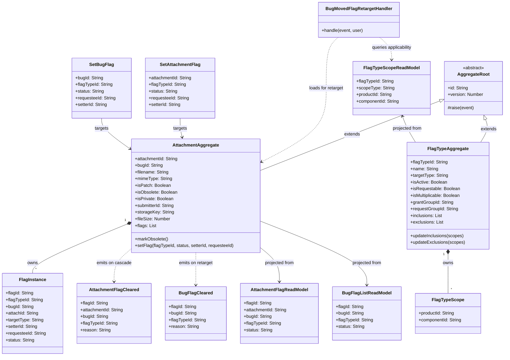

# C4 Code Diagram — service-attachment

> Risk source: [source: audit-output/cluster-inventory.md:26] — flagged `unknown` in stability JSON; the largest non-bug service at 4 921 LOC across `Flag.pm` (1 309 LOC), `Attachment.pm` (1 055 LOC), `FlagType.pm` (797 LOC), and `attachment.cgi` (849 LOC). Per [source: output/phase-4-architecture/interaction-map.md:386], service-attachment subscribes to `bug.Events.BugProductChanged`, `user.Events.GroupMemberAdded`, `user.Events.GroupMemberRemoved`, and four `product.Events.*` — the widest inbound subscription surface of any non-bug service. Per [source: output/phase-4-architecture/decisions/ADR-adr-005-flag-ownership.md:5], all flag logic (both bug-level and attachment-level) was deliberately co-located here, making this service the single authority for the cross-cutting flag request/grant/deny workflow.

## Class Diagram

### Diagram notes

The diagram shows 14 classes — the core aggregate hierarchy, child entities, value objects, and the key cross-service handler that constitutes the primary risk hotspot.

- **AttachmentAggregate** owns **FlagInstance** as a child entity collection. This is the design that enables the obsolete-cascade invariant (cancel all pending `?` flags when `isObsolete` transitions to `true`) to execute atomically within a single aggregate transaction [source: output/phase-4-architecture/services/service-attachment.md:38].
- **FlagTypeAggregate** owns **FlagTypeScope** value objects for inclusion/exclusion rules. Changes to these rules emit `FlagTypeInclusionsChanged` / `FlagTypeExclusionsChanged` events that trigger internal retargeting [source: output/phase-4-architecture/services/service-attachment.md:112].
- **BugMovedFlagRetargetHandler** is the highest-risk handler: it subscribes to `bug.Events.BugProductChanged` and must re-evaluate every flag instance (both bug-level and attachment-level) against the new product/component context, performing retarget or cleanup [source: output/phase-4-architecture/services/service-attachment.md:280]. This handler touches three read models (`AttachmentFlagReadModel`, `BugFlagListReadModel`, `FlagTypeScopeReadModel`) and issues clear/recreate commands — a complex multi-step fan-out within a single event handler.
- **SetBugFlag** and **SetBugFlag** commands both target `AttachmentAggregate`, reflecting ADR-005's decision to co-locate all flag logic in this service regardless of target type [source: output/phase-4-architecture/decisions/ADR-adr-005-flag-ownership.md:41].
- **AttachmentFlagReadModel** and **BugFlagListReadModel** represent the dual read-model projection pattern: attachment-level flags are consumed locally and by notification/search, while bug-level flags are also consumed by `service-bug` via cross-service event subscription [source: output/phase-4-architecture/services/service-attachment.md:158].

## Citations

| # | Citation | Fact |
|---|----------|------|
| 1 | [source: audit-output/cluster-inventory.md:26] | service-attachment cluster contains `Flag.pm` (1 309 LOC), `Attachment.pm` (1 055 LOC), `FlagType.pm` (797 LOC), `attachment.cgi` (849 LOC) — stability `unknown` |
| 2 | [source: audit-output/cluster-inventory.md:27] | `Bugzilla::Flag` at 1 309 LOC is the second-largest single module after `Bug` and `User` |
| 3 | [source: output/phase-4-architecture/services/service-attachment.md:1] | Service-attachment owns two tightly coupled bounded contexts: file attachments and the full flag/request/approval workflow |
| 4 | [source: output/phase-4-architecture/services/service-attachment.md:38] | `AttachmentAggregate` owns `FlagInstance` as a child entity collection for atomic obsolete-cascade invariant |
| 5 | [source: output/phase-4-architecture/services/service-attachment.md:68] | `FlagInstance` fields: `flagId`, `flagTypeId`, `bugId`, `attachId`, `targetType`, `setterId`, `requesteeId`, `status` |
| 6 | [source: output/phase-4-architecture/services/service-attachment.md:83] | `FlagTypeAggregate` fields: `flagTypeId`, `name`, `targetType`, `isActive`, `isRequestable`, `isMultiplicable`, `grantGroupId`, `requestGroupId`, `inclusions`, `exclusions` |
| 7 | [source: output/phase-4-architecture/services/service-attachment.md:112] | `FlagTypeScope` value object: `productId`, `componentId` — used for inclusion/exclusion rules |
| 8 | [source: output/phase-4-architecture/services/service-attachment.md:280] | `BugMovedFlagRetargetHandler` subscribes to `bug.Events.BugProductChanged` and retargets or cleans up all flags when a bug changes product/component |
| 9 | [source: output/phase-4-architecture/services/service-attachment.md:158] | `AttachmentFlagReadModel` projected from `AttachmentFlagRequested`, `AttachmentFlagGranted`, `AttachmentFlagDenied`, `AttachmentFlagCleared` |
| 10 | [source: output/phase-4-architecture/services/service-attachment.md:183] | `BugFlagListReadModel` projected from `BugFlagRequested`, `BugFlagGranted`, `BugFlagDenied`, `BugFlagCleared` — consumed by `service-bug` |
| 11 | [source: output/phase-4-architecture/services/service-attachment.md:207] | `FlagTypeScopeReadModel` stores inclusion/exclusion scopes for applicability resolution |
| 12 | [source: output/phase-4-architecture/decisions/ADR-adr-005-flag-ownership.md:5] | ADR-005 decision: all flag logic (both bug-level and attachment-level) resides in service-attachment |
| 13 | [source: output/phase-4-architecture/decisions/ADR-adr-005-flag-ownership.md:41] | Bug-level flags modeled as `attachId = null`, `targetType = 'bug'` — a field, not a service boundary |
| 14 | [source: output/phase-4-architecture/interaction-map.md:386] | service-attachment subscribes to `bug.Events.BugProductChanged`, `user.Events.GroupMemberAdded/Removed`, and four `product.Events.*` — widest inbound surface |
| 15 | [source: output/phase-4-architecture/services/service-attachment.md:134] | `SetAttachmentFlag` and `SetBugFlag` commands with `status` field values `?`, `+`, `-`, `X` implementing the flag state machine |
| 16 | [source: output/phase-4-architecture/services/service-attachment.md:99] | `AttachmentFlagCleared` event with `reason` field: `'user'`, `'obsolete-cascade'`, or `'retarget'` |
