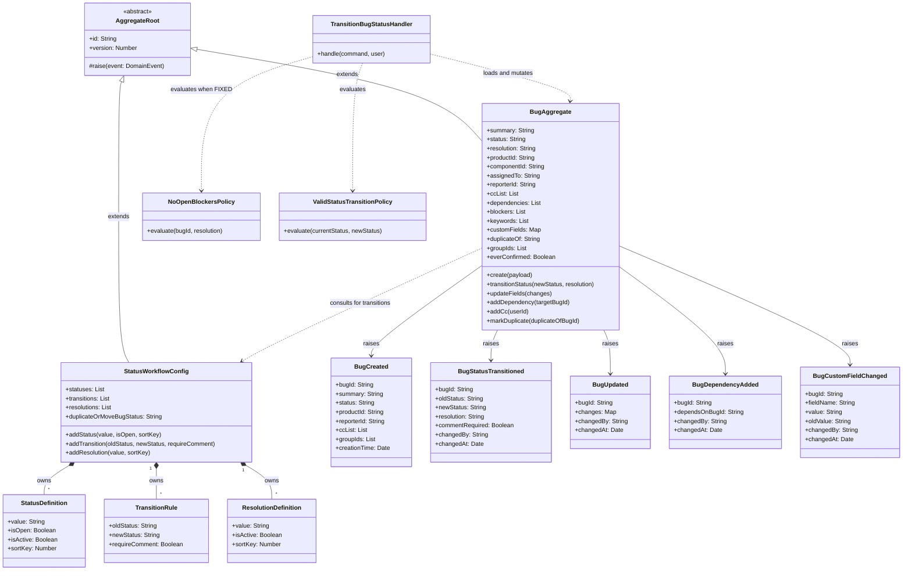

# C4 Code Diagram — service-bug (HIGH risk: central god-object aggregate)

> **Risk source** [source: audit-output/cluster-inventory.md:11] — `Bugzilla::Bug` (5 123 LOC god-object) is the
> architectural ancestor of `BugAggregate`; the entire monolith orbits it.
> Stability rated `unknown` (no git churn, no nearby tests) per
> [source: audit-output/cluster-inventory.md:31]. `BugAggregate` is the
> central domain aggregate consumed by every other service via domain events
> per [source: output/phase-4-architecture/interaction-map.md:22].

## Class Diagram

> Field list truncated for readability; `BugAggregate` carries 32 fields in total
> (see service-doc for full field list) [source: output/phase-4-architecture/services/service-bug.md:39].
> `StatusWorkflowConfig` is a configuration singleton whose value objects
> (`StatusDefinition`, `TransitionRule`, `ResolutionDefinition`) define the data-driven
> state machine [source: output/phase-4-architecture/services/service-bug.md:78].
> `TransitionBugStatusHandler` delegates policy evaluation in a fixed order:
> `ValidStatusTransitionPolicy` → `ResolutionRequiredPolicy` → `NoOpenBlockersPolicy`
> → `CanConfirmBugPolicy` → `MustHaveMilestoneOnAcceptPolicy`
> [source: output/phase-4-architecture/services/service-bug.md:428].

## Citations

| # | Fact | Source |
|---|------|--------|
| C1 | `Bugzilla::Bug` is a 5 123 LOC god-object; the entire monolith orbits it | [source: audit-output/cluster-inventory.md:11] |
| C2 | `Bug.pm` stability = `unknown` (no nearby tests, 0 churn) | [source: audit-output/cluster-inventory.md:31] |
| C3 | `service-bug` broadcasts domain events to all other services | [source: output/phase-4-architecture/interaction-map.md:22] |
| C4 | `BugAggregate` has 32 state fields including `ccList`, `dependencies`, `blockers`, `customFields` | [source: output/phase-4-architecture/services/service-bug.md:39] |
| C5 | `BugAggregate` behaviors: `create`, `transitionStatus`, `updateFields`, `addDependency`, `markDuplicate` | [source: output/phase-4-architecture/services/service-bug.md:72] |
| C6 | `StatusWorkflowConfig` is a configuration aggregate (singleton) with `statuses`, `transitions`, `resolutions` | [source: output/phase-4-architecture/services/service-bug.md:78] |
| C7 | `StatusDefinition` value object: `value`, `isOpen`, `isActive`, `sortKey` | [source: output/phase-4-architecture/services/service-bug.md:80] |
| C8 | `TransitionRule` value object: `oldStatus → newStatus` with `requireComment` flag | [source: output/phase-4-architecture/services/service-bug.md:81] |
| C9 | `TransitionBugStatus` validates against `StatusWorkflowConfig` transitions, runs `NoOpenBlockersPolicy` when FIXED | [source: output/phase-4-architecture/services/service-bug.md:99] |
| C10 | Policy evaluation order: steps 1–7 in the transition validation algorithm | [source: output/phase-4-architecture/services/service-bug.md:428] |
| C11 | `NoOpenBlockersPolicy` queries `BugDependencyReadModel` for open blockers | [source: output/phase-4-architecture/services/service-bug.md:366] |
| C12 | `ValidStatusTransitionPolicy` checks transition exists as active edge | [source: output/phase-4-architecture/services/service-bug.md:364] |
| C13 | `BugCustomFieldChanged` carries `fieldName` + typed `value` (ADR-014) | [source: output/phase-4-architecture/services/service-bug.md:165] |
| C14 | `BugDependencyAdded` emitted for read-model reverse-link projection (ADR-008) | [source: output/phase-4-architecture/services/service-bug.md:102] |
| C15 | `Bugzilla::Bug` god-object coupling: synchronously calls BugMail, Flag, Attachment, User within mutations | [source: audit-output/cluster-inventory.md:185] |
