# C4 Level 3 — Component: service-attachment

> **Service**: `attachment` · **Package**: `@banyanai/service-attachment` · **Contracts**: `@banyanai/service-attachment-contracts`
>
> Per ADR-005, service-attachment owns **all flag logic** (both bug-level and attachment-level) in addition to the attachment file lifecycle. Binary content is stored in external object storage (S3/MinIO); only metadata is event-sourced.

---

## Diagram

```mermaid
C4Component
    title Component Diagram — service-attachment

    Container_Boundary(attachment, "service-attachment") {

        %% ── Command Handlers (Attachment) ──────────────────────────
        Component(create_att_h, "CreateAttachmentHandler", "@CommandHandlerDecorator(CreateAttachment)", "Layer-2: CanEditAttachmentPolicy, CanEditPrivateAttachmentPolicy; sync GetBug query to service-bug")
        Component(update_att_h, "UpdateAttachmentMetadataHandler", "@CommandHandlerDecorator(UpdateAttachmentMetadata)", "Layer-2: CanEditAttachmentPolicy, CanEditPrivateAttachmentPolicy")
        Component(mark_obs_h, "MarkAttachmentObsoleteHandler", "@CommandHandlerDecorator(MarkAttachmentObsolete)", "Layer-2: CanEditAttachmentPolicy; cascades cancellation of pending '?' flags")
        Component(delete_att_h, "DeleteAttachmentHandler", "@CommandHandlerDecorator(DeleteAttachment)", "Layer-2: CanEditAttachmentPolicy; soft-delete + object-storage cleanup")

        %% ── Command Handlers (Flags) ───────────────────────────────
        Component(set_att_flag_h, "SetAttachmentFlagHandler", "@CommandHandlerDecorator(SetAttachmentFlag)", "Layer-2: CanSetFlagPolicy, FlagTypeApplicabilityPolicy, RequesteeVisibilityPolicy, MultiplicableFlagPolicy")
        Component(set_bug_flag_h, "SetBugFlagHandler", "@CommandHandlerDecorator(SetBugFlag)", "Layer-2: CanSetFlagPolicy, FlagTypeApplicabilityPolicy, RequesteeVisibilityPolicy, MultiplicableFlagPolicy")
        Component(clear_bug_flag_h, "ClearBugFlagHandler", "@CommandHandlerDecorator(ClearBugFlag)", "Clears bug-level flag during retargeting cleanup")

        %% ── Command Handlers (Flag Types — Admin) ──────────────────
        Component(create_ft_h, "CreateFlagTypeHandler", "@CommandHandlerDecorator(CreateFlagType)", "Admin; creates flag type with inclusion/exclusion rules")
        Component(update_ft_h, "UpdateFlagTypeHandler", "@CommandHandlerDecorator(UpdateFlagType)", "Admin; updates flag type attributes")
        Component(update_ft_inc_h, "UpdateFlagTypeInclusionsHandler", "@CommandHandlerDecorator(UpdateFlagTypeInclusions)", "Emits FlagTypeInclusionsChanged → triggers retargeting")
        Component(update_ft_exc_h, "UpdateFlagTypeExclusionsHandler", "@CommandHandlerDecorator(UpdateFlagTypeExclusions)", "Emits FlagTypeExclusionsChanged → triggers retargeting")
        Component(deactivate_ft_h, "DeactivateFlagTypeHandler", "@CommandHandlerDecorator(DeactivateFlagType)", "Sets isActive=false; preserves existing flags")

        %% ── Query Handlers ─────────────────────────────────────────
        Component(get_att_data_q, "GetAttachmentDataHandler", "@QueryHandlerDecorator(GetAttachmentData)", "Returns pre-signed URL / stream from object storage")
        Component(get_att_list_q, "GetAttachmentListHandler", "@QueryHandlerDecorator(GetAttachmentList)", "Reads AttachmentListReadModel; privacy-filtered")
        Component(get_att_flag_q, "GetAttachmentFlagsHandler", "@QueryHandlerDecorator(GetAttachmentFlags)", "Reads AttachmentFlagReadModel")
        Component(get_bug_flag_q, "GetBugFlagsHandler", "@QueryHandlerDecorator(GetBugFlags)", "Reads BugFlagListReadModel")
        Component(get_avail_ft_q, "GetAvailableFlagTypesHandler", "@QueryHandlerDecorator(GetAvailableFlagTypes)", "Reads FlagTypeReadModel + FlagTypeScopeReadModel; resolves inclusion/exclusion")
        Component(get_ft_q, "GetFlagTypeHandler", "@QueryHandlerDecorator(GetFlagType)", "Reads FlagTypeReadModel")

        %% ── Aggregate Roots ────────────────────────────────────────
        Component(att_agg, "AttachmentAggregate", "@Aggregate('Attachment')", "Event-sourced; owns attachment lifecycle + flag instances as child entities")
        Component(ft_agg, "FlagTypeAggregate", "@Aggregate('FlagType')", "Event-sourced; flag type definitions, inclusion/exclusion rules, group permissions")

        %% ── Read Models / Projections ──────────────────────────────
        Component(att_list_rm, "AttachmentListReadModel", "@ReadModel(rm_attachment_list)", "Projects AttachmentCreated/Updated/Obsolete/Deleted")
        Component(att_flag_rm, "AttachmentFlagReadModel", "@ReadModel(rm_attachment_flag)", "Projects AttachmentFlagRequested/Granted/Denied/Cleared")
        Component(bug_flag_rm, "BugFlagListReadModel", "@ReadModel(rm_bug_flag_list)", "Projects BugFlagRequested/Granted/Denied/Cleared; consumed by service-bug")
        Component(ft_rm, "FlagTypeReadModel", "@ReadModel(rm_flag_type)", "Projects FlagTypeCreated/Updated/Deactivated")
        Component(ft_scope_rm, "FlagTypeScopeReadModel", "@ReadModel(rm_flag_type_scope)", "Projects FlagTypeInclusionsChanged/ExclusionsChanged; inclusion/exclusion scopes")
        Component(ugm_rm, "UserGroupMembershipReadModel", "Projected read model", "From user.Events.GroupMemberAdded/Removed; supports CanSetFlagPolicy")
        Component(prod_rm, "ProductReadModel", "Projected read model", "From product.Events.*; supports FlagTypeApplicabilityPolicy")
        Component(comp_rm, "ComponentReadModel", "Projected read model", "From product.Events.Component*; supports FlagTypeApplicabilityPolicy")

        %% ── Event Subscription Handlers ────────────────────────────
        Component(bug_moved_sub, "BugMovedFlagRetargetHandler", "@EventHandlerDecorator('bug.Events.BugProductChanged')", "Retargets or clears bug-level + attachment-level flags on product move")
        Component(bug_del_sub, "BugDeletedFlagCleanupHandler", "@EventHandlerDecorator('bug.Events.BugDeleted')", "Removes all flag instances + attachment binaries for deleted bug")
        Component(ft_scope_sub, "FlagTypeScopeChangeRetargetHandler", "@EventHandlerDecorator('attachment.Events.FlagTypeInclusionsChanged')", "Force-cleanup flags invalidated by inclusion/exclusion rule changes")
        Component(grp_mem_sub, "GroupMembershipProjectionHandler", "@EventHandlerDecorator('user.Events.GroupMemberAdded')", "Maintains UserGroupMembershipReadModel for policy evaluation")
        Component(prod_sub, "ProductProjectionHandler", "@EventHandlerDecorator('product.Events.ProductCreated')", "Maintains ProductReadModel + ComponentReadModel for applicability")

        %% ── Domain Policies (Layer 2) ──────────────────────────────
        Component(can_edit_att_pol, "CanEditAttachmentPolicy", "Layer-2 Policy", "Submitter OR editbugs group; insider group for private attachments")
        Component(can_edit_priv_pol, "CanEditPrivateAttachmentPolicy", "Layer-2 Policy", "Insider group membership required to set isPrivate=true")
        Component(can_set_flag_pol, "CanSetFlagPolicy", "Layer-2 Policy", "Validates grant/request group membership per flag status transition")
        Component(ft_applic_pol, "FlagTypeApplicabilityPolicy", "Layer-2 Policy", "Checks inclusion/exclusion rules + isActive + targetType match")
        Component(req_vis_pol, "RequesteeVisibilityPolicy", "Layer-2 Policy", "Validates requestee account status, bug visibility, and flag permission")
        Component(multi_flag_pol, "MultiplicableFlagPolicy", "Layer-2 Policy", "Enforces single-instance constraint when isMultiplicable=false")

        %% ── External Dependency ─────────────────────────────────────
        Component_Ext(s3, "Object Storage (S3/MinIO)", "Binary attachment storage", "Not event-sourced; keyed by storageKey")
    }

    %% ── Relationships: Command Handlers → Aggregates ───────────────
    Rel(create_att_h, att_agg, "creates new", "save()")
    Rel(update_att_h, att_agg, "loads & mutates", "getAggregate()")
    Rel(mark_obs_h, att_agg, "loads & sets obsolete", "getAggregate()")
    Rel(delete_att_h, att_agg, "loads & soft-deletes", "getAggregate()")

    Rel(set_att_flag_h, att_agg, "loads, upserts flag instance", "getAggregate()")
    Rel(set_bug_flag_h, att_agg, "loads or creates, upserts flag", "getAggregate()")
    Rel(clear_bug_flag_h, att_agg, "loads, clears flag", "getAggregate()")

    Rel(create_ft_h, ft_agg, "creates new", "save()")
    Rel(update_ft_h, ft_agg, "loads & mutates", "getAggregate()")
    Rel(update_ft_inc_h, ft_agg, "loads, replaces inclusions", "getAggregate()")
    Rel(update_ft_exc_h, ft_agg, "loads, replaces exclusions", "getAggregate()")
    Rel(deactivate_ft_h, ft_agg, "loads, sets isActive=false", "getAggregate()")

    %% ── Relationships: Query Handlers → Read Models ────────────────
    Rel(get_att_list_q, att_list_rm, "reads", "findById/find")
    Rel(get_att_flag_q, att_flag_rm, "reads", "find")
    Rel(get_bug_flag_q, bug_flag_rm, "reads", "find")
    Rel(get_avail_ft_q, ft_rm, "reads", "find")
    Rel(get_avail_ft_q, ft_scope_rm, "reads", "scope resolution")
    Rel(get_ft_q, ft_rm, "reads", "findById")
    Rel(get_att_data_q, s3, "generates pre-signed URL", "S3 SDK")

    %% ── Relationships: Aggregates → Read Models (projection) ───────
    Rel(att_agg, att_list_rm, "projects", "AttachmentCreated/Updated/Obsolete/Deleted")
    Rel(att_agg, att_flag_rm, "projects", "AttachmentFlagRequested/Granted/Denied/Cleared")
    Rel(att_agg, bug_flag_rm, "projects", "BugFlagRequested/Granted/Denied/Cleared")
    Rel(ft_agg, ft_rm, "projects", "FlagTypeCreated/Updated/Deactivated")
    Rel(ft_agg, ft_scope_rm, "projects", "FlagTypeInclusionsChanged/ExclusionsChanged")

    %% ── Relationships: Subscription Handlers → Read Models ─────────
    Rel(bug_moved_sub, att_flag_rm, "queries flags for bugId", "read")
    Rel(bug_moved_sub, bug_flag_rm, "queries bug-level flags", "read")
    Rel(bug_moved_sub, ft_scope_rm, "checks applicability", "read")
    Rel(bug_moved_sub, att_agg, "clears/retargets flags", "command")
    Rel(ft_scope_sub, att_flag_rm, "queries flags for flagTypeId", "read")
    Rel(ft_scope_sub, bug_flag_rm, "queries bug-level flags", "read")
    Rel(ft_scope_sub, att_agg, "clears invalid flags", "command")
    Rel(grp_mem_sub, ugm_rm, "writes", "project")
    Rel(prod_sub, prod_rm, "writes", "project")
    Rel(prod_sub, comp_rm, "writes", "project")

    %% ── Relationships: Command Handlers → Policies ─────────────────
    Rel(create_att_h, can_edit_att_pol, "enforces", "Layer-2")
    Rel(create_att_h, can_edit_priv_pol, "enforces when isPrivate", "Layer-2")
    Rel(update_att_h, can_edit_att_pol, "enforces", "Layer-2")
    Rel(update_att_h, can_edit_priv_pol, "enforces when changing isPrivate", "Layer-2")
    Rel(mark_obs_h, can_edit_att_pol, "enforces", "Layer-2")
    Rel(delete_att_h, can_edit_att_pol, "enforces", "Layer-2")
    Rel(set_att_flag_h, can_set_flag_pol, "enforces", "Layer-2")
    Rel(set_att_flag_h, ft_applic_pol, "enforces", "Layer-2")
    Rel(set_att_flag_h, req_vis_pol, "enforces when requesteeId set", "Layer-2")
    Rel(set_att_flag_h, multi_flag_pol, "enforces", "Layer-2")
    Rel(set_bug_flag_h, can_set_flag_pol, "enforces", "Layer-2")
    Rel(set_bug_flag_h, ft_applic_pol, "enforces", "Layer-2")
    Rel(set_bug_flag_h, req_vis_pol, "enforces when requesteeId set", "Layer-2")
    Rel(set_bug_flag_h, multi_flag_pol, "enforces", "Layer-2")

    %% ── Relationships: Binary storage ──────────────────────────────
    Rel(create_att_h, s3, "writes binary", "S3 SDK")
    Rel(delete_att_h, s3, "removes binary", "S3 SDK")
```

---

## Components Table

| Component | Type | Stability | Description | Source |
|-----------|------|-----------|-------------|--------|
| `CreateAttachmentHandler` | Command Handler | unknown | Creates attachment; validates bug visibility, MIME, file size; writes binary to S3; creates initial flag instances | [source: output/phase-4-architecture/services/service-attachment.md:112] |
| `UpdateAttachmentMetadataHandler` | Command Handler | unknown | Batch update of description, filename, contentType, isPatch, isPrivate | [source: output/phase-4-architecture/services/service-attachment.md:113] |
| `MarkAttachmentObsoleteHandler` | Command Handler | unknown | Sets isObsolete=true; cascades cancellation of all pending `?` flag instances | [source: output/phase-4-architecture/services/service-attachment.md:114] |
| `DeleteAttachmentHandler` | Command Handler | unknown | Soft-delete; clears flags, removes binary from object storage | [source: output/phase-4-architecture/services/service-attachment.md:115] |
| `SetAttachmentFlagHandler` | Command Handler | unknown | Create/update/clear attachment-level flags; enforces applicability, group, multiplicable, requestee policies | [source: output/phase-4-architecture/services/service-attachment.md:121] |
| `SetBugFlagHandler` | Command Handler | unknown | Create/update/clear bug-level flags (attachId=null, targetType='bug'); same policy enforcement as SetAttachmentFlag | [source: output/phase-4-architecture/services/service-attachment.md:122] |
| `ClearBugFlagHandler` | Command Handler | unknown | Clears specific bug-level flag; used during retargeting cleanup | [source: output/phase-4-architecture/services/service-attachment.md:123] |
| `CreateFlagTypeHandler` | Command Handler | unknown | Admin operation; creates flag type with inclusion/exclusion rules and group permissions | [source: output/phase-4-architecture/services/service-attachment.md:129] |
| `UpdateFlagTypeHandler` | Command Handler | unknown | Admin operation; updates flag type attributes | [source: output/phase-4-architecture/services/service-attachment.md:130] |
| `UpdateFlagTypeInclusionsHandler` | Command Handler | unknown | Replaces inclusion rules; emits FlagTypeInclusionsChanged triggering retargeting | [source: output/phase-4-architecture/services/service-attachment.md:131] |
| `UpdateFlagTypeExclusionsHandler` | Command Handler | unknown | Replaces exclusion rules; emits FlagTypeExclusionsChanged triggering retargeting | [source: output/phase-4-architecture/services/service-attachment.md:132] |
| `DeactivateFlagTypeHandler` | Command Handler | unknown | Sets isActive=false; prevents new flag creation, preserves existing | [source: output/phase-4-architecture/services/service-attachment.md:133] |
| `GetAttachmentDataHandler` | Query Handler | unknown | Returns pre-signed URL or streams binary from object storage | [source: output/phase-4-architecture/services/service-attachment.md:440] |
| `GetAttachmentListHandler` | Query Handler | unknown | Reads AttachmentListReadModel; privacy-filtered for non-insider users | [source: output/phase-4-architecture/services/service-attachment.md:250] |
| `GetAttachmentFlagsHandler` | Query Handler | unknown | Reads AttachmentFlagReadModel for flag display | [source: output/phase-4-architecture/services/service-attachment.md:274] |
| `GetBugFlagsHandler` | Query Handler | unknown | Reads BugFlagListReadModel for bug-level flag display | [source: output/phase-4-architecture/services/service-attachment.md:298] |
| `GetAvailableFlagTypesHandler` | Query Handler | unknown | Reads FlagTypeReadModel + FlagTypeScopeReadModel; resolves inclusion/exclusion | [source: output/phase-4-architecture/services/service-attachment.md:321] |
| `GetFlagTypeHandler` | Query Handler | unknown | Reads FlagTypeReadModel by ID | [source: output/phase-4-architecture/services/service-attachment.md:319] |
| `AttachmentAggregate` | Aggregate Root | unknown | Event-sourced; `@Aggregate('Attachment')`; owns attachment lifecycle + FlagInstance child entities; obsolete-cascade invariant | [source: output/phase-4-architecture/services/service-attachment.md:39] |
| `FlagTypeAggregate` | Aggregate Root | unknown | Event-sourced; `@Aggregate('FlagType')`; flag type definitions, inclusion/exclusion, grant/request groups | [source: output/phase-4-architecture/services/service-attachment.md:78] |
| `AttachmentListReadModel` | Read Model | unknown | Table `rm_attachment_list`; projects AttachmentCreated/Updated/Obsolete/Deleted | [source: output/phase-4-architecture/services/service-attachment.md:250] |
| `AttachmentFlagReadModel` | Read Model | unknown | Table `rm_attachment_flag`; projects AttachmentFlagRequested/Granted/Denied/Cleared | [source: output/phase-4-architecture/services/service-attachment.md:274] |
| `BugFlagListReadModel` | Read Model | unknown | Table `rm_bug_flag_list`; projects BugFlagRequested/Granted/Denied/Cleared; consumed by service-bug | [source: output/phase-4-architecture/services/service-attachment.md:298] |
| `FlagTypeReadModel` | Read Model | unknown | Table `rm_flag_type`; projects FlagTypeCreated/Updated/Deactivated | [source: output/phase-4-architecture/services/service-attachment.md:319] |
| `FlagTypeScopeReadModel` | Read Model | unknown | Table `rm_flag_type_scope`; stores inclusion/exclusion scopes per flag type | [source: output/phase-4-architecture/services/service-attachment.md:342] |
| `UserGroupMembershipReadModel` | Read Model (projected) | unknown | From user events; supports CanSetFlagPolicy group membership checks | [source: output/phase-4-architecture/services/service-attachment.md:606] |
| `ProductReadModel` | Read Model (projected) | unknown | From product events; supports FlagTypeApplicabilityPolicy product resolution | [source: output/phase-4-architecture/services/service-attachment.md:607] |
| `ComponentReadModel` | Read Model (projected) | unknown | From product events; supports FlagTypeApplicabilityPolicy component resolution | [source: output/phase-4-architecture/services/service-attachment.md:608] |
| `BugMovedFlagRetargetHandler` | Event Subscription | unknown | Subscribes to `bug.Events.BugProductChanged`; retargets or clears both bug-level and attachment-level flags | [source: output/phase-4-architecture/services/service-attachment.md:614] |
| `BugDeletedFlagCleanupHandler` | Event Subscription | unknown | Subscribes to `bug.Events.BugDeleted`; removes all flag instances + binaries for deleted bug | [source: output/phase-4-architecture/services/service-attachment.md:639] |
| `FlagTypeScopeChangeRetargetHandler` | Event Subscription | unknown | Subscribes to `attachment.Events.FlagTypeInclusionsChanged` / `FlagTypeExclusionsChanged`; force-cleanup invalidated flags | [source: output/phase-4-architecture/services/service-attachment.md:629] |
| `GroupMembershipProjectionHandler` | Event Subscription | unknown | Subscribes to `user.Events.GroupMemberAdded` / `GroupMemberRemoved`; maintains UserGroupMembershipReadModel | [source: output/phase-4-architecture/services/service-attachment.md:648] |
| `ProductProjectionHandler` | Event Subscription | unknown | Subscribes to `product.Events.*`; maintains ProductReadModel + ComponentReadModel | [source: output/phase-4-architecture/services/service-attachment.md:654] |
| `CanEditAttachmentPolicy` | Layer-2 Policy | unknown | Submitter OR editbugs group; insider group for private | [source: output/phase-4-architecture/services/service-attachment.md:378] |
| `CanEditPrivateAttachmentPolicy` | Layer-2 Policy | unknown | Insider group membership required to set isPrivate=true | [source: output/phase-4-architecture/services/service-attachment.md:419] |
| `CanSetFlagPolicy` | Layer-2 Policy | unknown | Validates grant/request group membership per flag status transition (?/+/-/X) | [source: output/phase-4-architecture/services/service-attachment.md:384] |
| `FlagTypeApplicabilityPolicy` | Layer-2 Policy | unknown | Checks inclusion/exclusion rules via FlagTypeScopeReadModel; isActive + targetType | [source: output/phase-4-architecture/services/service-attachment.md:393] |
| `RequesteeVisibilityPolicy` | Layer-2 Policy | unknown | Validates requestee account status, bug visibility, attachment privacy, flag permission | [source: output/phase-4-architecture/services/service-attachment.md:402] |
| `MultiplicableFlagPolicy` | Layer-2 Policy | unknown | Enforces single-instance constraint when isMultiplicable=false | [source: output/phase-4-architecture/services/service-attachment.md:412] |

---

## Citations

1. **AttachmentAggregate `@Aggregate('Attachment')` — event-sourced with FlagInstance child entities**: [source: output/phase-4-architecture/services/service-attachment.md:39]
2. **FlagTypeAggregate `@Aggregate('FlagType')` — event-sourced, owns inclusion/exclusion rules**: [source: output/phase-4-architecture/services/service-attachment.md:78]
3. **CreateAttachment command — `attachments:create` permission, targets AttachmentAggregate (new)**: [source: output/phase-4-architecture/services/service-attachment.md:112]
4. **SetAttachmentFlag / SetBugFlag commands — Layer-2 policies CanSetFlagPolicy, FlagTypeApplicabilityPolicy, RequesteeVisibilityPolicy**: [source: output/phase-4-architecture/services/service-attachment.md:188]
5. **AttachmentListReadModel — table `rm_attachment_list`, projects AttachmentCreated/Updated/Obsolete/Deleted**: [source: output/phase-4-architecture/services/service-attachment.md:250]
6. **AttachmentFlagReadModel — table `rm_attachment_flag`, projects AttachmentFlagRequested/Granted/Denied/Cleared**: [source: output/phase-4-architecture/services/service-attachment.md:274]
7. **BugFlagListReadModel — table `rm_bug_flag_list`, projects BugFlagRequested/Granted/Denied/Cleared**: [source: output/phase-4-architecture/services/service-attachment.md:298]
8. **FlagTypeScopeReadModel — table `rm_flag_type_scope`, stores inclusion/exclusion scopes for FlagTypeApplicabilityPolicy**: [source: output/phase-4-architecture/services/service-attachment.md:342]
9. **GetAttachmentData query — returns pre-signed URL / stream from object storage**: [source: output/phase-4-architecture/services/service-attachment.md:440]
10. **BugMovedFlagRetargetHandler — subscribes to BugMoved, retargets or clears flags on product move**: [source: output/phase-4-architecture/services/service-attachment.md:614]
11. **BugMovedFlagRetargetHandler subscription listing in interaction-map — `bug.Events.BugProductChanged`**: [source: output/phase-4-architecture/interaction-map.md:387]
12. **FlagTypeScopeChangeRetargetHandler subscription — `attachment.Events.FlagTypeInclusionsChanged` / `FlagTypeExclusionsChanged`**: [source: output/phase-4-architecture/interaction-map.md:395]
13. **GroupMembershipProjectionHandler subscription — `user.Events.GroupMemberAdded/Removed`**: [source: output/phase-4-architecture/interaction-map.md:388]
14. **ProductProjectionHandler subscription — `product.Events.ProductCreated/Updated/Deactivated/ComponentCreated/Updated`**: [source: output/phase-4-architecture/interaction-map.md:390]
15. **ADR-005 decision — all flag logic (bug-level and attachment-level) resides in service-attachment**: [source: output/phase-4-architecture/decisions/ADR-adr-005-flag-ownership.md:34]
16. **ADR-005 — target_type as field not boundary, attachId=null for bug-level flags**: [source: output/phase-4-architecture/decisions/ADR-adr-005-flag-ownership.md:36]
17. **ADR-005 — Layer-2 policies CanSetFlagPolicy and FlagTypeApplicabilityPolicy inside service-attachment**: [source: output/phase-4-architecture/decisions/ADR-adr-005-flag-ownership.md:49]
18. **Cross-service event publications — AttachmentCreated consumed by service-comment, service-notification, service-search**: [source: output/phase-4-architecture/interaction-map.md:509]
19. **Synchronous GetBug query from service-attachment to service-bug during CreateAttachment**: [source: output/phase-4-architecture/interaction-map.md:434]
