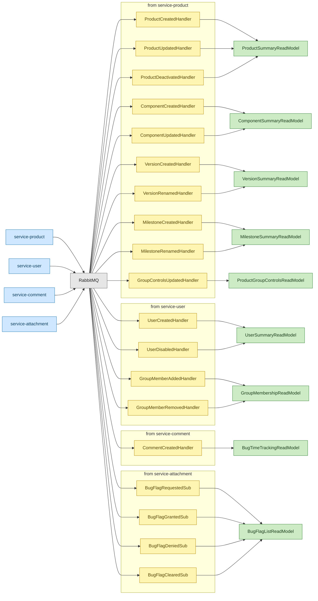

# C4 Level 3 — Component: service-bug

> Component diagram for **service-bug**, the central domain aggregate in the
> Bugzilla-to-Evergreen migration. It owns the Bug aggregate root (event-sourced
> lifecycle) and the StatusWorkflowConfig configuration aggregate (data-driven
> state machine). Service-bug is the largest bounded context: 19 bug commands,
> 7 workflow admin commands, 11 queries, 9 read models, 8 subscription-maintained
> local read models, 15 Layer-2 policies, and 19 incoming event subscriptions.

---

## Diagram

```mermaid
C4Component
    title Component Diagram — service-bug

    Container_Boundary(bug, "service-bug") {

        %% ── Aggregate Roots ──────────────────────────────────────────
        Component(bug_agg, "BugAggregate", "@Aggregate('BugAggregate')", "Event-sourced root; 30+ fields, 18 mutation behaviors")
        Component(sw_agg, "StatusWorkflowConfig", "@Aggregate('StatusWorkflowConfig')", "Configuration aggregate; statuses, transitions, resolutions")

        %% ── Command Handlers — BugAggregate ─────────────────────────
        Component(create_h, "CreateBugHandler", "@CommandHandlerDecorator(CreateBug)", "CanEnterProductPolicy, MandatoryFieldPolicy")
        Component(update_h, "UpdateBugHandler", "@CommandHandlerDecorator(UpdateBug)", "CanEditBugPolicy, CanChangeFieldPolicy, MandatoryFieldPolicy, CanEditTimeTrackingPolicy")
        Component(transition_h, "TransitionBugStatusHandler", "@CommandHandlerDecorator(TransitionBugStatus)", "ValidStatusTransitionPolicy, ResolutionRequiredPolicy, NoOpenBlockersPolicy, CanConfirmBugPolicy, MustHaveMilestoneOnAcceptPolicy")
        Component(assign_h, "AssignBugHandler", "@CommandHandlerDecorator(AssignBug)", "CanEditBugPolicy, StrictIsolationPolicy")
        Component(setres_h, "SetBugResolutionHandler", "@CommandHandlerDecorator(SetBugResolution)", "ResolutionRequiredPolicy")
        Component(adddep_h, "AddBugDependencyHandler", "@CommandHandlerDecorator(AddBugDependency)", "DependencyLoopPolicy, CanSeeBugPolicy")
        Component(remdep_h, "RemoveBugDependencyHandler", "@CommandHandlerDecorator(RemoveBugDependency)", "CanEditBugPolicy")
        Component(addcc_h, "AddBugCcHandler", "@CommandHandlerDecorator(AddBugCc)", "CanEditBugPolicy, StrictIsolationPolicy")
        Component(remcc_h, "RemoveBugCcHandler", "@CommandHandlerDecorator(RemoveBugCc)", "CanEditBugPolicy")
        Component(addkw_h, "AddBugKeywordHandler", "@CommandHandlerDecorator(AddBugKeyword)", "CanEditBugPolicy")
        Component(remkw_h, "RemoveBugKeywordHandler", "@CommandHandlerDecorator(RemoveBugKeyword)", "CanEditBugPolicy")
        Component(addal_h, "AddBugAliasHandler", "@CommandHandlerDecorator(AddBugAlias)", "CanEditBugPolicy")
        Component(remal_h, "RemoveBugAliasHandler", "@CommandHandlerDecorator(RemoveBugAlias)", "CanEditBugPolicy")
        Component(addsa_h, "AddBugSeeAlsoHandler", "@CommandHandlerDecorator(AddBugSeeAlso)", "CanEditBugPolicy")
        Component(remsa_h, "RemoveBugSeeAlsoHandler", "@CommandHandlerDecorator(RemoveBugSeeAlso)", "CanEditBugPolicy")
        Component(dup_h, "MarkBugDuplicateHandler", "@CommandHandlerDecorator(MarkBugDuplicate)", "CanMarkDuplicatePolicy")
        Component(setprod_h, "SetBugProductHandler", "@CommandHandlerDecorator(SetBugProduct)", "CanChangeProductPolicy")
        Component(addgrp_h, "AddBugGroupHandler", "@CommandHandlerDecorator(AddBugGroup)", "CanEditBugPolicy")
        Component(remgrp_h, "RemoveBugGroupHandler", "@CommandHandlerDecorator(RemoveBugGroup)", "CanEditBugPolicy")

        %% ── Command Handlers — StatusWorkflowConfig ─────────────────
        Component(addws_h, "AddWorkflowStatusHandler", "@CommandHandlerDecorator(AddWorkflowStatus)", "IsAdminPolicy")
        Component(remws_h, "RemoveWorkflowStatusHandler", "@CommandHandlerDecorator(RemoveWorkflowStatus)", "IsAdminPolicy")
        Component(addwt_h, "AddWorkflowTransitionHandler", "@CommandHandlerDecorator(AddWorkflowTransition)", "IsAdminPolicy")
        Component(remwt_h, "RemoveWorkflowTransitionHandler", "@CommandHandlerDecorator(RemoveWorkflowTransition)", "IsAdminPolicy")
        Component(uptc_h, "UpdateTransCommentReqHandler", "@CommandHandlerDecorator(UpdateTransitionCommentRequirement)", "IsAdminPolicy")
        Component(addwr_h, "AddWorkflowResolutionHandler", "@CommandHandlerDecorator(AddWorkflowResolution)", "IsAdminPolicy")
        Component(remwr_h, "RemoveWorkflowResolutionHandler", "@CommandHandlerDecorator(RemoveWorkflowResolution)", "IsAdminPolicy")

        %% ── Query Handlers ──────────────────────────────────────────
        Component(get_q, "GetBugHandler", "@QueryHandlerDecorator(GetBug)", "Reads BugDetailReadModel")
        Component(search_q, "SearchBugsHandler", "@QueryHandlerDecorator(SearchBugs)", "Reads BugListReadModel")
        Component(hist_q, "GetBugHistoryHandler", "@QueryHandlerDecorator(GetBugHistory)", "Reads BugActivityReadModel")
        Component(fields_q, "GetBugFieldsHandler", "@QueryHandlerDecorator(GetBugFields)", "Reads BugFieldMetadataReadModel")
        Component(legal_q, "GetLegalValuesHandler", "@QueryHandlerDecorator(GetLegalValues)", "Reads BugFieldMetadataReadModel")
        Component(vtrans_q, "GetValidTransitionsHandler", "@QueryHandlerDecorator(GetValidStatusTransitions)", "Reads StatusWorkflowReadModel")
        Component(cstat_q, "GetCreationStatusesHandler", "@QueryHandlerDecorator(GetCreationStatuses)", "Reads StatusWorkflowReadModel")
        Component(statuses_q, "GetStatusesHandler", "@QueryHandlerDecorator(GetStatuses)", "Reads StatusWorkflowReadModel")
        Component(res_q, "GetResolutionsHandler", "@QueryHandlerDecorator(GetResolutions)", "Reads StatusWorkflowReadModel")
        Component(deps_q, "GetBugDependenciesHandler", "@QueryHandlerDecorator(GetBugDependencies)", "Reads BugDependencyReadModel")
        Component(visit_q, "GetBugUserLastVisitHandler", "@QueryHandlerDecorator(GetBugUserLastVisit)", "Reads BugUserLastVisitReadModel")

        %% ── Read Models — Projected from BugAggregate ───────────────
        Component(detail_rm, "BugDetailReadModel", "@ReadModel(rm_bug_detail)", "Full bug view; all BugAggregate events")
        Component(list_rm, "BugListReadModel", "@ReadModel(rm_bug_list)", "Denormalized listing; subset of fields")
        Component(activity_rm, "BugActivityReadModel", "@ReadModel(rm_bug_activity)", "Audit trail; one row per field change")
        Component(dep_rm, "BugDependencyReadModel", "@ReadModel(rm_bug_dependency)", "Dependency graph; two rows per dependency")
        Component(cf_rm, "BugCustomFieldReadModel", "@ReadModel(rm_bug_custom_fields)", "Custom field values; BugCustomFieldChanged")
        Component(dup_rm, "BugDuplicateReadModel", "@ReadModel(rm_bug_duplicates)", "Duplicate chain resolution; transitive")
        Component(visit_rm, "BugUserLastVisitReadModel", "@ReadModel(rm_bug_user_last_visit)", "Per-user last-visit timestamps")
        Component(meta_rm, "BugFieldMetadataReadModel", "@ReadModel(rm_bug_field_metadata)", "Field definitions and legal values per product")

        %% ── Read Models — Projected from StatusWorkflowConfig ───────
        Component(sw_rm, "StatusWorkflowReadModel", "@ReadModel(rm_status_workflow)", "Workflow graph; statuses, transitions, resolutions")

        %% ── Read Models — Maintained by Subscription Handlers ───────
        Component(prod_rm, "ProductSummaryReadModel", "Local projection", "From product.Events.*; product validation")
        Component(comp_rm, "ComponentSummaryReadModel", "Local projection", "From product.Events.Component*; default assignee/QA/CC")
        Component(ver_rm, "VersionSummaryReadModel", "Local projection", "From product.Events.Version*; ID-based (ADR-013)")
        Component(mile_rm, "MilestoneSummaryReadModel", "Local projection", "From product.Events.Milestone*; ID-based (ADR-013)")
        Component(grp_rm, "ProductGroupControlsReadModel", "Local projection", "From product.Events.GroupControlsUpdated; Layer 2 auth")
        Component(user_rm, "UserSummaryReadModel", "Local projection", "From user.Events.UserCreated / UserDisabled")
        Component(memb_rm, "GroupMembershipReadModel", "Local projection", "From user.Events.GroupMemberAdded / Removed")
        Component(ttrack_rm, "BugTimeTrackingReadModel", "Local projection", "From comment.Events.CommentCreated + bug time events")
        Component(flag_rm, "BugFlagListReadModel", "Local projection", "From attachment.Events.BugFlag*; display bug-level flags")

        %% ── Event Subscription Handlers — Product Events ────────────
        Component(sub_prod_created, "ProductCreatedHandler", "@EventHandlerDecorator('product.Events.ProductCreated')", "Seeds ProductSummaryReadModel")
        Component(sub_prod_updated, "ProductUpdatedHandler", "@EventHandlerDecorator('product.Events.ProductUpdated')", "Updates ProductSummaryReadModel")
        Component(sub_prod_deact, "ProductDeactivatedHandler", "@EventHandlerDecorator('product.Events.ProductDeactivated')", "Marks product inactive")
        Component(sub_comp_created, "ComponentCreatedHandler", "@EventHandlerDecorator('product.Events.ComponentCreated')", "Seeds ComponentSummaryReadModel")
        Component(sub_comp_updated, "ComponentUpdatedHandler", "@EventHandlerDecorator('product.Events.ComponentUpdated')", "Updates ComponentSummaryReadModel")
        Component(sub_ver_created, "VersionCreatedHandler", "@EventHandlerDecorator('product.Events.VersionCreated')", "Seeds VersionSummaryReadModel")
        Component(sub_ver_renamed, "VersionRenamedHandler", "@EventHandlerDecorator('product.Events.VersionRenamed')", "Updates version display name")
        Component(sub_mile_created, "MilestoneCreatedHandler", "@EventHandlerDecorator('product.Events.MilestoneCreated')", "Seeds MilestoneSummaryReadModel")
        Component(sub_mile_renamed, "MilestoneRenamedHandler", "@EventHandlerDecorator('product.Events.MilestoneRenamed')", "Updates milestone display name")
        Component(sub_grp_ctrl, "GroupControlsUpdatedHandler", "@EventHandlerDecorator('product.Events.GroupControlsUpdated')", "Updates ProductGroupControlsReadModel")

        %% ── Event Subscription Handlers — User Events ───────────────
        Component(sub_user_created, "UserCreatedHandler", "@EventHandlerDecorator('user.Events.UserCreated')", "Seeds UserSummaryReadModel")
        Component(sub_user_disabled, "UserDisabledHandler", "@EventHandlerDecorator('user.Events.UserDisabled')", "Marks user disabled in read model")
        Component(sub_grp_added, "GroupMemberAddedHandler", "@EventHandlerDecorator('user.Events.GroupMemberAdded')", "Updates GroupMembershipReadModel")
        Component(sub_grp_removed, "GroupMemberRemovedHandler", "@EventHandlerDecorator('user.Events.GroupMemberRemoved')", "Updates GroupMembershipReadModel")

        %% ── Event Subscription Handlers — Comment Events ────────────
        Component(sub_comment, "CommentCreatedHandler", "@EventHandlerDecorator('comment.Events.CommentCreated')", "Projects workTime into BugTimeTrackingReadModel")

        %% ── Event Subscription Handlers — Attachment Flag Events ────
        Component(sub_flag_req, "BugFlagRequestedSub", "@EventHandlerDecorator('attachment.Events.BugFlagRequested')", "Updates BugFlagListReadModel")
        Component(sub_flag_grant, "BugFlagGrantedSub", "@EventHandlerDecorator('attachment.Events.BugFlagGranted')", "Updates BugFlagListReadModel")
        Component(sub_flag_deny, "BugFlagDeniedSub", "@EventHandlerDecorator('attachment.Events.BugFlagDenied')", "Updates BugFlagListReadModel")
        Component(sub_flag_clear, "BugFlagClearedSub", "@EventHandlerDecorator('attachment.Events.BugFlagCleared')", "Updates BugFlagListReadModel")

        %% ── Layer 2 Policy Classes ──────────────────────────────────
        Component(pol_enter, "CanEnterProductPolicy", "@RequirePolicy('CanEnterProductPolicy')", "Checks group_control_map.entry")
        Component(pol_edit, "CanEditBugPolicy", "@RequirePolicy('CanEditBugPolicy')", "editbugs group OR assignee/reporter/QA")
        Component(pol_field, "CanChangeFieldPolicy", "@RequirePolicy('CanChangeFieldPolicy')", "Fine-grained field-level permission")
        Component(pol_trans, "ValidStatusTransitionPolicy", "@RequirePolicy('ValidStatusTransitionPolicy')", "Checks StatusWorkflowReadModel edges")
        Component(pol_res, "ResolutionRequiredPolicy", "@RequirePolicy('ResolutionRequiredPolicy')", "Resolution required on closed status")
        Component(pol_blockers, "NoOpenBlockersPolicy", "@RequirePolicy('NoOpenBlockersPolicy')", "Queries BugDependencyReadModel for open blockers")
        Component(pol_confirm, "CanConfirmBugPolicy", "@RequirePolicy('CanConfirmBugPolicy')", "canconfirm group for UNCONFIRMED→NEW")
        Component(pol_dep, "DependencyLoopPolicy", "@RequirePolicy('DependencyLoopPolicy')", "No self-ref or circular dependencies")
        Component(pol_iso, "StrictIsolationPolicy", "@RequirePolicy('StrictIsolationPolicy')", "Target user must access bug's product")
        Component(pol_see, "CanSeeBugPolicy", "@RequirePolicy('CanSeeBugPolicy')", "Group visibility + ccList/reporter accessible")
        Component(pol_mandatory, "MandatoryFieldPolicy", "@RequirePolicy('MandatoryFieldPolicy')", "is_mandatory custom fields have values")
        Component(pol_milestone, "MustHaveMilestoneOnAcceptPolicy", "@RequirePolicy('MustHaveMilestoneOnAcceptPolicy')", "Non-default milestone on ASSIGNED/IN_PROGRESS")
        Component(pol_time, "CanEditTimeTrackingPolicy", "@RequirePolicy('CanEditTimeTrackingPolicy')", "timetrackinggroup membership")
        Component(pol_dup, "CanMarkDuplicatePolicy", "@RequirePolicy('CanMarkDuplicatePolicy')", "Visible target bug + valid transition")
        Component(pol_prod, "CanChangeProductPolicy", "@RequirePolicy('CanChangeProductPolicy')", "Entry access to new product")
        Component(pol_admin, "IsAdminPolicy", "@RequirePolicy('IsAdminPolicy')", "admin:workflow + admin group")
    }

    %% ── Relationships: Command Handlers → Aggregates ────────────────
    Rel(create_h, bug_agg, "creates", "BugAggregate.create")
    Rel(update_h, bug_agg, "updates", "BugAggregate.updateFields")
    Rel(transition_h, bug_agg, "transitions", "BugAggregate.transitionStatus")
    Rel(assign_h, bug_agg, "assigns", "BugAggregate.assign")
    Rel(setres_h, bug_agg, "sets resolution", "BugAggregate")
    Rel(adddep_h, bug_agg, "adds dependency", "BugAggregate.addDependency")
    Rel(remdep_h, bug_agg, "removes dependency", "BugAggregate.removeDependency")
    Rel(addcc_h, bug_agg, "adds CC", "BugAggregate.addCc")
    Rel(remcc_h, bug_agg, "removes CC", "BugAggregate.removeCc")
    Rel(addkw_h, bug_agg, "adds keyword", "BugAggregate.addKeyword")
    Rel(remkw_h, bug_agg, "removes keyword", "BugAggregate.removeKeyword")
    Rel(addal_h, bug_agg, "adds alias", "BugAggregate.addAlias")
    Rel(remal_h, bug_agg, "removes alias", "BugAggregate.removeAlias")
    Rel(addsa_h, bug_agg, "adds see-also", "BugAggregate.addSeeAlso")
    Rel(remsa_h, bug_agg, "removes see-also", "BugAggregate.removeSeeAlso")
    Rel(dup_h, bug_agg, "marks duplicate", "BugAggregate.markDuplicate")
    Rel(setprod_h, bug_agg, "changes product", "BugAggregate.setProduct")
    Rel(addgrp_h, bug_agg, "adds group", "BugAggregate.addGroup")
    Rel(remgrp_h, bug_agg, "removes group", "BugAggregate.removeGroup")

    Rel(addws_h, sw_agg, "adds status", "StatusWorkflowConfig.addStatus")
    Rel(remws_h, sw_agg, "removes status", "StatusWorkflowConfig.removeStatus")
    Rel(addwt_h, sw_agg, "adds transition", "StatusWorkflowConfig.addTransition")
    Rel(remwt_h, sw_agg, "removes transition", "StatusWorkflowConfig.removeTransition")
    Rel(uptc_h, sw_agg, "updates comment req", "StatusWorkflowConfig")
    Rel(addwr_h, sw_agg, "adds resolution", "StatusWorkflowConfig.addResolution")
    Rel(remwr_h, sw_agg, "removes resolution", "StatusWorkflowConfig.removeResolution")

    %% ── Relationships: Query Handlers → Read Models ─────────────────
    Rel(get_q, detail_rm, "reads", "BugDetailReadModel")
    Rel(search_q, list_rm, "reads", "BugListReadModel")
    Rel(hist_q, activity_rm, "reads", "BugActivityReadModel")
    Rel(fields_q, meta_rm, "reads", "BugFieldMetadataReadModel")
    Rel(legal_q, meta_rm, "reads", "BugFieldMetadataReadModel")
    Rel(vtrans_q, sw_rm, "reads", "StatusWorkflowReadModel")
    Rel(cstat_q, sw_rm, "reads", "StatusWorkflowReadModel")
    Rel(statuses_q, sw_rm, "reads", "StatusWorkflowReadModel")
    Rel(res_q, sw_rm, "reads", "StatusWorkflowReadModel")
    Rel(deps_q, dep_rm, "reads", "BugDependencyReadModel")
    Rel(visit_q, visit_rm, "reads", "BugUserLastVisitReadModel")

    %% ── Relationships: Policies → Read Models ───────────────────────
    Rel(pol_blockers, dep_rm, "queries open blockers", "BugDependencyReadModel")
    Rel(pol_trans, sw_rm, "validates transition edge", "StatusWorkflowReadModel")
    Rel(pol_enter, prod_rm, "checks product entry access", "ProductSummaryReadModel")
    Rel(pol_edit, grp_rm, "checks editbugs/canedit", "ProductGroupControlsReadModel")
    Rel(pol_see, memb_rm, "checks group membership", "GroupMembershipReadModel")

    %% ── Relationships: Subscription Handlers → Local Read Models ────
    Rel(sub_prod_created, prod_rm, "writes", "ProductSummaryReadModel")
    Rel(sub_prod_updated, prod_rm, "writes", "ProductSummaryReadModel")
    Rel(sub_prod_deact, prod_rm, "writes", "ProductSummaryReadModel")
    Rel(sub_comp_created, comp_rm, "writes", "ComponentSummaryReadModel")
    Rel(sub_comp_updated, comp_rm, "writes", "ComponentSummaryReadModel")
    Rel(sub_ver_created, ver_rm, "writes", "VersionSummaryReadModel")
    Rel(sub_ver_renamed, ver_rm, "writes", "VersionSummaryReadModel")
    Rel(sub_mile_created, mile_rm, "writes", "MilestoneSummaryReadModel")
    Rel(sub_mile_renamed, mile_rm, "writes", "MilestoneSummaryReadModel")
    Rel(sub_grp_ctrl, grp_rm, "writes", "ProductGroupControlsReadModel")
    Rel(sub_user_created, user_rm, "writes", "UserSummaryReadModel")
    Rel(sub_user_disabled, user_rm, "writes", "UserSummaryReadModel")
    Rel(sub_grp_added, memb_rm, "writes", "GroupMembershipReadModel")
    Rel(sub_grp_removed, memb_rm, "writes", "GroupMembershipReadModel")
    Rel(sub_comment, ttrack_rm, "projects workTime", "BugTimeTrackingReadModel")

    %% ── Relationships: TransitionBugStatusHandler → Policies ────────
    Rel(transition_h, pol_trans, "runs", "ValidStatusTransitionPolicy")
    Rel(transition_h, pol_res, "runs", "ResolutionRequiredPolicy")
    Rel(transition_h, pol_blockers, "runs when FIXED", "NoOpenBlockersPolicy")
    Rel(transition_h, pol_confirm, "runs when UNCONFIRMED→NEW", "CanConfirmBugPolicy")
    Rel(transition_h, pol_milestone, "runs when →ASSIGNED/IN_PROGRESS", "MustHaveMilestoneOnAcceptPolicy")
```

---

## Components Table

### Aggregate Roots

| Component | Type | Stability | Description | Source |
|-----------|------|-----------|-------------|--------|
| `BugAggregate` | Aggregate Root | high-risk | Event-sourced root owning 30+ fields (summary, status, resolution, severity, priority, dependencies, CC, keywords, aliases, custom fields, time-tracking, group visibility). 18 mutation behaviors. `@Aggregate('BugAggregate')` | [source: output/phase-4-architecture/services/service-bug.md:28] |
| `StatusWorkflowConfig` | Aggregate Root (Configuration) | unknown | Singleton configuration aggregate defining the global status workflow directed graph — statuses, transitions, resolutions. `@Aggregate('StatusWorkflowConfig')` | [source: output/phase-4-architecture/services/service-bug.md:72] |

### Command Handlers — BugAggregate

| Component | Type | Stability | Target Aggregate | Layer-2 Policies | Source |
|-----------|------|-----------|-----------------|------------------|--------|
| `CreateBugHandler` | Command Handler | high-risk | BugAggregate | CanEnterProductPolicy, MandatoryFieldPolicy | [source: output/phase-4-architecture/services/service-bug.md:97] |
| `UpdateBugHandler` | Command Handler | high-risk | BugAggregate | CanEditBugPolicy, CanChangeFieldPolicy, MandatoryFieldPolicy, CanEditTimeTrackingPolicy | [source: output/phase-4-architecture/services/service-bug.md:98] |
| `TransitionBugStatusHandler` | Command Handler | high-risk | BugAggregate | ValidStatusTransitionPolicy, ResolutionRequiredPolicy, NoOpenBlockersPolicy, CanConfirmBugPolicy, MustHaveMilestoneOnAcceptPolicy | [source: output/phase-4-architecture/services/service-bug.md:99] |
| `AssignBugHandler` | Command Handler | unknown | BugAggregate | CanEditBugPolicy, StrictIsolationPolicy | [source: output/phase-4-architecture/services/service-bug.md:100] |
| `SetBugResolutionHandler` | Command Handler | unknown | BugAggregate | ResolutionRequiredPolicy | [source: output/phase-4-architecture/services/service-bug.md:101] |
| `AddBugDependencyHandler` | Command Handler | fragile | BugAggregate | DependencyLoopPolicy, CanSeeBugPolicy | [source: output/phase-4-architecture/services/service-bug.md:102] |
| `RemoveBugDependencyHandler` | Command Handler | unknown | BugAggregate | CanEditBugPolicy | [source: output/phase-4-architecture/services/service-bug.md:103] |
| `AddBugCcHandler` | Command Handler | unknown | BugAggregate | CanEditBugPolicy, StrictIsolationPolicy | [source: output/phase-4-architecture/services/service-bug.md:104] |
| `RemoveBugCcHandler` | Command Handler | unknown | BugAggregate | CanEditBugPolicy | [source: output/phase-4-architecture/services/service-bug.md:105] |
| `AddBugKeywordHandler` | Command Handler | unknown | BugAggregate | CanEditBugPolicy | [source: output/phase-4-architecture/services/service-bug.md:106] |
| `RemoveBugKeywordHandler` | Command Handler | unknown | BugAggregate | CanEditBugPolicy | [source: output/phase-4-architecture/services/service-bug.md:107] |
| `AddBugAliasHandler` | Command Handler | unknown | BugAggregate | CanEditBugPolicy | [source: output/phase-4-architecture/services/service-bug.md:108] |
| `RemoveBugAliasHandler` | Command Handler | unknown | BugAggregate | CanEditBugPolicy | [source: output/phase-4-architecture/services/service-bug.md:109] |
| `AddBugSeeAlsoHandler` | Command Handler | unknown | BugAggregate | CanEditBugPolicy | [source: output/phase-4-architecture/services/service-bug.md:110] |
| `RemoveBugSeeAlsoHandler` | Command Handler | unknown | BugAggregate | CanEditBugPolicy | [source: output/phase-4-architecture/services/service-bug.md:111] |
| `MarkBugDuplicateHandler` | Command Handler | fragile | BugAggregate | CanMarkDuplicatePolicy | [source: output/phase-4-architecture/services/service-bug.md:112] |
| `SetBugProductHandler` | Command Handler | high-risk | BugAggregate | CanChangeProductPolicy | [source: output/phase-4-architecture/services/service-bug.md:113] |
| `AddBugGroupHandler` | Command Handler | unknown | BugAggregate | CanEditBugPolicy | [source: output/phase-4-architecture/services/service-bug.md:114] |
| `RemoveBugGroupHandler` | Command Handler | unknown | BugAggregate | CanEditBugPolicy | [source: output/phase-4-architecture/services/service-bug.md:115] |

### Command Handlers — StatusWorkflowConfig

| Component | Type | Stability | Target Aggregate | Layer-2 Policies | Source |
|-----------|------|-----------|-----------------|------------------|--------|
| `AddWorkflowStatusHandler` | Command Handler | unknown | StatusWorkflowConfig | IsAdminPolicy | [source: output/phase-4-architecture/services/service-bug.md:121] |
| `RemoveWorkflowStatusHandler` | Command Handler | unknown | StatusWorkflowConfig | IsAdminPolicy | [source: output/phase-4-architecture/services/service-bug.md:122] |
| `AddWorkflowTransitionHandler` | Command Handler | unknown | StatusWorkflowConfig | IsAdminPolicy | [source: output/phase-4-architecture/services/service-bug.md:123] |
| `RemoveWorkflowTransitionHandler` | Command Handler | unknown | StatusWorkflowConfig | IsAdminPolicy | [source: output/phase-4-architecture/services/service-bug.md:124] |
| `UpdateTransCommentReqHandler` | Command Handler | unknown | StatusWorkflowConfig | IsAdminPolicy | [source: output/phase-4-architecture/services/service-bug.md:125] |
| `AddWorkflowResolutionHandler` | Command Handler | unknown | StatusWorkflowConfig | IsAdminPolicy | [source: output/phase-4-architecture/services/service-bug.md:126] |
| `RemoveWorkflowResolutionHandler` | Command Handler | unknown | StatusWorkflowConfig | IsAdminPolicy | [source: output/phase-4-architecture/services/service-bug.md:127] |

### Query Handlers

| Component | Type | Stability | Target Read Model | Source |
|-----------|------|-----------|-------------------|--------|
| `GetBugHandler` | Query Handler | unknown | BugDetailReadModel | [source: output/phase-4-architecture/services/service-bug.md:133] |
| `SearchBugsHandler` | Query Handler | unknown | BugListReadModel | [source: output/phase-4-architecture/services/service-bug.md:134] |
| `GetBugHistoryHandler` | Query Handler | unknown | BugActivityReadModel | [source: output/phase-4-architecture/services/service-bug.md:135] |
| `GetBugFieldsHandler` | Query Handler | unknown | BugFieldMetadataReadModel | [source: output/phase-4-architecture/services/service-bug.md:136] |
| `GetLegalValuesHandler` | Query Handler | unknown | BugFieldMetadataReadModel | [source: output/phase-4-architecture/services/service-bug.md:137] |
| `GetValidTransitionsHandler` | Query Handler | unknown | StatusWorkflowReadModel | [source: output/phase-4-architecture/services/service-bug.md:138] |
| `GetCreationStatusesHandler` | Query Handler | unknown | StatusWorkflowReadModel | [source: output/phase-4-architecture/services/service-bug.md:139] |
| `GetStatusesHandler` | Query Handler | unknown | StatusWorkflowReadModel | [source: output/phase-4-architecture/services/service-bug.md:140] |
| `GetResolutionsHandler` | Query Handler | unknown | StatusWorkflowReadModel | [source: output/phase-4-architecture/services/service-bug.md:141] |
| `GetBugDependenciesHandler` | Query Handler | unknown | BugDependencyReadModel | [source: output/phase-4-architecture/services/service-bug.md:142] |
| `GetBugUserLastVisitHandler` | Query Handler | unknown | BugUserLastVisitReadModel | [source: output/phase-4-architecture/services/service-bug.md:143] |

### Read Models — Projected from BugAggregate

| Component | Type | Stability | Table | Source Events | Source |
|-----------|------|-----------|-------|---------------|--------|
| `BugDetailReadModel` | Read Model | unknown | `rm_bug_detail` | All BugAggregate events | [source: output/phase-4-architecture/services/service-bug.md:192] |
| `BugListReadModel` | Read Model | unknown | `rm_bug_list` | All BugAggregate events (subset) | [source: output/phase-4-architecture/services/service-bug.md:228] |
| `BugActivityReadModel` | Read Model | unknown | `rm_bug_activity` | All BugAggregate mutation events | [source: output/phase-4-architecture/services/service-bug.md:236] |
| `BugDependencyReadModel` | Read Model | fragile | `rm_bug_dependency` | BugDependencyAdded, BugDependencyRemoved, BugStatusTransitioned | [source: output/phase-4-architecture/services/service-bug.md:254] |
| `BugCustomFieldReadModel` | Read Model | unknown | `rm_bug_custom_fields` | BugCustomFieldChanged | [source: output/phase-4-architecture/services/service-bug.md:271] |
| `BugDuplicateReadModel` | Read Model | unknown | `rm_bug_duplicates` | BugMarkedDuplicate, BugReopened | [source: output/phase-4-architecture/services/service-bug.md:286] |
| `BugUserLastVisitReadModel` | Read Model | unknown | `rm_bug_user_last_visit` | UpdateBugUserLastVisit | [source: output/phase-4-architecture/services/service-bug.md:300] |
| `BugFieldMetadataReadModel` | Read Model | unknown | `rm_bug_field_metadata` | BugCustomFieldChanged + product events | [source: output/phase-4-architecture/services/service-bug.md:331] |

### Read Models — Projected from StatusWorkflowConfig

| Component | Type | Stability | Table | Source Events | Source |
|-----------|------|-----------|-------|---------------|--------|
| `StatusWorkflowReadModel` | Read Model | unknown | `rm_status_workflow` | All StatusWorkflowConfig events | [source: output/phase-4-architecture/services/service-bug.md:314] |

### Read Models — Maintained by Subscription Handlers (Local Projections)

| Component | Type | Stability | Source Events | Purpose | Source |
|-----------|------|-----------|---------------|---------|--------|
| `ProductSummaryReadModel` | Local Projection | unknown | product.Events.ProductCreated/Updated/Deactivated | Product validation during bug creation | [source: output/phase-4-architecture/services/service-bug.md:625] |
| `ComponentSummaryReadModel` | Local Projection | unknown | product.Events.ComponentCreated/Updated | Default assignee/QA/CC resolution | [source: output/phase-4-architecture/services/service-bug.md:626] |
| `VersionSummaryReadModel` | Local Projection | unknown | product.Events.VersionCreated/Renamed | Version validation (ID-based, ADR-013) | [source: output/phase-4-architecture/services/service-bug.md:627] |
| `MilestoneSummaryReadModel` | Local Projection | unknown | product.Events.MilestoneCreated/Renamed | Milestone validation (ID-based, ADR-013) | [source: output/phase-4-architecture/services/service-bug.md:628] |
| `ProductGroupControlsReadModel` | Local Projection | unknown | product.Events.GroupControlsUpdated | Layer 2 authorization: entry, canedit, editbugs | [source: output/phase-4-architecture/services/service-bug.md:629] |
| `UserSummaryReadModel` | Local Projection | unknown | user.Events.UserCreated/UserDisabled | User existence and active status | [source: output/phase-4-architecture/services/service-bug.md:630] |
| `GroupMembershipReadModel` | Local Projection | unknown | user.Events.GroupMemberAdded/Removed | Bug visibility and permission enforcement | [source: output/phase-4-architecture/services/service-bug.md:631] |
| `BugTimeTrackingReadModel` | Local Projection | unknown | comment.Events.CommentCreated, bug.Events.BugTimeTrackingUpdated | Aggregated time-tracking per bug | [source: output/phase-4-architecture/services/service-bug.md:632] |
| `BugFlagListReadModel` | Local Projection | unknown | attachment.Events.BugFlagRequested/Granted/Denied/Cleared | Display bug-level flags (owned by service-attachment) | [source: output/phase-4-architecture/interaction-map.md:364] |

### Event Subscription Handlers

| Component | Type | Stability | Source Event | Effect | Source |
|-----------|------|-----------|-------------|-------|--------|
| `ProductCreatedHandler` | Event Subscription | unknown | `product.Events.ProductCreated` | Seeds ProductSummaryReadModel | [source: output/phase-4-architecture/services/service-bug.md:553] |
| `ProductUpdatedHandler` | Event Subscription | unknown | `product.Events.ProductUpdated` | Updates ProductSummaryReadModel | [source: output/phase-4-architecture/services/service-bug.md:557] |
| `ProductDeactivatedHandler` | Event Subscription | unknown | `product.Events.ProductDeactivated` | Marks product inactive | [source: output/phase-4-architecture/interaction-map.md:349] |
| `ComponentCreatedHandler` | Event Subscription | unknown | `product.Events.ComponentCreated` | Seeds ComponentSummaryReadModel | [source: output/phase-4-architecture/services/service-bug.md:561] |
| `ComponentUpdatedHandler` | Event Subscription | unknown | `product.Events.ComponentUpdated` | Updates ComponentSummaryReadModel | [source: output/phase-4-architecture/services/service-bug.md:565] |
| `VersionCreatedHandler` | Event Subscription | unknown | `product.Events.VersionCreated` | Seeds VersionSummaryReadModel | [source: output/phase-4-architecture/services/service-bug.md:569] |
| `VersionRenamedHandler` | Event Subscription | unknown | `product.Events.VersionRenamed` | Updates version display name | [source: output/phase-4-architecture/services/service-bug.md:573] |
| `MilestoneCreatedHandler` | Event Subscription | unknown | `product.Events.MilestoneCreated` | Seeds MilestoneSummaryReadModel | [source: output/phase-4-architecture/services/service-bug.md:577] |
| `MilestoneRenamedHandler` | Event Subscription | unknown | `product.Events.MilestoneRenamed` | Updates milestone display name | [source: output/phase-4-architecture/services/service-bug.md:581] |
| `GroupControlsUpdatedHandler` | Event Subscription | unknown | `product.Events.GroupControlsUpdated` | Updates ProductGroupControlsReadModel | [source: output/phase-4-architecture/services/service-bug.md:585] |
| `UserCreatedHandler` | Event Subscription | unknown | `user.Events.UserCreated` | Seeds UserSummaryReadModel | [source: output/phase-4-architecture/services/service-bug.md:593] |
| `UserDisabledHandler` | Event Subscription | unknown | `user.Events.UserDisabled` | Marks user disabled | [source: output/phase-4-architecture/services/service-bug.md:597] |
| `GroupMemberAddedHandler` | Event Subscription | unknown | `user.Events.GroupMemberAdded` | Updates GroupMembershipReadModel | [source: output/phase-4-architecture/interaction-map.md:361] |
| `GroupMemberRemovedHandler` | Event Subscription | unknown | `user.Events.GroupMemberRemoved` | Updates GroupMembershipReadModel | [source: output/phase-4-architecture/services/service-bug.md:605] |
| `CommentCreatedHandler` | Event Subscription | unknown | `comment.Events.CommentCreated` | Projects workTime into BugTimeTrackingReadModel | [source: output/phase-4-architecture/interaction-map.md:363] |
| `BugFlagRequestedSub` | Event Subscription | unknown | `attachment.Events.BugFlagRequested` | Updates BugFlagListReadModel | [source: output/phase-4-architecture/interaction-map.md:364] |
| `BugFlagGrantedSub` | Event Subscription | unknown | `attachment.Events.BugFlagGranted` | Updates BugFlagListReadModel | [source: output/phase-4-architecture/interaction-map.md:365] |
| `BugFlagDeniedSub` | Event Subscription | unknown | `attachment.Events.BugFlagDenied` | Updates BugFlagListReadModel | [source: output/phase-4-architecture/interaction-map.md:366] |
| `BugFlagClearedSub` | Event Subscription | unknown | `attachment.Events.BugFlagCleared` | Updates BugFlagListReadModel | [source: output/phase-4-architecture/interaction-map.md:367] |

### Event Subscription Fan-In Diagram

The diagram below visualizes service-bug's role as a downstream consumer: 19 event-subscription handlers fan in from 4 producer services via RabbitMQ, and each handler projects into a local read-model used for cross-service validation and authorization. [source: output/phase-4-architecture/services/service-bug.md:553-606]



### Layer-2 Policy Classes

| Component | Type | Stability | Applied To | Rule | Source |
|-----------|------|-----------|-----------|------|--------|
| `CanEnterProductPolicy` | Policy | unknown | CreateBug | User must have entry access to bug's product | [source: output/phase-4-architecture/services/service-bug.md:361] |
| `CanEditBugPolicy` | Policy | unknown | UpdateBug, AssignBug, AddBugCc, RemoveBugCc, AddBugKeyword, RemoveBugKeyword, AddBugAlias, RemoveBugAlias, AddBugSeeAlso, RemoveBugSeeAlso, AddBugGroup, RemoveBugGroup | editbugs group OR assignee/reporter/QA + canedit check | [source: output/phase-4-architecture/services/service-bug.md:362] |
| `CanChangeFieldPolicy` | Policy | high-risk | UpdateBug | Fine-grained field-level permission (check_can_change_field) | [source: output/phase-4-architecture/services/service-bug.md:363] |
| `ValidStatusTransitionPolicy` | Policy | unknown | TransitionBugStatus | Transition must exist in StatusWorkflowReadModel | [source: output/phase-4-architecture/services/service-bug.md:364] |
| `ResolutionRequiredPolicy` | Policy | unknown | TransitionBugStatus | Resolution required when transitioning to closed status | [source: output/phase-4-architecture/services/service-bug.md:365] |
| `NoOpenBlockersPolicy` | Policy | fragile | TransitionBugStatus (FIXED) | Queries BugDependencyReadModel for open blockers | [source: output/phase-4-architecture/services/service-bug.md:366] |
| `CanConfirmBugPolicy` | Policy | unknown | TransitionBugStatus (UNCONFIRMED→NEW) | canconfirm group or assignee | [source: output/phase-4-architecture/services/service-bug.md:367] |
| `DependencyLoopPolicy` | Policy | fragile | AddBugDependency | No self-reference, no circular dependency cycles | [source: output/phase-4-architecture/services/service-bug.md:368] |
| `StrictIsolationPolicy` | Policy | unknown | AddBugCc, AssignBug | Target user must access bug's product | [source: output/phase-4-architecture/services/service-bug.md:369] |
| `CanSeeBugPolicy` | Policy | unknown | AddBugDependency, RemoveBugDependency | Group visibility + ccList/reporter accessible | [source: output/phase-4-architecture/services/service-bug.md:370] |
| `MandatoryFieldPolicy` | Policy | unknown | CreateBug, UpdateBug | is_mandatory custom fields must have values | [source: output/phase-4-architecture/services/service-bug.md:371] |
| `MustHaveMilestoneOnAcceptPolicy` | Policy | unknown | TransitionBugStatus (→ASSIGNED/IN_PROGRESS) | Non-default milestone required | [source: output/phase-4-architecture/services/service-bug.md:372] |
| `CanEditTimeTrackingPolicy` | Policy | unknown | UpdateBug (time-tracking fields) | timetrackinggroup membership | [source: output/phase-4-architecture/services/service-bug.md:373] |
| `CanMarkDuplicatePolicy` | Policy | unknown | MarkBugDuplicate | Visible target bug + valid transition | [source: output/phase-4-architecture/services/service-bug.md:374] |
| `CanChangeProductPolicy` | Policy | unknown | SetBugProduct | Entry access to new product | [source: output/phase-4-architecture/services/service-bug.md:375] |
| `IsAdminPolicy` | Policy | unknown | All StatusWorkflowConfig commands | admin:workflow permission + admin group | [source: output/phase-4-architecture/services/service-bug.md:381] |

---

## Citations

1. `BugAggregate` type name `@Aggregate('BugAggregate')`, 30+ fields, 18 mutation behaviors — [source: output/phase-4-architecture/services/service-bug.md:28]
2. `StatusWorkflowConfig` configuration aggregate, `@Aggregate('StatusWorkflowConfig')`, directed graph of legal transitions — [source: output/phase-4-architecture/services/service-bug.md:72]
3. `CreateBug` command targets BugAggregate, validates against StatusWorkflowConfig creation transitions — [source: output/phase-4-architecture/services/service-bug.md:97]
4. `TransitionBugStatus` command runs `NoOpenBlockersPolicy` when resolving as FIXED — [source: output/phase-4-architecture/services/service-bug.md:99]
5. `BugDetailReadModel` at `@ReadModel({ tableName: 'rm_bug_detail', aggregateType: 'BugAggregate' })`, full bug view — [source: output/phase-4-architecture/services/service-bug.md:192]
6. `BugDependencyReadModel` at `@ReadModel({ tableName: 'rm_bug_dependency' })`, two rows per dependency for bidirectional queries — [source: output/phase-4-architecture/services/service-bug.md:254]
7. `StatusWorkflowReadModel` at `@ReadModel({ tableName: 'rm_status_workflow', aggregateType: 'StatusWorkflowConfig' })` — [source: output/phase-4-architecture/services/service-bug.md:314]
8. `CanEnterProductPolicy` on CreateBug, checks `group_control_map.entry` — [source: output/phase-4-architecture/services/service-bug.md:361]
9. `NoOpenBlockersPolicy` queries `BugDependencyReadModel WHERE dependentBugId = ? AND isBlockerOpen = true` — [source: output/phase-4-architecture/services/service-bug.md:366]
10. `DependencyLoopPolicy` on AddBugDependency, builds full dependency tree in both directions — [source: output/phase-4-architecture/services/service-bug.md:368]
11. `ProductCreatedHandler` seeds local `ProductSummaryReadModel` — [source: output/phase-4-architecture/services/service-bug.md:553]
12. `CommentCreatedHandler` projects `workTime` into `BugTimeTrackingReadModel` — [source: output/phase-4-architecture/interaction-map.md:363]
13. `GroupMemberAddedHandler` updates local `GroupMembershipReadModel` — [source: output/phase-4-architecture/interaction-map.md:361]
14. `BugFlagListReadModel` projected from `attachment.Events.BugFlagRequested/Granted/Denied/Cleared` — [source: output/phase-4-architecture/interaction-map.md:364]
15. `service-bug` owns BugAggregate — central entity tracking issue lifecycle, status workflow, dependencies — [source: output/phase-4-architecture/decisions/ADR-adr-001-service-boundaries.md:27]
16. Status workflow is configuration data owned by `service-bug`, not a separate workflow service — [source: output/phase-4-architecture/decisions/ADR-adr-001-service-boundaries.md:49]
17. Group permission model is split three ways: user owns membership, product owns configuration, bug owns enforcement via `ProductGroupControlsReadModel` — [source: output/phase-4-architecture/decisions/ADR-adr-001-service-boundaries.md:53]
18. Local read models maintained by subscription handlers: ProductSummaryReadModel, ComponentSummaryReadModel, ProductGroupControlsReadModel, GroupMembershipReadModel, BugTimeTrackingReadModel — [source: output/phase-4-architecture/services/service-bug.md:625]
