# C4 Level 3 — Component: service-comment

## Diagram

```mermaid
C4Component
    title Component Diagram — service-comment

    Container_Boundary(comment, "service-comment") {

        Component(create_h, "CreateCommentCommandHandler", "@CommandHandlerDecorator(CreateComment)", "Layer-2: CanCommentOnBugPolicy + IsInsiderPolicy")
        Component(privacy_h, "SetCommentPrivacyCommandHandler", "@CommandHandlerDecorator(SetCommentPrivacy)", "Layer-2: IsInsiderPolicy")
        Component(add_tag_h, "AddCommentTagCommandHandler", "@CommandHandlerDecorator(AddCommentTag)", "Layer-2: IsCommentTaggerPolicy")
        Component(rm_tag_h, "RemoveCommentTagCommandHandler", "@CommandHandlerDecorator(RemoveCommentTag)", "Layer-2: IsCommentTaggerPolicy")
        Component(suppress_h, "SuppressCommentCommandHandler", "@CommandHandlerDecorator(SuppressComment)", "Layer-2: IsAdminPolicy")

        Component(get_q, "GetCommentQueryHandler", "@QueryHandlerDecorator(GetComment)", "Reads CommentDetailReadModel; Layer-2: CanSeePrivateCommentsPolicy")
        Component(list_q, "GetBugCommentsQueryHandler", "@QueryHandlerDecorator(GetBugComments)", "Reads CommentListReadModel; Layer-2: CanSeePrivateCommentsPolicy")
        Component(tags_q, "SearchCommentTagsQueryHandler", "@QueryHandlerDecorator(SearchCommentTags)", "Reads CommentTagWeightReadModel")

        Component(comment_agg, "CommentAggregate", "@Aggregate('CommentAggregate')", "Event-sourced, append-only; emits CommentCreated / CommentPrivacyChanged / CommentTagAdded / CommentTagRemoved / CommentSuppressed")

        Component(list_rm, "CommentListReadModel", "@ReadModel(rm_comment_list)", "Projects CommentCreated, CommentPrivacyChanged, CommentTagAdded, CommentTagRemoved, CommentSuppressed")
        Component(detail_rm, "CommentDetailReadModel", "@ReadModel(rm_comment_detail)", "Projects same events; single-comment lookup")
        Component(tag_weight_rm, "CommentTagWeightReadModel", "@ReadModel(rm_comment_tag_weight)", "Projects CommentTagAdded (+1), CommentTagRemoved (-1)")
        Component(tag_act_rm, "CommentTagActivityReadModel", "@ReadModel(rm_comment_tag_activity)", "Projects CommentTagAdded, CommentTagRemoved — audit trail")

        Component(dupe_sub, "BugDuplicateSubscriptionHandler", "@EventHandlerDecorator('bug.Events.BugMarkedDuplicate')", "Creates DUPE_OF + HAS_DUPE system comments")
        Component(attach_create_sub, "AttachmentCreatedSubscriptionHandler", "@EventHandlerDecorator('attachment.Events.AttachmentCreated')", "Creates ATTACHMENT_CREATED system comment")
        Component(attach_update_sub, "AttachmentUpdatedSubscriptionHandler", "@EventHandlerDecorator('attachment.Events.AttachmentUpdated')", "Creates ATTACHMENT_UPDATED system comment")
    }

    Container_Ext(bug_svc, "service-bug", "TypeScript / NestJS", "Bug aggregate owner")

    Rel(create_h, comment_agg, "creates new aggregate")
    Rel(privacy_h, comment_agg, "loads & mutates isPrivate")
    Rel(add_tag_h, comment_agg, "loads & adds tag")
    Rel(rm_tag_h, comment_agg, "loads & removes tag")
    Rel(suppress_h, comment_agg, "loads & sets suppressed=true")

    Rel(get_q, detail_rm, "reads")
    Rel(list_q, list_rm, "reads")
    Rel(tags_q, tag_weight_rm, "reads")

    Rel(dupe_sub, comment_agg, "creates DUPE_OF + HAS_DUPE")
    Rel(attach_create_sub, comment_agg, "creates ATTACHMENT_CREATED")
    Rel(attach_update_sub, comment_agg, "creates ATTACHMENT_UPDATED")

    Rel_Up(create_h, bug_svc, "synchronous bug existence check", "service-bug")
```

## Components Table

| Component | Type | Stability | Details | Source |
|-----------|------|-----------|---------|--------|
| `CreateCommentCommandHandler` | Command Handler | unknown | Creates new `CommentAggregate`; Layer-2: `CanCommentOnBugPolicy` + `IsInsiderPolicy`; emits `comment.Events.CommentCreated` | [source: output/phase-4-architecture/services/service-comment.md:36] |
| `SetCommentPrivacyCommandHandler` | Command Handler | unknown | Toggles `isPrivate` on existing aggregate; Layer-2: `IsInsiderPolicy`; emits `comment.Events.CommentPrivacyChanged` | [source: output/phase-4-architecture/services/service-comment.md:48] |
| `AddCommentTagCommandHandler` | Command Handler | unknown | Adds tag to existing aggregate; Layer-2: `IsCommentTaggerPolicy`; emits `comment.Events.CommentTagAdded` | [source: output/phase-4-architecture/services/service-comment.md:59] |
| `RemoveCommentTagCommandHandler` | Command Handler | unknown | Removes tag from existing aggregate; Layer-2: `IsCommentTaggerPolicy`; emits `comment.Events.CommentTagRemoved` | [source: output/phase-4-architecture/services/service-comment.md:71] |
| `SuppressCommentCommandHandler` | Command Handler | unknown | Sets `suppressed=true`; Layer-2: `IsAdminPolicy`; emits `comment.Events.CommentSuppressed` | [source: output/phase-4-architecture/services/service-comment.md:83] |
| `GetCommentQueryHandler` | Query Handler | unknown | Reads `CommentDetailReadModel`; Layer-2: `CanSeePrivateCommentsPolicy` | [source: output/phase-4-architecture/services/service-comment.md:99] |
| `GetBugCommentsQueryHandler` | Query Handler | unknown | Reads `CommentListReadModel`; Layer-2: `CanSeePrivateCommentsPolicy` | [source: output/phase-4-architecture/services/service-comment.md:110] |
| `SearchCommentTagsQueryHandler` | Query Handler | unknown | Reads `CommentTagWeightReadModel`; returns tag-weight pairs for autocomplete | [source: output/phase-4-architecture/services/service-comment.md:121] |
| `CommentAggregate` | Aggregate Root | unknown | Event-sourced, append-only. `@Aggregate('CommentAggregate')`. State: commentId, bugId, authorId, body (immutable), isPrivate, type, extraData, workTime, tags[], createdAt, suppressed | [source: output/phase-4-architecture/services/service-comment.md:22] |
| `CommentListReadModel` | Read Model | unknown | Table `rm_comment_list`; projects CommentCreated, CommentPrivacyChanged, CommentTagAdded, CommentTagRemoved, CommentSuppressed | [source: output/phase-4-architecture/services/service-comment.md:151] |
| `CommentDetailReadModel` | Read Model | unknown | Table `rm_comment_detail`; same events as CommentListReadModel, optimized for single-comment lookup by commentId | [source: output/phase-4-architecture/services/service-comment.md:160] |
| `CommentTagWeightReadModel` | Read Model | unknown | Table `rm_comment_tag_weight`; projects CommentTagAdded (increment), CommentTagRemoved (decrement) | [source: output/phase-4-architecture/services/service-comment.md:169] |
| `CommentTagActivityReadModel` | Read Model | unknown | Table `rm_comment_tag_activity`; projects CommentTagAdded, CommentTagRemoved — audit trail of tag changes | [source: output/phase-4-architecture/services/service-comment.md:178] |
| `BugDuplicateSubscriptionHandler` | Event Subscription | unknown | `@EventHandlerDecorator('bug.Events.BugMarkedDuplicate')`; creates two system comments: DUPE_OF on duplicate bug, HAS_DUPE on original | [source: output/phase-4-architecture/services/service-comment.md:276] |
| `AttachmentCreatedSubscriptionHandler` | Event Subscription | unknown | `@EventHandlerDecorator('attachment.Events.AttachmentCreated')`; creates ATTACHMENT_CREATED system comment | [source: output/phase-4-architecture/services/service-comment.md:295] |
| `AttachmentUpdatedSubscriptionHandler` | Event Subscription | unknown | `@EventHandlerDecorator('attachment.Events.AttachmentUpdated')`; creates ATTACHMENT_UPDATED system comment | [source: output/phase-4-architecture/services/service-comment.md:311] |
| `CanCommentOnBugPolicy` | Policy (Layer-2) | unknown | Verifies user has product-edit permission on the bug's product; requires bug existence check via service-bug | [source: output/phase-4-architecture/services/service-comment.md:207] |
| `IsInsiderPolicy` | Policy (Layer-2) | unknown | User must belong to insider group; gates CreateComment (isPrivate=true) and SetCommentPrivacy | [source: output/phase-4-architecture/services/service-comment.md:208] |
| `IsCommentTaggerPolicy` | Policy (Layer-2) | unknown | User must belong to `comment_taggers_group`; gates AddCommentTag and RemoveCommentTag | [source: output/phase-4-architecture/services/service-comment.md:209] |
| `CanSeePrivateCommentsPolicy` | Policy (Layer-2) | unknown | Query-side: filters private comments for non-insider users; gates GetComment and GetBugComments | [source: output/phase-4-architecture/services/service-comment.md:210] |
| `IsAdminPolicy` | Policy (Layer-2) | unknown | User must have admin privileges; gates SuppressComment (compliance/legal action) | [source: output/phase-4-architecture/services/service-comment.md:211] |

## Citations

| # | Claim | Source |
|---|-------|--------|
| 1 | Aggregate type name `CommentAggregate` with `@Aggregate('CommentAggregate')` | [source: output/phase-4-architecture/services/service-comment.md:22] |
| 2 | `CreateCommentCommandHandler` creates new `CommentAggregate`, Layer-2 `CanCommentOnBugPolicy` | [source: output/phase-4-architecture/services/service-comment.md:36] |
| 3 | `SetCommentPrivacyCommandHandler` toggles `isPrivate`, Layer-2 `IsInsiderPolicy` | [source: output/phase-4-architecture/services/service-comment.md:48] |
| 4 | `AddCommentTagCommandHandler` adds tags, Layer-2 `IsCommentTaggerPolicy` | [source: output/phase-4-architecture/services/service-comment.md:59] |
| 5 | `RemoveCommentTagCommandHandler` removes tags, Layer-2 `IsCommentTaggerPolicy` | [source: output/phase-4-architecture/services/service-comment.md:71] |
| 6 | `SuppressCommentCommandHandler` sets suppressed=true, Layer-2 `IsAdminPolicy` | [source: output/phase-4-architecture/services/service-comment.md:83] |
| 7 | `GetCommentQueryHandler` reads `CommentDetailReadModel` | [source: output/phase-4-architecture/services/service-comment.md:99] |
| 8 | `GetBugCommentsQueryHandler` reads `CommentListReadModel` | [source: output/phase-4-architecture/services/service-comment.md:110] |
| 9 | `SearchCommentTagsQueryHandler` reads `CommentTagWeightReadModel` | [source: output/phase-4-architecture/services/service-comment.md:121] |
| 10 | `CommentListReadModel` table `rm_comment_list` | [source: output/phase-4-architecture/services/service-comment.md:151] |
| 11 | `CommentDetailReadModel` table `rm_comment_detail` | [source: output/phase-4-architecture/services/service-comment.md:160] |
| 12 | `CommentTagWeightReadModel` table `rm_comment_tag_weight` | [source: output/phase-4-architecture/services/service-comment.md:169] |
| 13 | `CommentTagActivityReadModel` table `rm_comment_tag_activity` | [source: output/phase-4-architecture/services/service-comment.md:178] |
| 14 | `BugDuplicateSubscriptionHandler` subscribes to `bug.Events.BugMarkedDuplicate`, creates DUPE_OF + HAS_DUPE system comments | [source: output/phase-4-architecture/services/service-comment.md:276] |
| 15 | `AttachmentCreatedSubscriptionHandler` subscribes to `attachment.Events.AttachmentCreated` | [source: output/phase-4-architecture/services/service-comment.md:295] |
| 16 | `AttachmentUpdatedSubscriptionHandler` subscribes to `attachment.Events.AttachmentUpdated` | [source: output/phase-4-architecture/services/service-comment.md:311] |
| 17 | Cross-service subscription inventory for service-comment confirms BugDuplicateSubscriptionHandler, AttachmentCreatedSubscriptionHandler, AttachmentUpdatedSubscriptionHandler | [source: output/phase-4-architecture/interaction-map.md:379] |
| 18 | `comment.Events.CommentCreated` consumed by service-bug (time-tracking), service-notification, service-search | [source: output/phase-4-architecture/interaction-map.md:503] |
| 19 | Append-only design: no EditComment or DeleteComment commands; body immutable after creation | [source: output/phase-4-architecture/services/service-comment.md:217] |
| 20 | Service entry point imports all handlers; `serviceName: 'comment'` | [source: output/phase-4-architecture/services/service-comment.md:333] |
