# C4 Level 3 — Component: service-notification

> Service-doc materialized at `output/phase-4-architecture/services/service-notification.md`.
> Terminal event consumer per ADR-006; emits no domain events. Cross-referenced with interaction-map.md subscription catalog.

## Diagram

```mermaid
C4Component
    title Component Diagram — service-notification

    Container_Boundary(notification, "service-notification") {

        Component(create_report_h, "CreateScheduledReportHandler", "@CommandHandlerDecorator", "Creates ScheduledReportAggregate; perm: notifications:schedule:create; Layer-2: OwnsSchedulePolicy")
        Component(update_report_h, "UpdateScheduledReportHandler", "@CommandHandlerDecorator", "Updates ScheduledReportAggregate; perm: notifications:schedule:update; Layer-2: OwnsSchedulePolicy")
        Component(delete_report_h, "DeleteScheduledReportHandler", "@CommandHandlerDecorator", "Deletes ScheduledReportAggregate; perm: notifications:schedule:delete; Layer-2: OwnsSchedulePolicy")
        Component(update_prefs_h, "UpdateNotificationPreferencesHandler", "@CommandHandlerDecorator", "Side-effect write to NotificationPreferencesReadModel; perm: notifications:preferences:update")
        Component(set_watcher_h, "SetUserWatcherHandler", "@CommandHandlerDecorator", "Side-effect write to WatcherMapReadModel; perm: notifications:preferences:update")

        Component(get_prefs_q, "GetNotificationPreferencesHandler", "@QueryHandlerDecorator", "Reads NotificationPreferencesReadModel")
        Component(get_reports_q, "GetScheduledReportsHandler", "@QueryHandlerDecorator", "Reads ScheduledReportReadModel")
        Component(get_report_q, "GetScheduledReportHandler", "@QueryHandlerDecorator", "Reads ScheduledReportReadModel")
        Component(get_watchers_q, "GetWatcherListHandler", "@QueryHandlerDecorator", "Reads WatcherMapReadModel")
        Component(get_delivery_q, "GetEmailDeliveryStatusHandler", "@QueryHandlerDecorator", "Reads EmailDeliveryLogReadModel")

        Component(report_agg, "ScheduledReportAggregate", "@Aggregate('ScheduledReport')", "Event-sourced; owns Whine scheduled-report lifecycle")

        Component(prefs_rm, "NotificationPreferencesReadModel", "@ReadModel(rm_notification_preferences)", "Projected from user.Events.UserPreferencesChanged + direct command writes")
        Component(watcher_rm, "WatcherMapReadModel", "@ReadModel(rm_watcher_map)", "Projected from user.Events.UserWatchingChanged + direct command writes")
        Component(report_rm, "ScheduledReportReadModel", "@ReadModel(rm_scheduled_report)", "Projected from ScheduledReportCreated/Updated/Deleted/Executed")
        Component(delivery_rm, "EmailDeliveryLogReadModel", "@ReadModel(rm_email_delivery_log)", "Written by subscription handlers after dispatch")
        Component(global_rm, "GlobalWatcherReadModel", "@ReadModel(rm_global_watchers)", "Seeded from infrastructure config")

        Component(sub_bug_created, "BugCreatedNotificationHandler", "@EventHandlerDecorator('bug.Events.BugCreated')", "New bug email to CC/assignee/QA/reporter")
        Component(sub_bug_updated, "BugUpdatedNotificationHandler", "@EventHandlerDecorator('bug.Events.BugUpdated')", "Changed-field email with diffs")
        Component(sub_bug_status, "BugStatusChangedNotificationHandler", "@EventHandlerDecorator('bug.Events.BugStatusTransitioned')", "Status change email; dep_only cascade")
        Component(sub_bug_assigned, "BugAssignedNotificationHandler", "@EventHandlerDecorator('bug.Events.BugAssigned')", "Assignment notification")
        Component(sub_bug_resolved, "BugResolvedNotificationHandler", "@EventHandlerDecorator('bug.Events.BugResolved')", "Resolution email; dep_only cascade")
        Component(sub_bug_dup, "BugMarkedDuplicateNotificationHandler", "@EventHandlerDecorator('bug.Events.BugMarkedDuplicate')", "Duplicate notification")
        Component(sub_cc, "CCChangedNotificationHandler", "@EventHandlerDecorator('bug.Events.BugCcChanged')", "CC add/remove notification")
        Component(sub_dep, "DependencyNotificationHandler", "@EventHandlerDecorator('bug.Events.BugDependencyAdded' / 'bug.Events.BugDependencyRemoved')", "Dependency notification")
        Component(sub_comment, "CommentNotificationHandler", "@EventHandlerDecorator('comment.Events.CommentCreated')", "New comment email")
        Component(sub_comment_tag, "CommentTagNotificationHandler", "@EventHandlerDecorator('comment.Events.CommentTagged')", "Tag change notification (low priority)")
        Component(sub_attach, "AttachmentNotificationHandler", "@EventHandlerDecorator('attachment.Events.AttachmentCreated')", "New attachment email")
        Component(sub_flag, "FlagNotificationHandler", "@EventHandlerDecorator('attachment.Events.AttachmentFlagRequested' / 'Granted' / 'Denied' / 'Cleared' + bug-level equivalents)", "Flag state change email")
        Component(sub_prefs_sync, "UserPreferencesSyncHandler", "@EventHandlerDecorator('user.Events.EmailPreferencesUpdated')", "Sync notification preferences from service-user")
        Component(sub_watcher_sync, "UserWatchingSyncHandler", "@EventHandlerDecorator('user.Events.UserWatchingChanged')", "Sync watcher map from service-user")

        Component(resolver, "NotificationRecipientResolver", "Domain Service", "Computes recipients: roles + watchers + globals → filter prefs/visibility → forced recipients")
        Component(renderer, "EmailRenderer", "Domain Service", "Per-user template rendering: locale selection, MIME multipart, threading headers")
        Component(dispatcher, "EmailDispatcher", "Infrastructure Service", "SMTP delivery via pooled connections")
        Component(prefs_checker, "NotificationPreferencesChecker", "Domain Service", "Per-role wantsBugMail check")
    }

    Rel(create_report_h, report_agg, "creates")
    Rel(update_report_h, report_agg, "updates")
    Rel(delete_report_h, report_agg, "deletes")

    Rel(get_prefs_q, prefs_rm, "reads")
    Rel(get_reports_q, report_rm, "reads")
    Rel(get_report_q, report_rm, "reads")
    Rel(get_watchers_q, watcher_rm, "reads")
    Rel(get_delivery_q, delivery_rm, "reads")

    Rel(report_agg, report_rm, "projects to")

    Rel(sub_bug_created, resolver, "invokes")
    Rel(sub_bug_updated, resolver, "invokes")
    Rel(sub_bug_status, resolver, "invokes")
    Rel(sub_comment, resolver, "invokes")
    Rel(sub_attach, resolver, "invokes")
    Rel(sub_flag, resolver, "invokes")

    Rel(resolver, prefs_rm, "queries preferences")
    Rel(resolver, watcher_rm, "queries watchers")
    Rel(resolver, global_rm, "queries global watchers")
    Rel(resolver, prefs_checker, "checks wantsBugMail")
    Rel(resolver, renderer, "renders emails")
    Rel(renderer, dispatcher, "dispatches via SMTP")
    Rel(dispatcher, delivery_rm, "logs delivery status")

    Rel(sub_prefs_sync, prefs_rm, "writes")
    Rel(sub_watcher_sync, watcher_rm, "writes")
```

## Components Table

| Component | Type | Stability | Source |
|-----------|------|-----------|--------|
| `CreateScheduledReportHandler` | Command Handler | unknown | [source: output/phase-4-architecture/services/service-notification.md:38] |
| `UpdateScheduledReportHandler` | Command Handler | unknown | [source: output/phase-4-architecture/services/service-notification.md:39] |
| `DeleteScheduledReportHandler` | Command Handler | unknown | [source: output/phase-4-architecture/services/service-notification.md:40] |
| `UpdateNotificationPreferencesHandler` | Command Handler | unknown | [source: output/phase-4-architecture/services/service-notification.md:41] |
| `SetUserWatcherHandler` | Command Handler | unknown | [source: output/phase-4-architecture/services/service-notification.md:42] |
| `GetNotificationPreferencesHandler` | Query Handler | unknown | [source: output/phase-4-architecture/services/service-notification.md:48] |
| `GetScheduledReportsHandler` | Query Handler | unknown | [source: output/phase-4-architecture/services/service-notification.md:49] |
| `GetScheduledReportHandler` | Query Handler | unknown | [source: output/phase-4-architecture/services/service-notification.md:50] |
| `GetWatcherListHandler` | Query Handler | unknown | [source: output/phase-4-architecture/services/service-notification.md:51] |
| `GetEmailDeliveryStatusHandler` | Query Handler | unknown | [source: output/phase-4-architecture/services/service-notification.md:52] |
| `ScheduledReportAggregate` | Aggregate Root | unknown | [source: output/phase-4-architecture/services/service-notification.md:18] |
| `NotificationPreferencesReadModel` | Read Model | unknown | [source: output/phase-4-architecture/services/service-notification.md:93] |
| `WatcherMapReadModel` | Read Model | unknown | [source: output/phase-4-architecture/services/service-notification.md:94] |
| `ScheduledReportReadModel` | Read Model | unknown | [source: output/phase-4-architecture/services/service-notification.md:95] |
| `EmailDeliveryLogReadModel` | Read Model | unknown | [source: output/phase-4-architecture/services/service-notification.md:96] |
| `GlobalWatcherReadModel` | Read Model | unknown | [source: output/phase-4-architecture/services/service-notification.md:97] |
| `BugCreatedNotificationHandler` | Event Subscription | unknown | [source: output/phase-4-architecture/services/service-notification.md:71] |
| `BugUpdatedNotificationHandler` | Event Subscription | unknown | [source: output/phase-4-architecture/services/service-notification.md:72] |
| `BugStatusChangedNotificationHandler` | Event Subscription | unknown | [source: output/phase-4-architecture/services/service-notification.md:73] |
| `BugAssignedNotificationHandler` | Event Subscription | unknown | [source: output/phase-4-architecture/services/service-notification.md:74] |
| `BugResolvedNotificationHandler` | Event Subscription | unknown | [source: output/phase-4-architecture/services/service-notification.md:75] |
| `BugMarkedDuplicateNotificationHandler` | Event Subscription | unknown | [source: output/phase-4-architecture/services/service-notification.md:76] |
| `CCChangedNotificationHandler` | Event Subscription | unknown | [source: output/phase-4-architecture/services/service-notification.md:77] |
| `DependencyNotificationHandler` | Event Subscription | unknown | [source: output/phase-4-architecture/services/service-notification.md:78] |
| `CommentNotificationHandler` | Event Subscription | unknown | [source: output/phase-4-architecture/services/service-notification.md:79] |
| `CommentTagNotificationHandler` | Event Subscription | unknown | [source: output/phase-4-architecture/services/service-notification.md:80] |
| `AttachmentNotificationHandler` | Event Subscription | unknown | [source: output/phase-4-architecture/services/service-notification.md:81] |
| `FlagNotificationHandler` | Event Subscription | unknown | [source: output/phase-4-architecture/services/service-notification.md:82] |
| `UserPreferencesSyncHandler` | Event Subscription | unknown | [source: output/phase-4-architecture/services/service-notification.md:83] |
| `UserWatchingSyncHandler` | Event Subscription | unknown | [source: output/phase-4-architecture/services/service-notification.md:84] |
| `NotificationRecipientResolver` | Domain Service | unknown | [source: output/phase-4-architecture/services/service-notification.md:141] |
| `EmailRenderer` | Domain Service | unknown | [source: output/phase-4-architecture/services/service-notification.md:168] |
| `EmailDispatcher` | Infrastructure Service | unknown | [source: output/phase-4-architecture/services/service-notification.md:104] |
| `NotificationPreferencesChecker` | Domain Service | unknown | [source: output/phase-4-architecture/services/service-notification.md:201] |

## Citations

1. `ScheduledReportAggregate` declared as `@Aggregate('ScheduledReport')` owning Whine scheduled-report lifecycle — [source: output/phase-4-architecture/services/service-notification.md:18]
2. Five commands (Create/Update/DeleteScheduledReport, UpdateNotificationPreferences, SetUserWatcher) with permissions — [source: output/phase-4-architecture/services/service-notification.md:38-42]
3. Five queries (GetNotificationPreferences, GetScheduledReports, GetScheduledReport, GetWatcherList, GetEmailDeliveryStatus) with read model targets — [source: output/phase-4-architecture/services/service-notification.md:48-52]
4. 14 event subscription handlers with decorator strings and purposes — [source: output/phase-4-architecture/services/service-notification.md:71-84]
5. Five read models (NotificationPreferences, WatcherMap, ScheduledReport, EmailDeliveryLog, GlobalWatcher) with table names — [source: output/phase-4-architecture/services/service-notification.md:93-97]
6. NotificationRecipientResolver pipeline: direct recipients → watcher expansion → global watchers → preference filtering → forced recipients — [source: output/phase-4-architecture/services/service-notification.md:141]
7. EmailRenderer: locale-aware template selection, MIME multipart, threading headers — [source: output/phase-4-architecture/services/service-notification.md:168]
8. NotificationPreferencesChecker per-role wantsBugMail logic — [source: output/phase-4-architecture/services/service-notification.md:201]
9. ADR-007 decision: domain events carry full diff payloads so notification service never needs synchronous query-back — [source: output/phase-4-architecture/decisions/ADR-adr-007-event-payload-design.md:37]
10. ADR-007 rationale: notification rendering from self-contained event payload eliminates source-service coupling — [source: output/phase-4-architecture/decisions/ADR-adr-007-event-payload-design.md:121]
11. Interaction-map subscription catalog for service-notification confirming 14+ event subscriptions from bug/comment/attachment/user services — [source: output/phase-4-architecture/interaction-map.md:267]
12. Interaction-map Whine scheduled report sequence: CronJob → ScheduledReportReadModel → GetSavedSearchResults (service-search) → render → SMTP — [source: output/phase-4-architecture/interaction-map.md:187]
13. Interaction-map recipient computation pipeline: extract direct → expand watchers → add globals → filter by prefs/visibility → forced recipients → render → SMTP — [source: output/phase-4-architecture/interaction-map.md:163]
14. service-notification publishes no domain events (terminal consumer per ADR-006) — [source: output/phase-4-architecture/interaction-map.md:345]
