# C4 Level 3 — Component: service-product

> Service-product owns the Classification → Product → Component hierarchy, Version and Milestone reference entities, the `group_control_map` permission configuration, and the multi-step Product Creation Saga. It is the system of record for every structural entity that a bug can belong to.
>
> **Source**: Materialized service-doc at `output/phase-4-architecture/services/service-product.md`.

## Diagram

```mermaid
C4Component
    title Component Diagram — service-product

    Container_Boundary(product, "service-product") {

        Component(create_product_h, "CreateProductCommandHandler", "@CommandHandlerDecorator(CreateProduct)", "Saga initiator; orchestrates version + milestone + optional group creation")
        Component(update_product_h, "UpdateProductCommandHandler", "@CommandHandlerDecorator(UpdateProduct)", "Scalar field updates on ProductAggregate")
        Component(deactivate_product_h, "DeactivateProductCommandHandler", "@CommandHandlerDecorator(DeactivateProduct)", "Sets isActive=false; emits ProductDeactivated")
        Component(set_default_milestone_h, "SetDefaultMilestoneCommandHandler", "@CommandHandlerDecorator(SetDefaultMilestone)", "Changes defaultMilestoneId; emits DefaultMilestoneChanged")
        Component(update_group_controls_h, "UpdateGroupControlsCommandHandler", "@CommandHandlerDecorator(UpdateGroupControls)", "Validates membercontrol/othercontrol matrix; emits GroupControlsUpdated")

        Component(create_component_h, "CreateComponentCommandHandler", "@CommandHandlerDecorator(CreateComponent)", "Layer-2: CanAdminProductPolicy")
        Component(update_component_h, "UpdateComponentCommandHandler", "@CommandHandlerDecorator(UpdateComponent)", "Layer-2: CanAdminProductPolicy")
        Component(delete_component_h, "DeleteComponentCommandHandler", "@CommandHandlerDecorator(DeleteComponent)", "Layer-2: CanAdminProductPolicy + MinimumComponentPolicy + ProductHasNoBugsPolicy")

        Component(create_version_h, "CreateVersionCommandHandler", "@CommandHandlerDecorator(CreateVersion)", "Layer-2: CanAdminProductPolicy")
        Component(update_version_h, "UpdateVersionCommandHandler", "@CommandHandlerDecorator(UpdateVersion)", "Layer-2: CanAdminProductPolicy")
        Component(delete_version_h, "DeleteVersionCommandHandler", "@CommandHandlerDecorator(DeleteVersion)", "Layer-2: CanAdminProductPolicy + MinimumVersionPolicy + ProductHasNoBugsPolicy")

        Component(create_milestone_h, "CreateMilestoneCommandHandler", "@CommandHandlerDecorator(CreateMilestone)", "Layer-2: CanAdminProductPolicy")
        Component(update_milestone_h, "UpdateMilestoneCommandHandler", "@CommandHandlerDecorator(UpdateMilestone)", "Layer-2: CanAdminProductPolicy")
        Component(delete_milestone_h, "DeleteMilestoneCommandHandler", "@CommandHandlerDecorator(DeleteMilestone)", "Layer-2: CanAdminProductPolicy + NotDefaultMilestonePolicy")

        Component(create_classification_h, "CreateClassificationCommandHandler", "@CommandHandlerDecorator(CreateClassification)", "Direct CRUD — no aggregate")
        Component(update_classification_h, "UpdateClassificationCommandHandler", "@CommandHandlerDecorator(UpdateClassification)", "Direct CRUD — no aggregate")
        Component(delete_classification_h, "DeleteClassificationCommandHandler", "@CommandHandlerDecorator(DeleteClassification)", "Direct CRUD; Layer-2: DefaultClassificationProtectionPolicy")

        Component(get_product_q, "GetProductQueryHandler", "@QueryHandlerDecorator(GetProduct)", "Reads ProductDetailReadModel")
        Component(list_products_q, "ListProductsQueryHandler", "@QueryHandlerDecorator(ListProducts)", "Reads ProductListReadModel")
        Component(get_components_q, "GetProductComponentsQueryHandler", "@QueryHandlerDecorator(GetProductComponents)", "Reads ComponentListReadModel")
        Component(get_versions_q, "GetProductVersionsQueryHandler", "@QueryHandlerDecorator(GetProductVersions)", "Reads VersionListReadModel")
        Component(get_milestones_q, "GetProductMilestonesQueryHandler", "@QueryHandlerDecorator(GetProductMilestones)", "Reads MilestoneListReadModel")
        Component(get_classification_q, "GetClassificationQueryHandler", "@QueryHandlerDecorator(GetClassification)", "Reads ClassificationReadModel")
        Component(list_classifications_q, "ListClassificationsQueryHandler", "@QueryHandlerDecorator(ListClassifications)", "Reads ClassificationReadModel")
        Component(get_group_controls_q, "GetGroupControlsQueryHandler", "@QueryHandlerDecorator(GetGroupControls)", "Reads GroupControlMapReadModel")
        Component(check_access_q, "CheckProductAccessQueryHandler", "@QueryHandlerDecorator(CheckProductAccess)", "Layer-2: ProductAccessPolicy; reads GroupControlMapReadModel")

        Component(product_agg, "ProductAggregate", "@Aggregate('Product')", "Event-sourced; owns product identity, group_control_map, saga coordination")
        Component(component_agg, "ComponentAggregate", "@Aggregate('Component')", "Event-sourced; component within a product")
        Component(version_agg, "VersionAggregate", "@Aggregate('Version')", "Event-sourced; version label within a product (ID-based refs)")
        Component(milestone_agg, "MilestoneAggregate", "@Aggregate('Milestone')", "Event-sourced; milestone within a product (ID-based refs)")

        Component(product_list_rm, "ProductListReadModel", "@ReadModel(rm_product_list)", "Projects ProductCreated / ProductUpdated / DefaultMilestoneChanged")
        Component(product_detail_rm, "ProductDetailReadModel", "@ReadModel(rm_product_detail)", "Denormalized counts + classification name")
        Component(component_list_rm, "ComponentListReadModel", "@ReadModel(rm_component_list)", "Projects ComponentCreated / ComponentUpdated")
        Component(version_list_rm, "VersionListReadModel", "@ReadModel(rm_version_list)", "Projects VersionCreated / VersionRenamed")
        Component(milestone_list_rm, "MilestoneListReadModel", "@ReadModel(rm_milestone_list)", "Projects MilestoneCreated / MilestoneRenamed")
        Component(group_control_rm, "GroupControlMapReadModel", "@ReadModel(rm_group_control_map)", "Projects GroupControlsUpdated; critical for service-bug authorization (ADR-006)")
        Component(classification_rm, "ClassificationReadModel", "Simple table (not event-sourced)", "Direct DB table 'classifications'; no ReadModelBase projection")

        Component(saga, "ProductCreationSaga", "Process Manager", "Orchestrates CreateProduct → CreateVersion → CreateMilestone → SetDefaultMilestone → (optional) CreateGroup + UpdateGroupControls")

        Component(sub_user_disabled, "ClearDefaultAssigneeOnUserDisabledHandler", "@EventHandlerDecorator('user.Events.UserDisabled')", "Clears defaultAssigneeUserId / defaultQaContactUserId on affected components")

        Component(policy_admin, "CanAdminProductPolicy", "Layer-2 Policy", "Checks editcomponents group control + UserGroupMembershipReadModel")
        Component(policy_access, "ProductAccessPolicy", "Layer-2 Policy", "Checks entry group control for bug-filing permission")
        Component(policy_no_bugs, "ProductHasNoBugsPolicy", "Layer-2 Policy", "Blocks deletion when bugs reference the target entity")
        Component(policy_min_comp, "MinimumComponentPolicy", "Layer-2 Policy", "Enforces ≥1 component per product")
        Component(policy_min_ver, "MinimumVersionPolicy", "Layer-2 Policy", "Enforces ≥1 version per product")
        Component(policy_not_default_ms, "NotDefaultMilestonePolicy", "Layer-2 Policy", "Prevents deletion of product's default milestone")
        Component(policy_default_class, "DefaultClassificationProtectionPolicy", "Layer-2 Policy", "Prevents deletion of default classification (id=1)")
    }

    Rel(create_product_h, product_agg, "creates + initiates saga")
    Rel(update_product_h, product_agg, "updates")
    Rel(deactivate_product_h, product_agg, "deactivates")
    Rel(set_default_milestone_h, product_agg, "sets defaultMilestoneId")
    Rel(update_group_controls_h, product_agg, "validates + updates group_control_map")

    Rel(create_component_h, component_agg, "creates")
    Rel(update_component_h, component_agg, "updates")
    Rel(delete_component_h, component_agg, "deletes")

    Rel(create_version_h, version_agg, "creates")
    Rel(update_version_h, version_agg, "renames value")
    Rel(delete_version_h, version_agg, "deletes")

    Rel(create_milestone_h, milestone_agg, "creates")
    Rel(update_milestone_h, milestone_agg, "updates")
    Rel(delete_milestone_h, milestone_agg, "deletes")

    Rel(get_product_q, product_detail_rm, "reads")
    Rel(list_products_q, product_list_rm, "reads")
    Rel(get_components_q, component_list_rm, "reads")
    Rel(get_versions_q, version_list_rm, "reads")
    Rel(get_milestones_q, milestone_list_rm, "reads")
    Rel(get_classification_q, classification_rm, "reads")
    Rel(list_classifications_q, classification_rm, "reads")
    Rel(get_group_controls_q, group_control_rm, "reads")
    Rel(check_access_q, group_control_rm, "reads")

    Rel(product_agg, product_list_rm, "projects events")
    Rel(product_agg, product_detail_rm, "projects events")
    Rel(product_agg, group_control_rm, "projects GroupControlsUpdated")
    Rel(component_agg, component_list_rm, "projects events")
    Rel(version_agg, version_list_rm, "projects events")
    Rel(milestone_agg, milestone_list_rm, "projects events")

    Rel(sub_user_disabled, component_list_rm, "queries defaultAssignee/defaultQA")
    Rel(sub_user_disabled, component_agg, "issues UpdateComponent to clear reference")

    Rel(saga, product_agg, "step 1: CreateProduct")
    Rel(saga, version_agg, "step 2: CreateVersion (auto)")
    Rel(saga, milestone_agg, "step 3: CreateMilestone (auto)")
    Rel(saga, product_agg, "step 4: SetDefaultMilestone (auto)")
```

## Components Table

| Component | Type | Stability | Source |
|---|---|---|---|
| `CreateProductCommandHandler` | Command Handler | unknown | [source: output/phase-4-architecture/services/service-product.md:119] |
| `UpdateProductCommandHandler` | Command Handler | unknown | [source: output/phase-4-architecture/services/service-product.md:120] |
| `DeactivateProductCommandHandler` | Command Handler | unknown | [source: output/phase-4-architecture/services/service-product.md:121] |
| `SetDefaultMilestoneCommandHandler` | Command Handler | unknown | [source: output/phase-4-architecture/services/service-product.md:122] |
| `UpdateGroupControlsCommandHandler` | Command Handler | unknown | [source: output/phase-4-architecture/services/service-product.md:123] |
| `CreateComponentCommandHandler` | Command Handler | unknown | [source: output/phase-4-architecture/services/service-product.md:124] |
| `UpdateComponentCommandHandler` | Command Handler | unknown | [source: output/phase-4-architecture/services/service-product.md:125] |
| `DeleteComponentCommandHandler` | Command Handler | unknown | [source: output/phase-4-architecture/services/service-product.md:126] |
| `CreateVersionCommandHandler` | Command Handler | unknown | [source: output/phase-4-architecture/services/service-product.md:127] |
| `UpdateVersionCommandHandler` | Command Handler | unknown | [source: output/phase-4-architecture/services/service-product.md:128] |
| `DeleteVersionCommandHandler` | Command Handler | unknown | [source: output/phase-4-architecture/services/service-product.md:129] |
| `CreateMilestoneCommandHandler` | Command Handler | unknown | [source: output/phase-4-architecture/services/service-product.md:130] |
| `UpdateMilestoneCommandHandler` | Command Handler | unknown | [source: output/phase-4-architecture/services/service-product.md:131] |
| `DeleteMilestoneCommandHandler` | Command Handler | unknown | [source: output/phase-4-architecture/services/service-product.md:132] |
| `CreateClassificationCommandHandler` | Command Handler (direct CRUD) | unknown | [source: output/phase-4-architecture/services/service-product.md:133] |
| `UpdateClassificationCommandHandler` | Command Handler (direct CRUD) | unknown | [source: output/phase-4-architecture/services/service-product.md:134] |
| `DeleteClassificationCommandHandler` | Command Handler (direct CRUD) | unknown | [source: output/phase-4-architecture/services/service-product.md:135] |
| `GetProductQueryHandler` | Query Handler | unknown | [source: output/phase-4-architecture/services/service-product.md:143] |
| `ListProductsQueryHandler` | Query Handler | unknown | [source: output/phase-4-architecture/services/service-product.md:144] |
| `GetProductComponentsQueryHandler` | Query Handler | unknown | [source: output/phase-4-architecture/services/service-product.md:145] |
| `GetProductVersionsQueryHandler` | Query Handler | unknown | [source: output/phase-4-architecture/services/service-product.md:146] |
| `GetProductMilestonesQueryHandler` | Query Handler | unknown | [source: output/phase-4-architecture/services/service-product.md:147] |
| `GetClassificationQueryHandler` | Query Handler | unknown | [source: output/phase-4-architecture/services/service-product.md:148] |
| `ListClassificationsQueryHandler` | Query Handler | unknown | [source: output/phase-4-architecture/services/service-product.md:149] |
| `GetGroupControlsQueryHandler` | Query Handler | unknown | [source: output/phase-4-architecture/services/service-product.md:150] |
| `CheckProductAccessQueryHandler` | Query Handler | unknown | [source: output/phase-4-architecture/services/service-product.md:151] |
| `ProductAggregate` | Aggregate Root (`@Aggregate('Product')`) | unknown | [source: output/phase-4-architecture/services/service-product.md:21] |
| `ComponentAggregate` | Aggregate Root (`@Aggregate('Component')`) | unknown | [source: output/phase-4-architecture/services/service-product.md:42] |
| `VersionAggregate` | Aggregate Root (`@Aggregate('Version')`) | unknown | [source: output/phase-4-architecture/services/service-product.md:64] |
| `MilestoneAggregate` | Aggregate Root (`@Aggregate('Milestone')`) | unknown | [source: output/phase-4-architecture/services/service-product.md:81] |
| `ProductListReadModel` | Read Model (`rm_product_list`) | unknown | [source: output/phase-4-architecture/services/service-product.md:191] |
| `ProductDetailReadModel` | Read Model (`rm_product_detail`) | unknown | [source: output/phase-4-architecture/services/service-product.md:208] |
| `ComponentListReadModel` | Read Model (`rm_component_list`) | unknown | [source: output/phase-4-architecture/services/service-product.md:223] |
| `VersionListReadModel` | Read Model (`rm_version_list`) | unknown | [source: output/phase-4-architecture/services/service-product.md:241] |
| `MilestoneListReadModel` | Read Model (`rm_milestone_list`) | unknown | [source: output/phase-4-architecture/services/service-product.md:258] |
| `GroupControlMapReadModel` | Read Model (`rm_group_control_map`) | unknown | [source: output/phase-4-architecture/services/service-product.md:274] |
| `ClassificationReadModel` | Read Model (simple table, not event-sourced) | unknown | [source: output/phase-4-architecture/services/service-product.md:296] |
| `ProductCreationSaga` | Process Manager | unknown | [source: output/phase-4-architecture/services/service-product.md:361] |
| `ClearDefaultAssigneeOnUserDisabledHandler` | Event Subscription | unknown | [source: output/phase-4-architecture/services/service-product.md:513] |
| `CanAdminProductPolicy` | Layer-2 Policy | unknown | [source: output/phase-4-architecture/services/service-product.md:332] |
| `ProductAccessPolicy` | Layer-2 Policy | unknown | [source: output/phase-4-architecture/services/service-product.md:333] |
| `ProductHasNoBugsPolicy` | Layer-2 Policy | unknown | [source: output/phase-4-architecture/services/service-product.md:334] |
| `MinimumComponentPolicy` | Layer-2 Policy | unknown | [source: output/phase-4-architecture/services/service-product.md:346] |
| `MinimumVersionPolicy` | Layer-2 Policy | unknown | [source: output/phase-4-architecture/services/service-product.md:347] |
| `NotDefaultMilestonePolicy` | Layer-2 Policy | unknown | [source: output/phase-4-architecture/services/service-product.md:340] |
| `DefaultClassificationProtectionPolicy` | Layer-2 Policy | unknown | [source: output/phase-4-architecture/services/service-product.md:353] |

## Citations

1. `ProductAggregate @Aggregate('Product')` — event-sourced aggregate owning product identity, group control map, and saga coordination.
   [source: output/phase-4-architecture/services/service-product.md:21]

2. `ComponentAggregate @Aggregate('Component')` — event-sourced aggregate for components within a product; last-component deletion blocked by `MinimumComponentPolicy`.
   [source: output/phase-4-architecture/services/service-product.md:42]

3. `VersionAggregate @Aggregate('Version')` — event-sourced; ID-based references eliminate rename propagation to bugs (Q8).
   [source: output/phase-4-architecture/services/service-product.md:64]

4. `MilestoneAggregate @Aggregate('Milestone')` — event-sourced; default milestone deletion prevented by `NotDefaultMilestonePolicy`.
   [source: output/phase-4-architecture/services/service-product.md:81]

5. Command table: 16 commands spanning Product, Component, Version, Milestone, Classification, and GroupControls.
   [source: output/phase-4-architecture/services/service-product.md:119]

6. Query table: 9 queries including `CheckProductAccess` (Layer-2: `ProductAccessPolicy`) and `GetGroupControls`.
   [source: output/phase-4-architecture/services/service-product.md:143]

7. `GroupControlMapReadModel @ReadModel(rm_group_control_map)` — projects `GroupControlsUpdated` events; critical for service-bug authorization enforcement per ADR-006.
   [source: output/phase-4-architecture/services/service-product.md:274]

8. `ClassificationReadModel` — simple table, not event-sourced; direct persistence per Q11.
   [source: output/phase-4-architecture/services/service-product.md:296]

9. `CanAdminProductPolicy` — Layer-2 policy checking `editcomponents` group control + `UserGroupMembershipReadModel` for 9 handlers.
   [source: output/phase-4-architecture/services/service-product.md:332]

10. `ProductCreationSaga` — process manager orchestrating CreateProduct → CreateVersion → CreateMilestone → SetDefaultMilestone → (optional) CreateGroup + UpdateGroupControls.
    [source: output/phase-4-architecture/services/service-product.md:361]

11. `ClearDefaultAssigneeOnUserDisabledHandler @EventHandlerDecorator('user.Events.UserDisabled')` — sole cross-service event subscription; clears default assignee/QA references when a user is disabled.
    [source: output/phase-4-architecture/services/service-product.md:513]

12. Product creation saga sequence diagram showing `product.Events.ProductCreated` through `product.Events.GroupControlsUpdated` emitted to service-bug.
    [source: output/phase-4-architecture/interaction-map.md:216]

13. `service-product (Subscriptions)` section confirming the single inbound subscription `user.Events.UserDisabled` → `ClearDefaultAssigneeOnUserDisabledHandler`.
    [source: output/phase-4-architecture/interaction-map.md:369]

14. `product.Events.GroupControlsUpdated` consumer table — service-bug's `GroupControlsUpdatedHandler` updates `ProductGroupControlsReadModel` for authorization.
    [source: output/phase-4-architecture/interaction-map.md:358]

15. ADR-006 §2: `service-product` — Group Control Configuration Owner; owns `UpdateGroupControls` command, `GroupControlsUpdated` event, and the `membercontrol/othercontrol` legality matrix validation.
    [source: output/phase-4-architecture/decisions/ADR-adr-006-group-permission-three-way-split.md:44]

16. ADR-006 event flow summary showing `GroupControlsUpdated` broadcast from service-product to service-bug's `ProductGroupControlsReadModel`.
    [source: output/phase-4-architecture/decisions/ADR-adr-006-group-permission-three-way-split.md:83]

17. ADR-006: `GroupCreated` event from service-user consumed by service-product to initialize default `group_control_map` entries when `makeproductgroups` is enabled.
    [source: output/phase-4-architecture/decisions/ADR-adr-006-group-permission-three-way-split.md:38]
