# C4 Level 3 — Component Diagram: service-search

> **Service**: `service-search` (`@evergreen/service-search`)
> **Contracts**: `@evergreen/service-search-contracts`
> **Stability**: `unknown` — no git churn, no sibling test coverage; greenfield service built from Phase-4 architecture docs.

> `service-search` is a **pure query/projection service** that owns the Elasticsearch-based search engine for bugs, saved search CRUD, quicksearch parsing, boolean chart query translation, and reporting/chart aggregations. It is a **leaf service** (Level 3 in dependency topology) and a **Conformist** to `service-bug`, `service-product`, `service-comment`, and `service-attachment`. [source: output/phase-4-architecture/services/service-search.md:10] [source: output/phase-4-architecture/services/service-search.md:599]

---

## Diagram

```mermaid
C4Component
    title Component Diagram — service-search

    Container_Boundary(search, "service-search") {

        %% ── Command Handlers ──────────────────────────────────────
        Component(create_ss, "CreateSavedSearchCommandHandler", "@CommandHandlerDecorator(CreateSavedSearch)", "SavedSearchAggregate (new)")
        Component(update_ss, "UpdateSavedSearchCommandHandler", "@CommandHandlerDecorator(UpdateSavedSearch)", "OwnsSearchPolicy")
        Component(delete_ss, "DeleteSavedSearchCommandHandler", "@CommandHandlerDecorator(DeleteSavedSearch)", "OwnsSearchPolicy + NotUsedByReportPolicy")
        Component(share_ss, "ShareSavedSearchCommandHandler", "@CommandHandlerDecorator(ShareSavedSearch)", "OwnsSearchPolicy + GroupExistsPolicy")
        Component(unshare_ss, "UnshareSavedSearchCommandHandler", "@CommandHandlerDecorator(UnshareSavedSearch)", "OwnsSearchPolicy")
        Component(toggle_fl, "ToggleFooterLinkCommandHandler", "@CommandHandlerDecorator(ToggleFooterLink)", "SearchVisibilityPolicy")
        Component(create_sr, "CreateScheduledReportCommandHandler", "@CommandHandlerDecorator(CreateScheduledReport)", "ScheduledReportAggregate (new)")
        Component(update_sr, "UpdateScheduledReportCommandHandler", "@CommandHandlerDecorator(UpdateScheduledReport)", "OwnsReportPolicy")
        Component(delete_sr, "DeleteScheduledReportCommandHandler", "@CommandHandlerDecorator(DeleteScheduledReport)", "OwnsReportPolicy")

        %% ── Query Handlers ────────────────────────────────────────
        Component(exec_search, "ExecuteSearchQueryHandler", "@QueryHandlerDecorator(ExecuteSearch)", "Elasticsearch bugs index + security-filter")
        Component(quicksearch, "QuicksearchQueryHandler", "@QueryHandlerDecorator(Quicksearch)", "Elasticsearch bugs index + quicksearch-parser")
        Component(get_ss, "GetSavedSearchQueryHandler", "@QueryHandlerDecorator(GetSavedSearch)", "SavedSearchListReadModel")
        Component(list_ss, "ListSavedSearchesQueryHandler", "@QueryHandlerDecorator(ListSavedSearches)", "SavedSearchListReadModel")
        Component(get_recent, "GetRecentSearchesQueryHandler", "@QueryHandlerDecorator(GetRecentSearches)", "RecentSearchReadModel")
        Component(get_chart, "GetChartDataQueryHandler", "@QueryHandlerDecorator(GetChartData)", "Elasticsearch aggregations + SeriesVisibilityPolicy")
        Component(get_series, "GetVisibleSeriesQueryHandler", "@QueryHandlerDecorator(GetVisibleSeries)", "SeriesCatalogReadModel")

        %% ── Aggregate Roots ───────────────────────────────────────
        Component(ss_agg, "SavedSearchAggregate", "CRUD-mode (not event-sourced)", "@Aggregate('SavedSearchAggregate')")
        Component(sr_agg, "ScheduledReportAggregate", "Event-sourced", "@Aggregate('ScheduledReportAggregate')")

        %% ── Read Models / Projections ─────────────────────────────
        Component(ss_rm, "SavedSearchListReadModel", "@ReadModel(rm_saved_search_list)", "Projects SavedSearch* events")
        Component(recent_rm, "RecentSearchReadModel", "@ReadModel(rm_recent_search)", "Per-user search result cache")
        Component(series_rm, "SeriesCatalogReadModel", "@ReadModel(rm_series_catalog)", "Reporting metadata, group-filtered")
        ComponentDb(es_index, "Elasticsearch bugs index", "bugs", "Denormalized bug documents, 1s refresh")

        %% ── Event Subscription Handlers ───────────────────────────
        Component(bug_created_sub, "BugCreatedSubscriptionHandler", "@EventHandlerDecorator('bug.Events.BugCreated')", "Index new bug doc")
        Component(bug_updated_sub, "BugUpdatedSubscriptionHandler", "@EventHandlerDecorator('bug.Events.BugUpdated')", "Partial-update bug doc")
        Component(bug_status_sub, "BugStatusTransitionedSubscriptionHandler", "@EventHandlerDecorator('bug.Events.BugStatusTransitioned')", "Update status/resolution")
        Component(bug_resolved_sub, "BugResolvedSubscriptionHandler", "@EventHandlerDecorator('bug.Events.BugResolved')", "Set resolved state")
        Component(comment_created_sub, "CommentCreatedSubscriptionHandler", "@EventHandlerDecorator('comment.Events.CommentCreated')", "Append comment text")
        Component(comment_priv_sub, "CommentPrivacyChangedSubscriptionHandler", "@EventHandlerDecorator('comment.Events.CommentPrivacyChanged')", "Rebuild comments field")
        Component(attach_created_sub, "AttachmentCreatedSubscriptionHandler", "@EventHandlerDecorator('attachment.Events.AttachmentCreated')", "Update attachment metadata")
        Component(prod_rename_sub, "ProductRenamedSubscriptionHandler", "@EventHandlerDecorator('product.Events.ProductRenamed')", "Reindex + rename in saved queries")
        Component(comp_rename_sub, "ComponentRenamedSubscriptionHandler", "@EventHandlerDecorator('product.Events.ComponentRenamed')", "Reindex + rename in saved queries")

        %% ── Search Engine Modules ─────────────────────────────────
        Component(bool_ast, "boolean-chart-ast.ts", "TypeScript module", "Clause/Condition/ClauseGroup → ES bool query")
        Component(op_map, "operator-map.ts", "TypeScript module", "25+ operators → ES filter clauses")
        Component(qs_parser, "quicksearch-parser.ts", "TypeScript module", "Mini-language → SearchClause tree")
        Component(sec_filter, "security-filter.ts", "TypeScript module", "Group visibility → ES security filter")
    }

    %% ── Command → Aggregate relationships
    Rel(create_ss, ss_agg, "creates", "CRUD save")
    Rel(update_ss, ss_agg, "updates", "CRUD save")
    Rel(delete_ss, ss_agg, "deletes", "CRUD delete")
    Rel(share_ss, ss_agg, "updates sharedGroupId", "CRUD save")
    Rel(unshare_ss, ss_agg, "clears sharedGroupId", "CRUD save")
    Rel(toggle_fl, ss_agg, "updates linkInFooter", "CRUD save")
    Rel(create_sr, sr_agg, "creates", "event-sourced")
    Rel(update_sr, sr_agg, "updates", "event-sourced")
    Rel(delete_sr, sr_agg, "deletes", "event-sourced")

    %% ── Query → Read Model / ES relationships
    Rel(exec_search, es_index, "queries", "ES bool + security filter")
    Rel(quicksearch, es_index, "queries", "ES multi_match + security filter")
    Rel(exec_search, sec_filter, "applies", "group visibility filter")
    Rel(quicksearch, sec_filter, "applies", "group visibility filter")
    Rel(exec_search, bool_ast, "parses via", "boolean chart AST")
    Rel(exec_search, op_map, "translates via", "operator dispatch")
    Rel(quicksearch, qs_parser, "parses via", "quicksearch grammar")
    Rel(get_ss, ss_rm, "reads", "findById")
    Rel(list_ss, ss_rm, "reads", "find by userId + sharedGroupId")
    Rel(get_recent, recent_rm, "reads", "find by userId")
    Rel(get_chart, es_index, "aggregates", "ES date_histogram/terms")
    Rel(get_series, series_rm, "reads", "group-filtered catalog")

    %% ── Subscription → ES index relationships
    Rel(bug_created_sub, es_index, "indexes", "ES index API")
    Rel(bug_updated_sub, es_index, "partial update", "ES update API")
    Rel(bug_status_sub, es_index, "updates", "ES update API")
    Rel(bug_resolved_sub, es_index, "updates", "ES update API")
    Rel(comment_created_sub, es_index, "appends text", "ES update script")
    Rel(comment_priv_sub, es_index, "rebuilds comments", "ES update script")
    Rel(attach_created_sub, es_index, "updates metadata", "ES update API")
    Rel(prod_rename_sub, es_index, "updateByQuery", "ES updateByQuery")
    Rel(comp_rename_sub, es_index, "updateByQuery", "ES updateByQuery")
    Rel(prod_rename_sub, ss_rm, "renames field values", "saved query propagation")
    Rel(comp_rename_sub, ss_rm, "renames field values", "saved query propagation")
```

---

## Components Table

| Component | Type | Stability | Details | Source |
|-----------|------|-----------|---------|--------|
| `CreateSavedSearchCommandHandler` | Command Handler | unknown | Creates `SavedSearchAggregate` (CRUD-mode). Permission: `search:saved-search:create`. No Layer-2 policy. | [source: output/phase-4-architecture/services/service-search.md:48] |
| `UpdateSavedSearchCommandHandler` | Command Handler | unknown | Updates existing `SavedSearchAggregate`. Permission: `search:saved-search:update`. Layer-2: `OwnsSearchPolicy`. | [source: output/phase-4-architecture/services/service-search.md:60] |
| `DeleteSavedSearchCommandHandler` | Command Handler | unknown | Deletes `SavedSearchAggregate`. Permission: `search:saved-search:delete`. Layer-2: `OwnsSearchPolicy` + `NotUsedByReportPolicy`. | [source: output/phase-4-architecture/services/service-search.md:72] |
| `ShareSavedSearchCommandHandler` | Command Handler | unknown | Sets `sharedGroupId`. Permission: `search:saved-search:share`. Layer-2: `OwnsSearchPolicy` + `GroupExistsPolicy`. | [source: output/phase-4-architecture/services/service-search.md:83] |
| `UnshareSavedSearchCommandHandler` | Command Handler | unknown | Clears `sharedGroupId`. Permission: `search:saved-search:share`. Layer-2: `OwnsSearchPolicy`. | [source: output/phase-4-architecture/services/service-search.md:95] |
| `ToggleFooterLinkCommandHandler` | Command Handler | unknown | Per-user footer link toggle. Permission: `search:saved-search:footer`. Layer-2: `SearchVisibilityPolicy`. | [source: output/phase-4-architecture/services/service-search.md:107] |
| `CreateScheduledReportCommandHandler` | Command Handler | unknown | Creates `ScheduledReportAggregate` (event-sourced). Permission: `search:report:create`. No Layer-2 policy. | [source: output/phase-4-architecture/services/service-search.md:119] |
| `UpdateScheduledReportCommandHandler` | Command Handler | unknown | Updates `ScheduledReportAggregate`. Permission: `search:report:update`. Layer-2: `OwnsReportPolicy`. | [source: output/phase-4-architecture/services/service-search.md:131] |
| `DeleteScheduledReportCommandHandler` | Command Handler | unknown | Deletes `ScheduledReportAggregate`. Permission: `search:report:delete`. Layer-2: `OwnsReportPolicy`. | [source: output/phase-4-architecture/services/service-search.md:142] |
| `ExecuteSearchQueryHandler` | Query Handler | unknown | Full structured search via boolean chart AST → Elasticsearch `bool` query with security filter. Permission: `search:execute`. | [source: output/phase-4-architecture/services/service-search.md:157] |
| `QuicksearchQueryHandler` | Query Handler | unknown | Quicksearch mini-language → Elasticsearch `multi_match`. Permission: `search:execute`. | [source: output/phase-4-architecture/services/service-search.md:168] |
| `GetSavedSearchQueryHandler` | Query Handler | unknown | Reads `SavedSearchListReadModel`. Permission: `search:saved-search:read`. Layer-2: `SearchVisibilityPolicy`. | [source: output/phase-4-architecture/services/service-search.md:179] |
| `ListSavedSearchesQueryHandler` | Query Handler | unknown | Reads `SavedSearchListReadModel` for owned + shared searches. Permission: `search:saved-search:read`. | [source: output/phase-4-architecture/services/service-search.md:190] |
| `GetRecentSearchesQueryHandler` | Query Handler | unknown | Reads `RecentSearchReadModel`. Permission: `search:execute`. Capped at `SAVE_NUM_SEARCHES` per user. | [source: output/phase-4-architecture/services/service-search.md:200] |
| `GetChartDataQueryHandler` | Query Handler | unknown | Elasticsearch aggregations for time-series chart data. Permission: `search:chart:view`. Layer-2: `SeriesVisibilityPolicy`. | [source: output/phase-4-architecture/services/service-search.md:210] |
| `GetVisibleSeriesQueryHandler` | Query Handler | unknown | Reads `SeriesCatalogReadModel` filtered by group membership. Permission: `search:chart:view`. | [source: output/phase-4-architecture/services/service-search.md:221] |
| `SavedSearchAggregate` | Aggregate (CRUD) | unknown | CRUD-mode — not event-sourced (Q16). State: `savedSearchId`, `userId`, `name`, `query`, `sharedGroupId`, `linkInFooter`. Invariant: `name` unique per user. | [source: output/phase-4-architecture/services/service-search.md:24] |
| `ScheduledReportAggregate` | Aggregate (Event-Sourced) | unknown | Event-sourced aggregate for scheduled email reports (Whine system). State: `reportId`, `savedSearchId`, `userId`, `schedule`, `recipients`, `lastRunAt`, `active`. | [source: output/phase-4-architecture/services/service-search.md:34] |
| `SavedSearchListReadModel` | Read Model | unknown | Table `rm_saved_search_list`. Projects `SavedSearchCreated/Updated/Deleted/Shared/Unshared`. Fields: `savedSearchId`, `userId`, `name`, `query`, `sharedGroupId`. | [source: output/phase-4-architecture/services/service-search.md:253] |
| `RecentSearchReadModel` | Read Model | unknown | Table `rm_recent_search`. Per-user search result cache. Capped at `SAVE_NUM_SEARCHES`. Fields: `id`, `userId`, `bugList`, `listOrder`, `createdAt`. | [source: output/phase-4-architecture/services/service-search.md:262] |
| `SeriesCatalogReadModel` | Read Model | unknown | Table `rm_series_catalog`. Reporting metadata. Fields: `seriesId`, `name`, `category`, `subcategory`, `creator`, `isPublic`, `allowedGroupIds`. | [source: output/phase-4-architecture/services/service-search.md:271] |
| `Elasticsearch bugs index` | External Index | unknown | Primary denormalized read model for bug search. 1s refresh interval. 20+ fields including `visibleGroups`, `reporterAccessible`, `cclistAccessible` for security filtering. | [source: output/phase-4-architecture/services/service-search.md:354] [source: output/phase-4-architecture/decisions/ADR-adr-004-elasticsearch-search-engine.md:43] |
| `BugCreatedSubscriptionHandler` | Event Subscription | unknown | `@EventHandlerDecorator('bug.Events.BugCreated')`. Indexes new bug document into Elasticsearch. | [source: output/phase-4-architecture/services/service-search.md:610] |
| `BugUpdatedSubscriptionHandler` | Event Subscription | unknown | `@EventHandlerDecorator('bug.Events.BugUpdated')`. Partial-update of changed fields in ES document. | [source: output/phase-4-architecture/services/service-search.md:629] |
| `BugStatusTransitionedSubscriptionHandler` | Event Subscription | unknown | `@EventHandlerDecorator('bug.Events.BugStatusTransitioned')`. Updates status/resolution fields. | [source: output/phase-4-architecture/services/service-search.md:645] |
| `BugResolvedSubscriptionHandler` | Event Subscription | unknown | `@EventHandlerDecorator('bug.Events.BugResolved')`. Sets resolved state in ES document. | [source: output/phase-4-architecture/services/service-search.md:660] |
| `CommentCreatedSubscriptionHandler` | Event Subscription | unknown | `@EventHandlerDecorator('comment.Events.CommentCreated')`. Appends non-private comment text. | [source: output/phase-4-architecture/services/service-search.md:674] |
| `CommentPrivacyChangedSubscriptionHandler` | Event Subscription | unknown | `@EventHandlerDecorator('comment.Events.CommentPrivacyChanged')`. Rebuilds comments field with privacy filter. | [source: output/phase-4-architecture/services/service-search.md:692] |
| `AttachmentCreatedSubscriptionHandler` | Event Subscription | unknown | `@EventHandlerDecorator('attachment.Events.AttachmentCreated')`. Updates attachment count/metadata. | [source: output/phase-4-architecture/services/service-search.md:707] |
| `ProductRenamedSubscriptionHandler` | Event Subscription | unknown | `@EventHandlerDecorator('product.Events.ProductRenamed')`. ES `updateByQuery` + saved search field-value propagation. | [source: output/phase-4-architecture/services/service-search.md:721] |
| `ComponentRenamedSubscriptionHandler` | Event Subscription | unknown | `@EventHandlerDecorator('product.Events.ComponentRenamed')`. ES `updateByQuery` + saved search field-value propagation. | [source: output/phase-4-architecture/services/service-search.md:738] |
| `boolean-chart-ast.ts` | Domain Module | unknown | Ports `Bugzilla::Search::Clause/Condition/ClauseGroup`. Translates AST → ES `bool.must`/`bool.should`/`bool.must_not`. | [source: output/phase-4-architecture/services/service-search.md:372] [source: output/phase-4-architecture/decisions/ADR-adr-004-elasticsearch-search-engine.md:64] |
| `operator-map.ts` | Domain Module | unknown | Maps 25+ Bugzilla operators (equals, substring, regex, word matching, changed-tracking, emptiness, fulltext) to ES filter clauses. | [source: output/phase-4-architecture/services/service-search.md:398] [source: output/phase-4-architecture/decisions/ADR-adr-004-elasticsearch-search-engine.md:52] |
| `quicksearch-parser.ts` | Domain Module | unknown | Ports `Bugzilla::Search::Quicksearch`. Parses `#word`, `@user`, `field:value`, `P1-P5` mini-language into `SearchClause` tree. | [source: output/phase-4-architecture/services/service-search.md:421] [source: output/phase-4-architecture/decisions/ADR-adr-004-elasticsearch-search-engine.md:69] |
| `security-filter.ts` | Domain Module | unknown | Translates Bugzilla's `_standard_where` security model into ES filters: reporter/CC identity, group membership via `visibleGroups` array. | [source: output/phase-4-architecture/services/service-search.md:434] [source: output/phase-4-architecture/decisions/ADR-adr-004-elasticsearch-search-engine.md:71] |

---

## Citations

| # | Citation | Fact |
|---|----------|------|
| 1 | [source: output/phase-4-architecture/services/service-search.md:5] | Service name: `service-search`, packages `@evergreen/service-search-contracts` / `@evergreen/service-search` |
| 2 | [source: output/phase-4-architecture/services/service-search.md:10] | Pure query/projection service; consumes events from bug, product, comment, attachment for Elasticsearch index |
| 3 | [source: output/phase-4-architecture/services/service-search.md:24] | `SavedSearchAggregate` CRUD-mode, not event-sourced per Q16 |
| 4 | [source: output/phase-4-architecture/services/service-search.md:34] | `ScheduledReportAggregate` event-sourced for Whine scheduled reports |
| 5 | [source: output/phase-4-architecture/services/service-search.md:48] | `CreateSavedSearchCommandHandler` — no Layer-2 policy |
| 6 | [source: output/phase-4-architecture/services/service-search.md:63] | `OwnsSearchPolicy` — only owner may update |
| 7 | [source: output/phase-4-architecture/services/service-search.md:75] | `NotUsedByReportPolicy` — blocks delete if referenced by `ScheduledReportAggregate` |
| 8 | [source: output/phase-4-architecture/services/service-search.md:86] | `GroupExistsPolicy` — validates target group for `ShareSavedSearch` |
| 9 | [source: output/phase-4-architecture/services/service-search.md:110] | `SearchVisibilityPolicy` — owner or shared group member for `ToggleFooterLink` |
| 10 | [source: output/phase-4-architecture/services/service-search.md:157] | `ExecuteSearchQueryHandler` — boolean chart AST → Elasticsearch bool query |
| 11 | [source: output/phase-4-architecture/services/service-search.md:168] | `QuicksearchQueryHandler` — quicksearch mini-language → ES multi_match |
| 12 | [source: output/phase-4-architecture/services/service-search.md:210] | `GetChartDataQueryHandler` — ES aggregations, `SeriesVisibilityPolicy` |
| 13 | [source: output/phase-4-architecture/services/service-search.md:253] | `SavedSearchListReadModel` — table `rm_saved_search_list` |
| 14 | [source: output/phase-4-architecture/services/service-search.md:262] | `RecentSearchReadModel` — table `rm_recent_search` |
| 15 | [source: output/phase-4-architecture/services/service-search.md:271] | `SeriesCatalogReadModel` — table `rm_series_catalog` |
| 16 | [source: output/phase-4-architecture/services/service-search.md:354] | Elasticsearch 8.x node, `bugs` index, 1s refresh interval |
| 17 | [source: output/phase-4-architecture/services/service-search.md:372] | `boolean-chart-ast.ts` — ports `Search::Clause/Condition/ClauseGroup` |
| 18 | [source: output/phase-4-architecture/services/service-search.md:398] | `operator-map.ts` — maps 25+ operators to ES DSL |
| 19 | [source: output/phase-4-architecture/services/service-search.md:421] | `quicksearch-parser.ts` — ports `Search::Quicksearch` |
| 20 | [source: output/phase-4-architecture/services/service-search.md:434] | `security-filter.ts` — group visibility → ES security filter |
| 21 | [source: output/phase-4-architecture/services/service-search.md:599] | Leaf service, Conformist to bug/product/comment/attachment |
| 22 | [source: output/phase-4-architecture/services/service-search.md:610] | `BugCreatedSubscriptionHandler` subscribes to `bug.Events.BugCreated` |
| 23 | [source: output/phase-4-architecture/services/service-search.md:629] | `BugUpdatedSubscriptionHandler` subscribes to `bug.Events.BugUpdated` |
| 24 | [source: output/phase-4-architecture/services/service-search.md:645] | `BugStatusTransitionedSubscriptionHandler` subscribes to `bug.Events.BugStatusTransitioned` |
| 25 | [source: output/phase-4-architecture/services/service-search.md:660] | `BugResolvedSubscriptionHandler` subscribes to `bug.Events.BugResolved` |
| 26 | [source: output/phase-4-architecture/services/service-search.md:674] | `CommentCreatedSubscriptionHandler` subscribes to `comment.Events.CommentCreated` |
| 27 | [source: output/phase-4-architecture/services/service-search.md:692] | `CommentPrivacyChangedSubscriptionHandler` subscribes to `comment.Events.CommentPrivacyChanged` |
| 28 | [source: output/phase-4-architecture/services/service-search.md:707] | `AttachmentCreatedSubscriptionHandler` subscribes to `attachment.Events.AttachmentCreated` |
| 29 | [source: output/phase-4-architecture/services/service-search.md:721] | `ProductRenamedSubscriptionHandler` subscribes to `product.Events.ProductRenamed` |
| 30 | [source: output/phase-4-architecture/services/service-search.md:738] | `ComponentRenamedSubscriptionHandler` subscribes to `product.Events.ComponentRenamed` |
| 31 | [source: output/phase-4-architecture/interaction-map.md:536] | `service-search` emits no domain events; query-side service only |
| 32 | [source: output/phase-4-architecture/interaction-map.md:448] | `service-search` consumes `bug.Events.BugCreated`, `BugUpdated`, `BugStatusTransitioned` |
| 33 | [source: output/phase-4-architecture/interaction-map.md:503] | `service-search` consumes `comment.Events.CommentCreated` |
| 34 | [source: output/phase-4-architecture/interaction-map.md:586] | Bug creation → Elasticsearch index update latency: 1–2 seconds |
| 35 | [source: output/phase-4-architecture/decisions/ADR-adr-004-elasticsearch-search-engine.md:43] | Decision: Elasticsearch as search engine for `service-search` |
| 36 | [source: output/phase-4-architecture/decisions/ADR-adr-004-elasticsearch-search-engine.md:64] | Boolean chart AST: `AND` → `bool.must`, `OR` → `bool.should`, negation → `bool.must_not` |
| 37 | [source: output/phase-4-architecture/decisions/ADR-adr-004-elasticsearch-search-engine.md:77] | Chart aggregations via Elasticsearch for series data replacing `series_data` table |
