# C4 Level 3 — Component: service-user

> **Source**: Materialized service-doc at `output/phase-4-architecture/services/service-user.md`.
> Service-user owns the User Accounts & Authentication bounded context. It is a **pure upstream producer** with no inbound event subscriptions from other Evergreen services [source: output/phase-4-architecture/services/service-user.md:12].

---

## Diagram

```mermaid
C4Component
    title Component Diagram — service-user

    Container_Boundary(user, "service-user") {

        %% ─────────────────────────────────────────────
        %% Command Handlers
        %% ─────────────────────────────────────────────

        Component(create_user_h, "CreateUserHandler", "@CommandHandlerDecorator(CreateUser)", "permissions: users:create → UserAggregate")
        Component(update_profile_h, "UpdateUserProfileHandler", "@CommandHandlerDecorator(UpdateUserProfile)", "permissions: users:update, Policy: OwnsProfilePolicy")
        Component(change_email_h, "ChangeEmailHandler", "@CommandHandlerDecorator(ChangeEmail)", "permissions: users:email, Policy: OwnsProfilePolicy")
        Component(disable_user_h, "DisableUserHandler", "@CommandHandlerDecorator(DisableUser)", "permissions: users:disable, Policy: CanDisableUserPolicy")
        Component(enable_user_h, "EnableUserHandler", "@CommandHandlerDecorator(EnableUser)", "permissions: users:enable, Policy: CanEnableUserPolicy")
        Component(change_pw_h, "ChangePasswordHandler", "@CommandHandlerDecorator(ChangePassword)", "permissions: users:password, Policy: OwnsProfilePolicy + NotDisabledPolicy")
        Component(auth_user_h, "AuthenticateUserHandler", "@CommandHandlerDecorator(AuthenticateUser)", "no permissions (public); transparent rehash")
        Component(create_group_h, "CreateGroupHandler", "@CommandHandlerDecorator(CreateGroup)", "permissions: groups:create, Policy: CanAdministerGroupsPolicy")
        Component(update_group_h, "UpdateGroupHandler", "@CommandHandlerDecorator(UpdateGroup)", "permissions: groups:update, Policy: CanAdministerGroupsPolicy")
        Component(add_member_h, "AddGroupMemberHandler", "@CommandHandlerDecorator(AddGroupMember)", "permissions: groups:bless, Policy: CanBlessGroupPolicy")
        Component(remove_member_h, "RemoveGroupMemberHandler", "@CommandHandlerDecorator(RemoveGroupMember)", "permissions: groups:bless, Policy: CanBlessGroupPolicy")
        Component(add_inherit_h, "AddGroupInheritanceHandler", "@CommandHandlerDecorator(AddGroupInheritance)", "permissions: groups:update, Policy: CanAdministerGroupsPolicy")
        Component(remove_inherit_h, "RemoveGroupInheritanceHandler", "@CommandHandlerDecorator(RemoveGroupInheritance)", "permissions: groups:update, Policy: CanAdministerGroupsPolicy")
        Component(create_apikey_h, "CreateAPIKeyHandler", "@CommandHandlerDecorator(CreateAPIKey)", "permissions: apikeys:create, Policy: OwnsProfilePolicy")
        Component(revoke_apikey_h, "RevokeAPIKeyHandler", "@CommandHandlerDecorator(RevokeAPIKey)", "permissions: apikeys:revoke, Policy: OwnsKeyPolicy")
        Component(update_setting_h, "UpdateUserSettingHandler", "@CommandHandlerDecorator(UpdateUserSetting)", "permissions: users:update, Policy: OwnsProfilePolicy + NotDisabledPolicy")
        Component(update_email_pref_h, "UpdateEmailPreferencesHandler", "@CommandHandlerDecorator(UpdateEmailPreferences)", "permissions: users:update, Policy: OwnsProfilePolicy + NotDisabledPolicy")

        %% ─────────────────────────────────────────────
        %% Query Handlers
        %% ─────────────────────────────────────────────

        Component(get_user_q, "GetUserHandler", "@QueryHandlerDecorator(GetUser)", "Reads UserProfileReadModel")
        Component(get_user_email_q, "GetUserByEmailHandler", "@QueryHandlerDecorator(GetUserByEmail)", "Reads UserProfileReadModel")
        Component(list_users_q, "ListUsersHandler", "@QueryHandlerDecorator(ListUsers)", "Reads UserProfileReadModel")
        Component(get_group_q, "GetGroupHandler", "@QueryHandlerDecorator(GetGroup)", "Reads GroupListReadModel")
        Component(get_group_name_q, "GetGroupByNameHandler", "@QueryHandlerDecorator(GetGroupByName)", "Reads GroupListReadModel")
        Component(list_groups_q, "ListGroupsHandler", "@QueryHandlerDecorator(ListGroups)", "Reads GroupListReadModel")
        Component(list_grp_members_q, "ListGroupMembersHandler", "@QueryHandlerDecorator(ListGroupMembers)", "Reads UserGroupMembershipReadModel")
        Component(list_user_groups_q, "ListUserGroupsHandler", "@QueryHandlerDecorator(ListUserGroups)", "Reads UserGroupMembershipReadModel")
        Component(list_apikeys_q, "ListAPIKeysHandler", "@QueryHandlerDecorator(ListAPIKeys)", "Reads APIKeyListReadModel")
        Component(get_settings_q, "GetUserSettingsHandler", "@QueryHandlerDecorator(GetUserSettings)", "Reads UserSettingsReadModel")
        Component(get_email_pref_q, "GetEmailPreferencesHandler", "@QueryHandlerDecorator(GetEmailPreferences)", "Reads UserEmailPreferencesReadModel")

        %% ─────────────────────────────────────────────
        %% Aggregate Roots
        %% ─────────────────────────────────────────────

        Component(user_agg, "UserAggregate", "@Aggregate('User')", "Event-sourced; surrogate userId (UUID); emits UserCreated / UserEmailChanged / PasswordChanged / …")
        Component(group_agg, "GroupAggregate", "@Aggregate('Group')", "Event-sourced; surrogate groupId (UUID); emits GroupMemberAdded / GroupMemberRemoved / RegexMembershipDerived / …")

        %% ─────────────────────────────────────────────
        %% Read Models / Projections
        %% ─────────────────────────────────────────────

        Component(rm_user_profile, "UserProfileReadModel", "@ReadModel(rm_user_profile)", "Projection of UserCreated, UserProfileUpdated, UserEmailChanged, UserDisabled, UserEnabled")
        Component(rm_group_membership, "UserGroupMembershipReadModel", "@ReadModel(rm_user_group_membership)", "Projection of GroupMemberAdded, GroupMemberRemoved, RegexMembershipDerived")
        Component(rm_group_list, "GroupListReadModel", "@ReadModel(rm_group_list)", "Projection of GroupCreated, GroupUpdated")
        Component(rm_api_keys, "APIKeyListReadModel", "@ReadModel(rm_api_key_list)", "Projection of APIKeyCreated, APIKeyRevoked")
        Component(rm_settings, "UserSettingsReadModel", "@ReadModel(rm_user_settings)", "Projection of UserSettingUpdated")
        Component(rm_email_prefs, "UserEmailPreferencesReadModel", "@ReadModel(rm_user_email_preferences)", "Projection of EmailPreferencesUpdated, UserCreated defaults")

        %% ─────────────────────────────────────────────
        %% Domain Services / Layer-2 Policies
        %% ─────────────────────────────────────────────

        Component(pol_owns_profile, "OwnsProfilePolicy", "@RequirePolicy('OwnsProfilePolicy')", "user.userId === targetUserId; admins bypass")
        Component(pol_bless_group, "CanBlessGroupPolicy", "@RequirePolicy('CanBlessGroupPolicy')", "Requester must have GROUP_BLESS grant on target group")
        Component(pol_admin_groups, "CanAdministerGroupsPolicy", "@RequirePolicy('CanAdministerGroupsPolicy')", "User in admin group or creategroups system group")
        Component(pol_not_disabled, "NotDisabledPolicy", "@RequirePolicy('NotDisabledPolicy')", "Target user isEnabled = true")
        Component(pol_disable_user, "CanDisableUserPolicy", "@RequirePolicy('CanDisableUserPolicy')", "users:disable + editusers group; cannot disable last admin")
        Component(pol_enable_user, "CanEnableUserPolicy", "@RequirePolicy('CanEnableUserPolicy')", "users:enable + editusers group")
        Component(pol_view_user, "CanViewUserPolicy", "@RequirePolicy('CanViewUserPolicy')", "GROUP_VISIBLE check or self-lookup")
        Component(pol_owns_key, "OwnsKeyPolicy", "@RequirePolicy('OwnsKeyPolicy')", "API key belongs to requester; admins bypass")
    }

    %% ─────────────────────────────────────────────
    %% Command Handler → Aggregate relationships
    %% ─────────────────────────────────────────────

    Rel(create_user_h, user_agg, "creates", "UserAggregate.create()")
    Rel(update_profile_h, user_agg, "updates")
    Rel(change_email_h, user_agg, "updates loginName")
    Rel(disable_user_h, user_agg, "sets disabledText")
    Rel(enable_user_h, user_agg, "clears disabledText")
    Rel(change_pw_h, user_agg, "updates passwordHash")
    Rel(auth_user_h, user_agg, "validates + rehashes")
    Rel(create_group_h, group_agg, "creates")
    Rel(update_group_h, group_agg, "updates + re-derives regex")
    Rel(add_member_h, group_agg, "adds member")
    Rel(remove_member_h, group_agg, "removes member")
    Rel(add_inherit_h, group_agg, "adds inheritance edge")
    Rel(remove_inherit_h, group_agg, "removes inheritance edge")
    Rel(create_apikey_h, user_agg, "generates key")
    Rel(revoke_apikey_h, user_agg, "revokes key")
    Rel(update_setting_h, user_agg, "updates setting")
    Rel(update_email_pref_h, user_agg, "updates prefs")

    %% ─────────────────────────────────────────────
    %% Query Handler → Read Model relationships
    %% ─────────────────────────────────────────────

    Rel(get_user_q, rm_user_profile, "reads")
    Rel(get_user_email_q, rm_user_profile, "reads by loginName")
    Rel(list_users_q, rm_user_profile, "reads paginated")
    Rel(get_group_q, rm_group_list, "reads")
    Rel(get_group_name_q, rm_group_list, "reads by name")
    Rel(list_groups_q, rm_group_list, "reads paginated")
    Rel(list_grp_members_q, rm_group_membership, "reads members")
    Rel(list_user_groups_q, rm_group_membership, "reads groups for user")
    Rel(list_apikeys_q, rm_api_keys, "reads")
    Rel(get_settings_q, rm_settings, "reads")
    Rel(get_email_pref_q, rm_email_prefs, "reads")
```

---

## Components Table

| Component | Type | Stability | Description | Source |
|-----------|------|-----------|-------------|--------|
| `CreateUserHandler` | Command Handler | unknown | Creates UserAggregate; derives regex group memberships; permissions: `users:create` | [source: output/phase-4-architecture/services/service-user.md:53] |
| `UpdateUserProfileHandler` | Command Handler | unknown | Updates `realName` on UserAggregate; Policy: `OwnsProfilePolicy` | [source: output/phase-4-architecture/services/service-user.md:54] |
| `ChangeEmailHandler` | Command Handler | unknown | Two-step email change with token confirmation; Policy: `OwnsProfilePolicy` | [source: output/phase-4-architecture/services/service-user.md:55] |
| `DisableUserHandler` | Command Handler | unknown | Sets `disabledText` on UserAggregate; Policy: `CanDisableUserPolicy` | [source: output/phase-4-architecture/services/service-user.md:56] |
| `EnableUserHandler` | Command Handler | unknown | Clears `disabledText`; Policy: `CanEnableUserPolicy` | [source: output/phase-4-architecture/services/service-user.md:57] |
| `ChangePasswordHandler` | Command Handler | unknown | Validates current password, sets new hash with backward-compat rehash; Policies: `OwnsProfilePolicy`, `NotDisabledPolicy` | [source: output/phase-4-architecture/services/service-user.md:58] |
| `AuthenticateUserHandler` | Command Handler | unknown | Public (no permissions); validates credentials; transparent legacy rehash; no domain events emitted | [source: output/phase-4-architecture/services/service-user.md:69] |
| `CreateGroupHandler` | Command Handler | unknown | Creates GroupAggregate; auto-grants admin group MEMBERSHIP/BLESS/VISIBLE; Policy: `CanAdministerGroupsPolicy` | [source: output/phase-4-architecture/services/service-user.md:59] |
| `UpdateGroupHandler` | Command Handler | unknown | Updates group fields; re-derives regex memberships on userRegexp change; Policy: `CanAdministerGroupsPolicy` | [source: output/phase-4-architecture/services/service-user.md:60] |
| `AddGroupMemberHandler` | Command Handler | unknown | Adds user to group (GRANT_DIRECT); emits `GroupMemberAdded`; Policy: `CanBlessGroupPolicy` | [source: output/phase-4-architecture/services/service-user.md:61] |
| `RemoveGroupMemberHandler` | Command Handler | unknown | Removes user from group; emits `GroupMemberRemoved`; Policy: `CanBlessGroupPolicy` | [source: output/phase-4-architecture/services/service-user.md:62] |
| `AddGroupInheritanceHandler` | Command Handler | unknown | Adds DAG edge; validates acyclicity; Policy: `CanAdministerGroupsPolicy` | [source: output/phase-4-architecture/services/service-user.md:63] |
| `RemoveGroupInheritanceHandler` | Command Handler | unknown | Removes inheritance edge; Policy: `CanAdministerGroupsPolicy` | [source: output/phase-4-architecture/services/service-user.md:64] |
| `CreateAPIKeyHandler` | Command Handler | unknown | Generates 40-char API key (unscoped v1); Policy: `OwnsProfilePolicy` | [source: output/phase-4-architecture/services/service-user.md:65] |
| `RevokeAPIKeyHandler` | Command Handler | unknown | Marks API key as revoked; Policy: `OwnsKeyPolicy` | [source: output/phase-4-architecture/services/service-user.md:66] |
| `UpdateUserSettingHandler` | Command Handler | unknown | Updates single user preference; Policies: `OwnsProfilePolicy`, `NotDisabledPolicy` | [source: output/phase-4-architecture/services/service-user.md:67] |
| `UpdateEmailPreferencesHandler` | Command Handler | unknown | Updates per-relationship, per-event email prefs; Policies: `OwnsProfilePolicy`, `NotDisabledPolicy` | [source: output/phase-4-architecture/services/service-user.md:68] |
| `GetUserHandler` | Query Handler | unknown | Reads `UserProfileReadModel` by `userId` | [source: output/phase-4-architecture/services/service-user.md:77] |
| `GetUserByEmailHandler` | Query Handler | unknown | Reads `UserProfileReadModel` by `loginName` (case-insensitive) | [source: output/phase-4-architecture/services/service-user.md:78] |
| `ListUsersHandler` | Query Handler | unknown | Paginated list with filters; Policy: `CanViewUserPolicy` | [source: output/phase-4-architecture/services/service-user.md:79] |
| `GetGroupHandler` | Query Handler | unknown | Reads `GroupListReadModel` by `groupId` | [source: output/phase-4-architecture/services/service-user.md:80] |
| `GetGroupByNameHandler` | Query Handler | unknown | Reads `GroupListReadModel` by `name` | [source: output/phase-4-architecture/services/service-user.md:81] |
| `ListGroupsHandler` | Query Handler | unknown | Paginated group listing | [source: output/phase-4-architecture/services/service-user.md:82] |
| `ListGroupMembersHandler` | Query Handler | unknown | Reads `UserGroupMembershipReadModel` for group members (direct + inherited) | [source: output/phase-4-architecture/services/service-user.md:83] |
| `ListUserGroupsHandler` | Query Handler | unknown | Reads `UserGroupMembershipReadModel` for user's groups | [source: output/phase-4-architecture/services/service-user.md:84] |
| `ListAPIKeysHandler` | Query Handler | unknown | Reads `APIKeyListReadModel` (key masked) | [source: output/phase-4-architecture/services/service-user.md:85] |
| `GetUserSettingsHandler` | Query Handler | unknown | Reads `UserSettingsReadModel` (merged user + defaults) | [source: output/phase-4-architecture/services/service-user.md:86] |
| `GetEmailPreferencesHandler` | Query Handler | unknown | Reads `UserEmailPreferencesReadModel` per relationship/event | [source: output/phase-4-architecture/services/service-user.md:87] |
| `UserAggregate` | Aggregate Root | unknown | Event-sourced; `@Aggregate('User')`; surrogate `userId` (UUID per ADR-008); owns account lifecycle, password hash, API keys, settings | [source: output/phase-4-architecture/services/service-user.md:24] |
| `GroupAggregate` | Aggregate Root | unknown | Event-sourced; `@Aggregate('Group')`; surrogate `groupId` (UUID); owns group definitions, regex auto-membership, inheritance DAG | [source: output/phase-4-architecture/services/service-user.md:37] |
| `UserProfileReadModel` | Read Model / Projection | unknown | Table `rm_user_profile`; projected from UserCreated, UserProfileUpdated, UserEmailChanged, UserDisabled, UserEnabled | [source: output/phase-4-architecture/services/service-user.md:121] |
| `UserGroupMembershipReadModel` | Read Model / Projection | unknown | Table `rm_user_group_membership`; projected from GroupMemberAdded, GroupMemberRemoved, RegexMembershipDerived; flattens inherited memberships | [source: output/phase-4-architecture/services/service-user.md:138] |
| `GroupListReadModel` | Read Model / Projection | unknown | Table `rm_group_list`; projected from GroupCreated, GroupUpdated | [source: output/phase-4-architecture/services/service-user.md:155] |
| `APIKeyListReadModel` | Read Model / Projection | unknown | Table `rm_api_key_list`; projected from APIKeyCreated, APIKeyRevoked | [source: output/phase-4-architecture/services/service-user.md:170] |
| `UserSettingsReadModel` | Read Model / Projection | unknown | Table `rm_user_settings`; projected from UserSettingUpdated | [source: output/phase-4-architecture/services/service-user.md:185] |
| `UserEmailPreferencesReadModel` | Read Model / Projection | unknown | Table `rm_user_email_preferences`; projected from EmailPreferencesUpdated, UserCreated defaults | [source: output/phase-4-architecture/services/service-user.md:198] |
| `OwnsProfilePolicy` | Policy (Layer 2) | unknown | `user.userId === targetUserId`; applied to UpdateUserProfile, ChangePassword, ChangeEmail, UpdateUserSetting, UpdateEmailPreferences, CreateAPIKey, RevokeAPIKey, ListAPIKeys | [source: output/phase-4-architecture/services/service-user.md:241] |
| `CanBlessGroupPolicy` | Policy (Layer 2) | unknown | Requester must have GROUP_BLESS grant on target group; queries UserGroupMembershipReadModel | [source: output/phase-4-architecture/services/service-user.md:242] |
| `CanAdministerGroupsPolicy` | Policy (Layer 2) | unknown | User in admin group or creategroups system group | [source: output/phase-4-architecture/services/service-user.md:243] |
| `NotDisabledPolicy` | Policy (Layer 2) | unknown | Target user isEnabled = true; applied to ChangePassword, ChangeEmail, UpdateUserSetting, UpdateEmailPreferences | [source: output/phase-4-architecture/services/service-user.md:244] |
| `CanDisableUserPolicy` | Policy (Layer 2) | unknown | users:disable + editusers group; cannot disable last admin | [source: output/phase-4-architecture/services/service-user.md:245] |
| `CanEnableUserPolicy` | Policy (Layer 2) | unknown | users:enable + editusers group | [source: output/phase-4-architecture/services/service-user.md:246] |
| `CanViewUserPolicy` | Policy (Layer 2) | unknown | GROUP_VISIBLE check when usevisibilitygroups enabled, or self-lookup | [source: output/phase-4-architecture/services/service-user.md:247] |
| `OwnsKeyPolicy` | Policy (Layer 2) | unknown | API key belongs to requester via APIKeyListReadModel; admins bypass | [source: output/phase-4-architecture/services/service-user.md:248] |

---

## Citations

| # | Claim | Source |
|---|-------|--------|
| 1 | `service-user` has no inbound event subscriptions — it is a pure producer | [source: output/phase-4-architecture/services/service-user.md:12] |
| 2 | UserAggregate uses `@Aggregate('User')` with surrogate userId | [source: output/phase-4-architecture/services/service-user.md:24] |
| 3 | GroupAggregate uses `@Aggregate('Group')` with surrogate groupId | [source: output/phase-4-architecture/services/service-user.md:37] |
| 4 | `CreateUser` command: `users:create` permission → UserAggregate; derives regex memberships | [source: output/phase-4-architecture/services/service-user.md:53] |
| 5 | `AddGroupMember` emits `GroupMemberAdded` with grantType `DIRECT` or `REGEXP` | [source: output/phase-4-architecture/services/service-user.md:61] |
| 6 | `AuthenticateUser` is public (no permissions), does not create domain events | [source: output/phase-4-architecture/services/service-user.md:69] |
| 7 | `ListGroupMembers` reads `UserGroupMembershipReadModel` | [source: output/phase-4-architecture/services/service-user.md:83] |
| 8 | `UserProfileReadModel` table `rm_user_profile` projected from UserCreated, UserProfileUpdated, UserEmailChanged, UserDisabled, UserEnabled | [source: output/phase-4-architecture/services/service-user.md:121] |
| 9 | `UserGroupMembershipReadModel` table `rm_user_group_membership` projected from GroupMemberAdded, GroupMemberRemoved, RegexMembershipDerived | [source: output/phase-4-architecture/services/service-user.md:138] |
| 10 | `GroupListReadModel` table `rm_group_list` projected from GroupCreated, GroupUpdated | [source: output/phase-4-architecture/services/service-user.md:155] |
| 11 | `APIKeyListReadModel` table `rm_api_key_list` projected from APIKeyCreated, APIKeyRevoked | [source: output/phase-4-architecture/services/service-user.md:170] |
| 12 | `UserSettingsReadModel` table `rm_user_settings` projected from UserSettingUpdated | [source: output/phase-4-architecture/services/service-user.md:185] |
| 13 | `UserEmailPreferencesReadModel` table `rm_user_email_preferences` projected from EmailPreferencesUpdated | [source: output/phase-4-architecture/services/service-user.md:198] |
| 14 | `OwnsProfilePolicy` enforces `user.userId === targetUserId`; admins bypass | [source: output/phase-4-architecture/services/service-user.md:241] |
| 15 | `CanBlessGroupPolicy` queries UserGroupMembershipReadModel for GROUP_BLESS grant | [source: output/phase-4-architecture/services/service-user.md:242] |
| 16 | `CanAdministerGroupsPolicy` requires admin or creategroups group membership | [source: output/phase-4-architecture/services/service-user.md:243] |
| 17 | `CanDisableUserPolicy` requires editusers group; cannot disable last admin | [source: output/phase-4-architecture/services/service-user.md:245] |
| 18 | `OwnsKeyPolicy` checks API key ownership via APIKeyListReadModel | [source: output/phase-4-architecture/services/service-user.md:248] |
| 19 | Surrogate UUID chosen for UserAggregate ID (not email) to avoid rename problem | [source: output/phase-4-architecture/decisions/ADR-adr-008-user-identity-surrogate-id.md:34] |
| 20 | Cross-service references carry `userId` (UUID), never `loginName` | [source: output/phase-4-architecture/decisions/ADR-adr-008-user-identity-surrogate-id.md:41] |
| 21 | ADR-006 three-way split: service-user owns GroupAggregate and membership; service-bug subscribes to `user.Events.GroupMemberAdded`/`GroupMemberRemoved` | [source: output/phase-4-architecture/decisions/ADR-adr-006-group-permission-three-way-split.md:29] |
| 22 | service-user emits `GroupMemberAdded` consumed by service-bug, service-product, service-attachment, service-comment | [source: output/phase-4-architecture/interaction-map.md:473] |
| 23 | service-user emits `UserDisabled` consumed by service-bug, service-product, service-notification | [source: output/phase-4-architecture/interaction-map.md:471] |
| 24 | service-user emits `RegexMembershipDerived` consumed by service-bug for bulk visibility update | [source: output/phase-4-architecture/interaction-map.md:478] |
| 25 | service-user emits `EmailPreferencesUpdated` consumed by service-notification | [source: output/phase-4-architecture/interaction-map.md:476] |
| 26 | Entry point: `BaseService.start({ serviceName: 'user', serviceVersion: '1.0.0' })` | [source: output/phase-4-architecture/services/service-user.md:445] |
| 27 | Group inheritance DAG: subscription handler flattens transitive closure on GroupInheritanceAdded/Removed | [source: output/phase-4-architecture/services/service-user.md:151] |
