# C4 Level 2 — Container Diagram

## Diagram

```mermaid
C4Container
    title Container Diagram — Evergreen Bug Tracker

    Person(reporter, "Bug Reporter", "Files bugs, comments, attachments, searches")
    Person(triager, "Triager / Maintainer", "Resolves, assigns, reviews flags")
    Person(admin, "System Admin", "Manages users, groups, products, flag types")

    Container_Boundary(banyan, "Evergreen Bug Tracker") {

        Container(gw, "API Gateway", "Node.js / Express", "Layer-1 permission check from @Command decorators; routes HTTPS requests to owning service")
        Container(svc_bug, "service-bug", "TypeScript / Evergreen CQRS", "Bug lifecycle, status workflow, dependencies, duplicate marking, product change propagation; broadcasts BugCreated/BugUpdated/BugStatusTransitioned/BugResolved/BugMarkedDuplicate/BugProductChanged")
        Container(svc_user, "service-user", "TypeScript / Evergreen CQRS", "User identity, group membership, API keys, multi-method auth; pure upstream producer — broadcasts UserCreated/GroupMemberAdded/UserDisabled")
        Container(svc_product, "service-product", "TypeScript / Evergreen CQRS", "Classification/Product/Component/Version/Milestone hierarchy, group controls; broadcasts ProductCreated/GroupControlsUpdated")
        Container(svc_comment, "service-comment", "TypeScript / Evergreen CQRS", "Append-only comments, privacy, tags, system comments (DUPE_OF, HAS_DUPE, ATTACHMENT_CREATED); broadcasts CommentCreated")
        Container(svc_attachment, "service-attachment", "TypeScript / Evergreen CQRS", "File attachments + all flag logic (bug-level and attachment-level per ADR-005); broadcasts AttachmentCreated/AttachmentFlagRequested/BugFlagRequested")
        Container(svc_search, "service-search", "TypeScript / Evergreen CQRS + ES", "Elasticsearch-based search, boolean chart AST, saved searches, charts; leaf service — no outbound events")
        Container(svc_notification, "service-notification", "TypeScript / Evergreen CQRS", "Email rendering pipeline, recipient computation, Whine scheduled reports; terminal consumer — no outbound events")

        ContainerDb(pg_event, "PostgreSQL Event Store", "PostgreSQL", "Event-sourced aggregate streams for all services")
        ContainerDb(pg_read, "PostgreSQL Read Models", "PostgreSQL", "Projected read models (rm_*) for queries")
        ContainerDb(redis, "Redis", "Redis", "Caching, session data")
        Container(rabbit, "RabbitMQ", "RabbitMQ", "Domain event bus — OHS/PL inter-service communication")
        ContainerDb(es, "Elasticsearch", "Elasticsearch 8.x", "Denormalized bugs index for full-text and structured search; 1s refresh")
        ContainerDb(s3, "Object Storage", "S3/MinIO", "Binary attachment blobs keyed by storageKey")
    }

    System_Ext(smtp, "SMTP Server", "Outbound email delivery")
    System_Ext(idp, "Identity Provider", "LDAP/RADIUS for external auth")
    Container(jaeger, "Jaeger", "Distributed Tracing", "OpenTelemetry trace collection")

    Rel(reporter, gw, "HTTPS requests", "HTTPS")
    Rel(triager, gw, "HTTPS requests", "HTTPS")
    Rel(admin, gw, "HTTPS requests", "HTTPS")

    Rel(gw, svc_bug, "routes commands/queries", "HTTPS")
    Rel(gw, svc_user, "routes commands/queries", "HTTPS")
    Rel(gw, svc_product, "routes commands/queries", "HTTPS")
    Rel(gw, svc_comment, "routes commands/queries", "HTTPS")
    Rel(gw, svc_attachment, "routes commands/queries", "HTTPS")
    Rel(gw, svc_search, "routes queries", "HTTPS")
    Rel(gw, svc_notification, "routes commands/queries", "HTTPS")

    Rel(svc_bug, pg_event, "persists events", "Postgres-wire")
    Rel(svc_bug, pg_read, "reads projections", "Postgres-wire")
    Rel(svc_user, pg_event, "persists events", "Postgres-wire")
    Rel(svc_user, pg_read, "reads projections", "Postgres-wire")
    Rel(svc_product, pg_event, "persists events", "Postgres-wire")
    Rel(svc_product, pg_read, "reads projections", "Postgres-wire")
    Rel(svc_comment, pg_event, "persists events", "Postgres-wire")
    Rel(svc_comment, pg_read, "reads projections", "Postgres-wire")
    Rel(svc_attachment, pg_event, "persists events", "Postgres-wire")
    Rel(svc_attachment, pg_read, "reads projections", "Postgres-wire")
    Rel(svc_search, pg_event, "persists events", "Postgres-wire")
    Rel(svc_search, pg_read, "reads projections", "Postgres-wire")
    Rel(svc_notification, pg_event, "persists events", "Postgres-wire")
    Rel(svc_notification, pg_read, "reads projections", "Postgres-wire")

    Rel(svc_bug, rabbit, "publishes bug.Events.*", "AMQP")
    Rel(svc_user, rabbit, "publishes user.Events.*", "AMQP")
    Rel(svc_product, rabbit, "publishes product.Events.*", "AMQP")
    Rel(svc_comment, rabbit, "publishes comment.Events.*", "AMQP")
    Rel(svc_attachment, rabbit, "publishes attachment.Events.*", "AMQP")

    Rel(svc_bug, rabbit, "subscribes: user/product/comment/attachment events", "AMQP")
    Rel(svc_product, rabbit, "subscribes: user.Events.UserDisabled", "AMQP")
    Rel(svc_comment, rabbit, "subscribes: bug/attachment events", "AMQP")
    Rel(svc_attachment, rabbit, "subscribes: bug/user/product events", "AMQP")
    Rel(svc_search, rabbit, "subscribes: bug/comment/attachment/product events", "AMQP")
    Rel(svc_notification, rabbit, "subscribes: bug/comment/attachment/user events", "AMQP")

    Rel(svc_search, es, "indexes and queries", "ES REST")
    Rel(svc_attachment, s3, "stores/retrieves binaries", "S3 API")
    Rel(svc_notification, smtp, "sends emails", "SMTP")
    Rel(svc_user, idp, "validates credentials", "LDAP/RADIUS")

    Rel(svc_bug, jaeger, "emits traces", "OTLP")
    Rel(svc_search, jaeger, "emits traces", "OTLP")
    Rel(svc_notification, jaeger, "emits traces", "OTLP")
```

## Notes

- The API gateway performs Layer-1 permission checks from `@Command({ permissions: [...] })` decorators on contracts, then routes commands to the owning service [source: output/phase-4-architecture/interaction-map.md:24].
- service-bug is the central domain aggregate; it broadcasts the widest set of domain events (BugCreated, BugUpdated, BugStatusTransitioned, BugResolved, BugMarkedDuplicate, BugProductChanged, BugDependencyAdded, BugCcChanged, BugAssigned, BugCustomFieldChanged) consumed by notification, search, comment, and attachment services [source: output/phase-4-architecture/context-map.md:115].
- service-search is a leaf Conformist that projects events from four upstream services into Elasticsearch; it emits no domain events [source: audit-output/c4/component-search.md:5].
- service-notification is a terminal consumer with 14+ event subscription handlers from bug, comment, attachment, and user services; it sends rendered emails via SMTP [source: audit-output/c4/component-notification.md:4].
- service-attachment has the widest inbound subscription surface among non-bug services: bug.Events.BugProductChanged, user.Events.GroupMemberAdded/Removed, and multiple product.Events.* [source: audit-output/c4/code-attachment-code.md:1].
- Elasticsearch 8.x is used for the bugs index with 1s refresh interval and security filtering [source: audit-output/c4/component-search.md:16].

## Citations

- [source: output/phase-4-architecture/interaction-map.md:24]
- [source: output/phase-4-architecture/context-map.md:115]
- [source: audit-output/c4/component-search.md:5]
- [source: audit-output/c4/component-notification.md:4]
- [source: audit-output/c4/code-attachment-code.md:1]
- [source: audit-output/c4/component-search.md:16]
