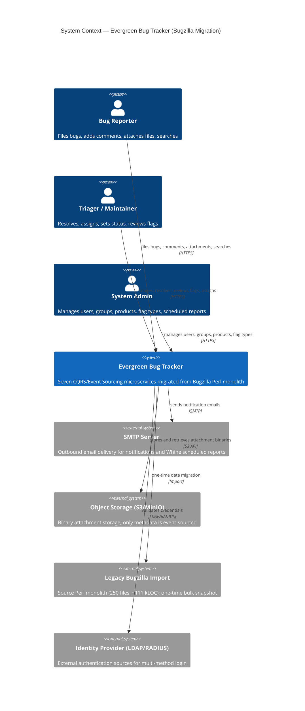

# C4 Level 1 — System Context

## Diagram

## Notes

- The system comprises seven bounded contexts decomposed from the Bugzilla monolith: bug, user, product, comment, attachment, search, and notification [source: output/phase-4-architecture/context-map.md:20].
- All inter-service communication uses the Published Language of domain events on RabbitMQ (OHS/PL pattern) [source: output/phase-4-architecture/context-map.md:89].
- Service-notification is a terminal consumer that sends emails via SMTP; it has no outbound domain events [source: output/phase-4-architecture/interaction-map.md:345].
- Binary attachments are stored in S3/MinIO while only metadata is event-sourced inside the AttachmentAggregate [source: output/phase-4-architecture/services/service-attachment.md:440].
- Multi-method authentication (DB, LDAP, RADIUS) is inherited from the Bugzilla `Bugzilla::Auth` stack [source: audit-output/cluster-inventory.md:55].

## Citations

- [source: output/phase-4-architecture/context-map.md:20]
- [source: output/phase-4-architecture/context-map.md:89]
- [source: output/phase-4-architecture/interaction-map.md:345]
- [source: output/phase-4-architecture/services/service-attachment.md:440]
- [source: audit-output/cluster-inventory.md:55]
