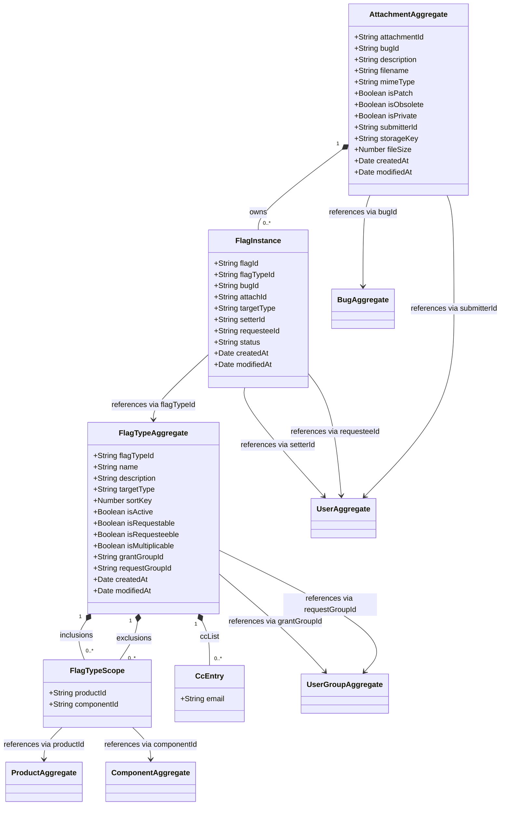

# Attachment — Domain Class Diagram

[source: output/phase-4-architecture/services/service-attachment.md]

## Aggregates

- **AttachmentAggregate** — root entity for the complete lifecycle of a single file attachment on a bug: creation, metadata mutation, obsolescence, deletion, and all flag instances attached to that attachment. Flag instances are child entities (not separate aggregates) so that the obsolete-cascade invariant can be enforced atomically within a single aggregate transaction. ID is `attachmentId` (string UUID). [source: output/phase-4-architecture/services/service-attachment.md:37]
- **FlagTypeAggregate** — root entity for the definition of a flag type (e.g., "review", "approval", "feedback") including attributes, applicability rules (inclusion/exclusion by product/component), and grant/request group permissions. ID is `flagTypeId` (string UUID). [source: output/phase-4-architecture/services/service-attachment.md:76]

## Child entities / value objects

- **FlagInstance** — child entity within AttachmentAggregate representing a single flag instance on an attachment (or bug, when `attachId` is null). Fields: `flagId`, `flagTypeId`, `bugId`, `attachId`, `targetType`, `setterId`, `requesteeId`, `status`, `createdAt`, `modifiedAt`. Status transitions follow the `?` → `+`/`-`/`X` state machine. [source: output/phase-4-architecture/services/service-attachment.md:64]
- **FlagTypeScope** — value object within FlagTypeAggregate representing a product/component combination for inclusion or exclusion rules. Fields: `productId` (null means any product), `componentId` (null means any component). [source: output/phase-4-architecture/services/service-attachment.md:96]
- **CcEntry** — value-object element of `ccList` on FlagTypeAggregate, representing an email address notified on flag changes. `ccList` is typed as `string[]` in the architecture doc; each entry is modeled as a CcEntry value object for diagram clarity. [source: output/phase-4-architecture/services/service-attachment.md:85]

## Cross-context foreign-key references

- `AttachmentAggregate.bugId → BugAggregate` [source: output/phase-4-architecture/services/service-attachment.md:44]
- `AttachmentAggregate.submitterId → UserAggregate` [source: output/phase-4-architecture/services/service-attachment.md:51]
- `FlagInstance.flagTypeId → FlagTypeAggregate` [source: output/phase-4-architecture/services/service-attachment.md:66]
- `FlagInstance.setterId → UserAggregate` [source: output/phase-4-architecture/services/service-attachment.md:70]
- `FlagInstance.requesteeId → UserAggregate` [source: output/phase-4-architecture/services/service-attachment.md:71]
- `FlagTypeScope.productId → ProductAggregate` [source: output/phase-4-architecture/services/service-attachment.md:97]
- `FlagTypeScope.componentId → ComponentAggregate` [source: output/phase-4-architecture/services/service-attachment.md:98]
- `FlagTypeAggregate.grantGroupId → UserGroupAggregate` [source: output/phase-4-architecture/services/service-attachment.md:92]
- `FlagTypeAggregate.requestGroupId → UserGroupAggregate` [source: output/phase-4-architecture/services/service-attachment.md:93]
