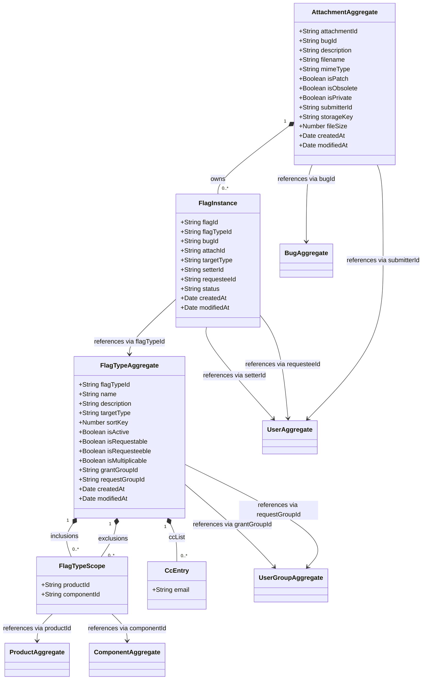

# Attachment — Domain Class Diagram

[source: output/phase-4-architecture/services/service-attachment.md]



## Aggregates

- **AttachmentAggregate** — root entity for the complete lifecycle of a single file attachment on a bug: creation, metadata mutation, obsolescence, deletion, and all flag instances attached to that attachment. Flag instances are child entities (not separate aggregates) so that the obsolete-cascade invariant can be enforced atomically within a single aggregate transaction. ID is `attachmentId` (string UUID). [source: output/phase-4-architecture/services/service-attachment.md:37]
- **FlagTypeAggregate** — root entity for the definition of a flag type (e.g., "review", "approval", "feedback") including attributes, applicability rules (inclusion/exclusion by product/component), and grant/request group permissions. ID is `flagTypeId` (string UUID). [source: output/phase-4-architecture/services/service-attachment.md:76]

## Child entities / value objects

- **FlagInstance** — child entity within AttachmentAggregate representing a single flag instance on an attachment (or bug, when `attachId` is null). Fields: `flagId`, `flagTypeId`, `bugId`, `attachId`, `targetType`, `setterId`, `requesteeId`, `status`, `createdAt`, `modifiedAt`. Status transitions follow the `?` → `+`/`-`/`X` state machine. [source: output/phase-4-architecture/services/service-attachment.md:64]
- **FlagTypeScope** — value object within FlagTypeAggregate representing a product/component combination for inclusion or exclusion rules. Fields: `productId` (null means any product), `componentId` (null means any component). [source: output/phase-4-architecture/services/service-attachment.md:96]
- **CcEntry** — value-object element of `ccList` on FlagTypeAggregate, representing an email address notified on flag changes. `ccList` is typed as `string[]` in the architecture doc; each entry is modeled as a CcEntry value object for diagram clarity. [source: output/phase-4-architecture/services/service-attachment.md:85]

## Cross-context foreign-key references

- `AttachmentAggregate.bugId → BugAggregate` [source: output/phase-4-architecture/services/service-attachment.md:44]
- `AttachmentAggregate.submitterId → UserAggregate` [source: output/phase-4-architecture/services/service-attachment.md:51]
- `FlagInstance.flagTypeId → FlagTypeAggregate` [source: output/phase-4-architecture/services/service-attachment.md:66]
- `FlagInstance.setterId → UserAggregate` [source: output/phase-4-architecture/services/service-attachment.md:70]
- `FlagInstance.requesteeId → UserAggregate` [source: output/phase-4-architecture/services/service-attachment.md:71]
- `FlagTypeScope.productId → ProductAggregate` [source: output/phase-4-architecture/services/service-attachment.md:97]
- `FlagTypeScope.componentId → ComponentAggregate` [source: output/phase-4-architecture/services/service-attachment.md:98]
- `FlagTypeAggregate.grantGroupId → UserGroupAggregate` [source: output/phase-4-architecture/services/service-attachment.md:92]
- `FlagTypeAggregate.requestGroupId → UserGroupAggregate` [source: output/phase-4-architecture/services/service-attachment.md:93]

## State Machines

### Attachment Lifecycle

An attachment moves through three lifecycle states (`Active`, `Obsolete`, `Deleted`). Obsolescence triggers the cascade-clear of all pending `?` flags on the attachment (BR-attachment-007), and an attachment may also be deleted directly from `Active` without ever passing through `Obsolete`.

```mermaid
stateDiagram-v2
  [*] --> Active : CreateAttachment (BR-attachment-ST-None-Active)
  Active --> Obsolete : MarkAttachmentObsolete (BR-attachment-ST-Active-Obsolete)
  Active --> Deleted : DeleteAttachment (BR-attachment-ST-Active-Deleted)
  Obsolete --> Deleted : DeleteAttachment (BR-attachment-ST-Obsolete-Deleted)
  Deleted --> [*]

  note right of Obsolete : Active → Obsolete cascades cancellation of every flag with status='?' on this attachment (BR-attachment-007, reason='obsolete-cascade'); flags with status '+' or '-' are unaffected.
```

[source: output/phase-4-architecture/services/service-attachment.md:320-329, decision-rules-slices/attachment.md BR-attachment-ST-None-Active, BR-attachment-ST-Active-Obsolete, BR-attachment-ST-Active-Deleted, BR-attachment-ST-Obsolete-Deleted, BR-attachment-007]

### Flag Instance Lifecycle

A `FlagInstance` (child entity of `AttachmentAggregate`) progresses through the request/grant/deny workflow `?` (requested) → `+` (granted) / `-` (denied), with `Cleared` as the terminal state (the cleared flag is removed from the aggregate). Granted (`+`) and denied (`-`) flags can be re-requested, returning the flag to `?`. The diagram uses readable identifiers: `Requested` for `?`, `Granted` for `+`, `Denied` for `-`, and `Cleared` for `X`/deleted.

```mermaid
stateDiagram-v2
  [*] --> Requested : SetAttachmentFlag/SetBugFlag status='?' (BR-attachment-ST-FlagNone-Requested)

  Requested : Requested (?)
  Granted : Granted (+)
  Denied : Denied (-)
  Cleared : Cleared (X / deleted, terminal)

  Requested --> Granted : grant — user in grantGroupId (BR-attachment-ST-FlagRequested-Granted)
  Requested --> Denied : deny — user in grantGroupId (BR-attachment-ST-FlagRequested-Denied)
  Requested --> Cleared : user clear or system cascade (BR-attachment-ST-FlagRequested-Cleared)
  Requested --> Requested : re-request with new requesteeId (setter NOT updated)

  Granted --> Requested : re-request — user in requestGroupId; setter updated (BR-attachment-ST-FlagGranted-Requested)
  Denied --> Requested : re-request — user in requestGroupId; setter updated (BR-attachment-ST-FlagDenied-Requested)

  Granted --> Cleared : clear (X) — original setter or grant/request group
  Denied --> Cleared : clear (X) — original setter or grant/request group

  Cleared --> [*]

  note right of Cleared : Requested → Cleared can be triggered by an attachment-obsolescence cascade (BR-attachment-007, reason='obsolete-cascade') or by a bug retarget (reason='retarget'), not just by an explicit user clear.
```

[source: output/phase-4-architecture/services/service-attachment.md:13, output/phase-4-architecture/services/service-attachment.md:279-318, decision-rules-slices/attachment.md BR-attachment-ST-FlagNone-Requested, BR-attachment-ST-FlagRequested-Granted, BR-attachment-ST-FlagRequested-Denied, BR-attachment-ST-FlagRequested-Cleared, BR-attachment-ST-FlagGranted-Requested, BR-attachment-ST-FlagDenied-Requested, BR-attachment-007]

