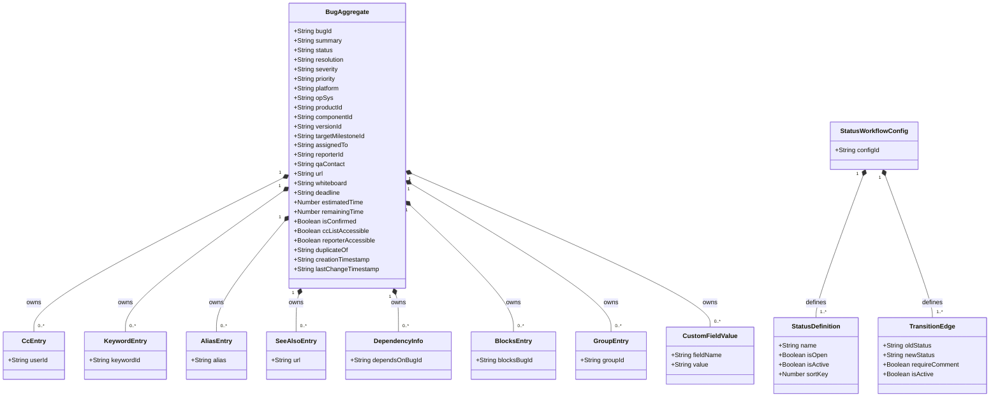

# Bug — Domain Class Diagram

[source: output/phase-4-architecture/services/service-bug.md]

## Aggregates

- **BugAggregate** — root entity for issue lifecycle. Owns all bug fields, status/resolution state machine, CC list, keywords, dependencies, custom fields, aliases, See Also URLs, group visibility restrictions, and time-tracking fields. ID: `bugId` (string UUID). [source: output/phase-4-architecture/services/service-bug.md:18]
- **StatusWorkflowConfig** — singleton configuration aggregate storing the global status workflow directed graph. ID: `configId` (string, singleton). Consulted by `TransitionBugStatus` command handlers. [source: output/phase-4-architecture/services/service-bug.md:40]

## Child entities / value objects

- **CcEntry** — value-object element of `ccList` (CC user IDs). One entry per user on the CC list. [source: output/phase-4-architecture/services/service-bug.md:75]
- **KeywordEntry** — value-object element of `keywords` (keyword IDs). One entry per keyword assigned to the bug. [source: output/phase-4-architecture/services/service-bug.md:76]
- **AliasEntry** — value-object element of `aliases` (human-readable alternate identifiers). Max 40 chars, not purely numeric, no commas/spaces, globally unique. [source: output/phase-4-architecture/services/service-bug.md:77]
- **SeeAlsoEntry** — value-object element of `seeAlsoUrls` (external URL references). [source: output/phase-4-architecture/services/service-bug.md:78]
- **DependencyInfo** — value-object element of `dependsOn` (bug IDs this bug depends on). Each entry references another BugAggregate ID. [source: output/phase-4-architecture/services/service-bug.md:79]
- **BlocksEntry** — value-object element of `blocks` (bug IDs that depend on this bug). Each entry references another BugAggregate ID. [source: output/phase-4-architecture/services/service-bug.md:80]
- **GroupEntry** — value-object element of `groupIds` (group IDs restricting bug visibility). Mandatory groups cannot be removed. [source: output/phase-4-architecture/services/service-bug.md:81]
- **CustomFieldValue** — value-object element of `customFields` map (dynamic custom field values keyed by field name). Supports freetext, single-select, multi-select, textarea, datetime, date, bug-id, and integer field types. [source: output/phase-4-architecture/services/service-bug.md:82]
- **StatusDefinition** — embedded value object within `StatusWorkflowConfig`. Holds `{ name, isOpen, isActive, sortKey }`. [source: output/phase-4-architecture/services/service-bug.md:95]
- **TransitionEdge** — embedded value object within `StatusWorkflowConfig`. Holds `{ oldStatus, newStatus, requireComment, isActive }`. `oldStatus: null` means available at bug creation time. [source: output/phase-4-architecture/services/service-bug.md:96]

## Cross-context foreign-key references

- `BugAggregate.productId → ProductAggregate` [source: output/phase-4-architecture/services/service-bug.md:57]
- `BugAggregate.componentId → ComponentAggregate` [source: output/phase-4-architecture/services/service-bug.md:58]
- `BugAggregate.versionId → VersionAggregate` [source: output/phase-4-architecture/services/service-bug.md:59]
- `BugAggregate.targetMilestoneId → MilestoneAggregate` [source: output/phase-4-architecture/services/service-bug.md:60]
- `BugAggregate.assignedTo → UserAggregate` [source: output/phase-4-architecture/services/service-bug.md:61]
- `BugAggregate.reporterId → UserAggregate` [source: output/phase-4-architecture/services/service-bug.md:62]
- `BugAggregate.qaContact → UserAggregate` [source: output/phase-4-architecture/services/service-bug.md:63]
