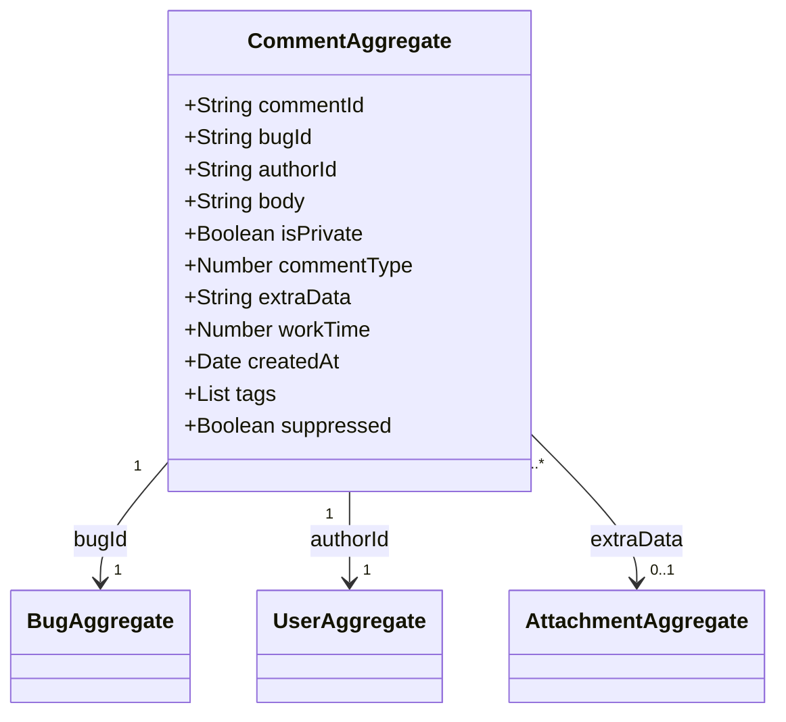

# Service Comment — Domain Class Diagram

[source: output/phase-4-architecture/services/service-comment.md]

## Aggregates

- **CommentAggregate** — root entity for the append-only comment lifecycle: creation with body/privacy/type/tags, privacy toggling, tag add/remove mutations, and administrative suppression. The only aggregate in this service. [source: output/phase-4-architecture/services/service-comment.md:18]

  State fields: `commentId`, `bugId`, `authorId`, `body` (max 65 535 chars), `isPrivate`, `commentType` (enum: NORMAL=0, DUPE_OF=1, HAS_DUPE=2, ATTACHMENT_CREATED=5, ATTACHMENT_UPDATED=6), `extraData` (nullable string/int — type-specific payload), `workTime` (nullable decimal — hours), `tags` (string array, sorted alphabetically, case-insensitive matching), `createdAt` (timestamp), `suppressed` (boolean, default false). [source: output/phase-4-architecture/services/service-comment.md:25]

  The aggregate is append-only — no edit or delete commands exist. Only `isPrivate` and `tags` are mutable after creation. [source: output/phase-4-architecture/services/service-comment.md:24]

## Child entities / value objects

No child entities or value objects are defined within the CommentAggregate boundary. The `tags` field is modeled as a flat `List` of strings (sorted alphabetically with case-insensitive deduplication) rather than as a separate CommentTag value object. The `extraData` field is a nullable scalar (string or number) carrying type-specific payloads inline — it is not decomposed into child value objects. [source: output/phase-4-architecture/services/service-comment.md:25]

## Cross-context foreign-key references

- `CommentAggregate.bugId → BugAggregate` — references the parent bug in `service-bug`. Validated synchronously during `CreateComment` to confirm bug existence and resolve the bug's product for authorization. [source: output/phase-4-architecture/services/service-comment.md:255]
- `CommentAggregate.authorId → UserAggregate` — references the user who authored the comment in `service-user`. Set at creation and immutable. User group membership (insider, comment_taggers_group) is resolved against `service-user` for policy enforcement. [source: output/phase-4-architecture/services/service-comment.md:256]
- `CommentAggregate.extraData → AttachmentAggregate` — for system comments of type 5 (ATTACHMENT_CREATED) and type 6 (ATTACHMENT_UPDATED), `extraData` carries an attachment ID referencing an aggregate in `service-attachment`. This is an indirect FK through a polymorphic field — `extraData` stores other payloads (duplicateBugId, originalBugId) for other comment types. [source: output/phase-4-architecture/services/service-comment.md:240]
