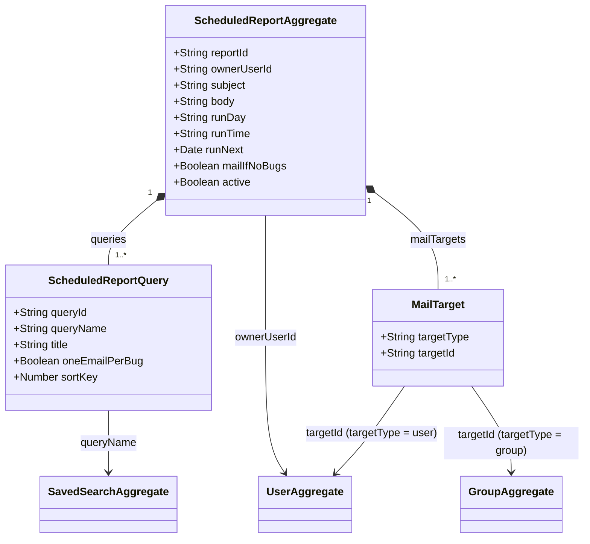

# Domain Class Diagram — notification

## Aggregates

### ScheduledReportAggregate

The sole event-sourced aggregate root in service-notification, decorated `@Aggregate('ScheduledReport')`. Each instance represents one user-owned Whine scheduled report — a recurring email report that runs saved searches and delivers matching bugs as digest or per-bug emails.

| Field | Type | Description |
|-------|------|-------------|
| `reportId` | `String` | UUID identity for this scheduled report [source: output/phase-4-architecture/services/service-notification.md:370] |
| `ownerUserId` | `String` | The user who created the report [source: output/phase-4-architecture/services/service-notification.md:371] |
| `subject` | `String` | Email subject template [source: output/phase-4-architecture/services/service-notification.md:374] |
| `body` | `String` | Email body template (Handlebars) [source: output/phase-4-architecture/services/service-notification.md:375] |
| `runDay` | `String` | Day pattern (e.g., `*`, `1,15`, `Mon`) [source: output/phase-4-architecture/services/service-notification.md:378] |
| `runTime` | `String` | Time pattern (e.g., `08:00`, `*/2`) [source: output/phase-4-architecture/services/service-notification.md:379] |
| `runNext` | `Date` | Next scheduled execution timestamp [source: output/phase-4-architecture/services/service-notification.md:380] |
| `mailIfNoBugs` | `Boolean` | Whether to email when queries return no results [source: output/phase-4-architecture/services/service-notification.md:381] |
| `queries` | `List` | Ordered list of saved-search bindings (`ScheduledReportQuery[]`) [source: output/phase-4-architecture/services/service-notification.md:384] |
| `mailTargets` | `List` | Users or groups who receive the report (`MailTarget[]`) [source: output/phase-4-architecture/services/service-notification.md:387] |
| `active` | `Boolean` | Whether the report is active (soft-delete flag) [source: output/phase-4-architecture/services/service-notification.md:390] |

**Lifecycle**: Created via `CreateScheduledReport` → Active. Can be updated (`UpdateScheduledReport`) while active. Scheduler records execution internally (`ScheduledReportExecuted`) to advance `runNext`. Deleted via `DeleteScheduledReport` → Deleted (terminal). The aggregate does not publish events to the message bus; all lifecycle events are internal-only [source: output/phase-4-architecture/services/service-notification.md:13] [source: output/phase-5-specification/specs/service-notification/SERVICE_SPEC.md:81].

**Invariants** (enforced while in Active state):
- Must have at least one query binding and at least one mail target [source: output/phase-5-specification/specs/service-notification/SERVICE_SPEC.md:210].
- `runNext` must always be recomputed when the schedule pattern changes or a scheduled execution completes [source: output/phase-5-specification/specs/service-notification/SERVICE_SPEC.md:211].
- Only the owner user can transition to Updated or Deleted states [source: output/phase-5-specification/specs/service-notification/SERVICE_SPEC.md:212].

## Child entities / value objects

### ScheduledReportQuery

A value object representing one saved-search binding within a scheduled report. Each query references a saved search by name, provides a display title for the report section, and controls whether results are delivered as one email per bug or as a single digest.

| Field | Type | Description |
|-------|------|-------------|
| `queryId` | `String` | References a saved search by name [source: output/phase-4-architecture/services/service-notification.md:398] |
| `queryName` | `String` | The saved search name (from service-search) [source: output/phase-4-architecture/services/service-notification.md:399] |
| `title` | `String` | Display title for this query's section in the report [source: output/phase-4-architecture/services/service-notification.md:400] |
| `oneEmailPerBug` | `Boolean` | If true, send individual emails per bug; if false, send digest [source: output/phase-4-architecture/services/service-notification.md:401] |
| `sortKey` | `Number` | Display order [source: output/phase-4-architecture/services/service-notification.md:402] |

**Cardinality**: Each `ScheduledReportAggregate` owns `1..*` `ScheduledReportQuery` instances (composition — queries cannot exist without their parent report) [source: output/phase-4-architecture/services/service-notification.md:384].

### MailTarget

A value object representing one recipient of a scheduled report. A target can be either an individual user or a group (expanded to individual members at execution time).

| Field | Type | Description |
|-------|------|-------------|
| `targetType` | `String` | Either `"user"` or `"group"` [source: output/phase-4-architecture/services/service-notification.md:406] |
| `targetId` | `String` | userId or groupId [source: output/phase-4-architecture/services/service-notification.md:407] |

**Cardinality**: Each `ScheduledReportAggregate` owns `1..*` `MailTarget` instances (composition — targets cannot exist without their parent report) [source: output/phase-4-architecture/services/service-notification.md:387].

## Cross-context foreign-key references

service-notification is a **Conformist** (terminal event consumer per ADR-006): it subscribes to domain events from service-bug, service-comment, service-attachment, and service-user but publishes no domain events itself [source: output/phase-4-architecture/services/service-notification.md:4] [source: output/phase-5-specification/specs/service-notification/SERVICE_SPEC.md:5].

| Field | On Entity | Points To | Context | Notes |
|-------|-----------|-----------|---------|-------|
| `ownerUserId` | `ScheduledReportAggregate` | `UserAggregate` | service-user | The user who created and owns the report [source: output/phase-4-architecture/services/service-notification.md:371] |
| `targetId` (when `targetType = "user"`) | `MailTarget` | `UserAggregate` | service-user | Individual user recipient of a scheduled report [source: output/phase-4-architecture/services/service-notification.md:406-407] [source: output/phase-5-specification/specs/service-notification/SERVICE_SPEC.md:27] |
| `targetId` (when `targetType = "group"`) | `MailTarget` | `GroupAggregate` | service-user | Group recipient, expanded to individual members at execution time [source: output/phase-4-architecture/services/service-notification.md:406-407] [source: output/phase-5-specification/specs/service-notification/SERVICE_SPEC.md:27] |
| `queryName` | `ScheduledReportQuery` | `SavedSearchAggregate` | service-search | References a saved search by name; the Whine scheduler issues `GetSavedSearchResults` to service-search at execution time [source: output/phase-4-architecture/services/service-notification.md:399] [source: output/phase-5-specification/specs/service-notification/SERVICE_SPEC.md:27] |

**Note on event-payload FKs**: The subscription handlers that process real-time notifications receive event payloads containing `reporterId`, `assigneeId`, `qaContactId`, `ccUserIds`, `bugId`, `changerUserId`, and `groupIds` from source services. These are **not** stored on the ScheduledReportAggregate — they exist only in transient event payloads and are used to compute recipients and render emails within the stateless notification pipeline. The only stateful FKs in this service are those listed above on the aggregate and its child entities.
