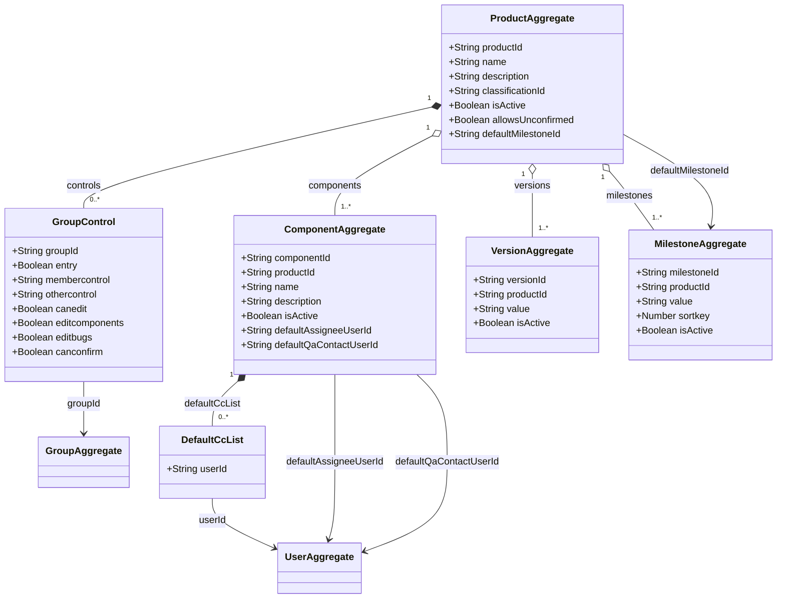

# Domain Class Diagram — product

> **Note**: `GroupAggregate` and `UserAggregate` are owned by **service-user** (external context). They appear here only as directed-association (`-->`) targets to indicate foreign-key references.

---

## Aggregates

### ProductAggregate

The primary structural entity. Owns product identity, active state, classification membership, the `allowsUnconfirmed` flag, the default milestone reference, and the group-control permission matrix. Acts as the saga coordinator during creation. [source: output/phase-4-architecture/services/service-product.md:21]

**State fields**:

| Field | Mermaid type | Notes | Source |
|-------|-------------|-------|--------|
| `productId` | `String` | Aggregate ID (UUID) | [source: output/phase-4-architecture/services/service-product.md:27] |
| `name` | `String` | Unique, case-insensitive, max `MAX_PRODUCT_SIZE` | [source: output/phase-4-architecture/services/service-product.md:28] |
| `description` | `String` | Required, non-blank | [source: output/phase-4-architecture/services/service-product.md:29] |
| `classificationId` | `String` | FK-style reference; default `'1'` (default classification) | [source: output/phase-4-architecture/services/service-product.md:30] |
| `isActive` | `Boolean` | Soft-active toggle | [source: output/phase-4-architecture/services/service-product.md:31] |
| `allowsUnconfirmed` | `Boolean` | Whether `UNCONFIRMED` status is legal for bugs in this product | [source: output/phase-4-architecture/services/service-product.md:32] |
| `defaultMilestoneId` | `String` | UUID reference to the default milestone aggregate (not a denormalized string per Q8); initially `null` during saga | [source: output/phase-4-architecture/services/service-product.md:33] |

### ComponentAggregate

Owns a component within a product — its name, default assignee, default QA contact, description, active state, and default CC list. `productId` is immutable after creation. [source: output/phase-4-architecture/services/service-product.md:42]

**State fields**:

| Field | Mermaid type | Notes | Source |
|-------|-------------|-------|--------|
| `componentId` | `String` | Aggregate ID (UUID) | [source: output/phase-4-architecture/services/service-product.md:48] |
| `productId` | `String` | Owning product (immutable after creation) | [source: output/phase-4-architecture/services/service-product.md:49] |
| `name` | `String` | Unique within product | [source: output/phase-4-architecture/services/service-product.md:50] |
| `description` | `String` | Required, non-blank | [source: output/phase-4-architecture/services/service-product.md:51] |
| `isActive` | `Boolean` | Soft-active toggle | [source: output/phase-4-architecture/services/service-product.md:52] |
| `defaultAssigneeUserId` | `String` | User ID (required) | [source: output/phase-4-architecture/services/service-product.md:53] |
| `defaultQaContactUserId` | `String` | User ID (optional, gated by `useqacontact` param) | [source: output/phase-4-architecture/services/service-product.md:54] |
| `defaultCcList` | `List` | Array of user IDs — rendered as child class `DefaultCcList` in diagram | [source: output/phase-4-architecture/services/service-product.md:55] |

### VersionAggregate

Owns a version label within a product. Because references are ID-based (Q8), renaming a version does NOT cascade updates to bugs — the read model resolves the name at query time. [source: output/phase-4-architecture/services/service-product.md:64]

**State fields**:

| Field | Mermaid type | Notes | Source |
|-------|-------------|-------|--------|
| `versionId` | `String` | Aggregate ID (UUID) | [source: output/phase-4-architecture/services/service-product.md:70] |
| `productId` | `String` | Owning product (immutable) | [source: output/phase-4-architecture/services/service-product.md:71] |
| `value` | `String` | The version string (e.g. `"1.0"`, `"unspecified"`); unique per product | [source: output/phase-4-architecture/services/service-product.md:72] |
| `isActive` | `Boolean` | Soft-active toggle | [source: output/phase-4-architecture/services/service-product.md:73] |

### MilestoneAggregate

Owns a milestone within a product. ID-based references (Q8) eliminate rename propagation to bugs. [source: output/phase-4-architecture/services/service-product.md:81]

**State fields**:

| Field | Mermaid type | Notes | Source |
|-------|-------------|-------|--------|
| `milestoneId` | `String` | Aggregate ID (UUID) | [source: output/phase-4-architecture/services/service-product.md:87] |
| `productId` | `String` | Owning product (immutable) | [source: output/phase-4-architecture/services/service-product.md:88] |
| `value` | `String` | The milestone name; unique per product | [source: output/phase-4-architecture/services/service-product.md:89] |
| `sortkey` | `Number` | Signed integer for display ordering | [source: output/phase-4-architecture/services/service-product.md:90] |
| `isActive` | `Boolean` | Soft-active toggle | [source: output/phase-4-architecture/services/service-product.md:91] |

---

## Child entities / value objects

### GroupControl (value object, composed on ProductAggregate)

Per-group permission entry within the product's group control map. Updated atomically via the `UpdateGroupControls` command, which validates the `membercontrol`/`othercontrol` legality matrix before applying and replaces the full set of entries for the product. [source: output/phase-4-architecture/services/service-product.md:123]

**Fields** (each entry in the `controls` array passed to `UpdateGroupControls`):

| Field | Mermaid type | Notes | Source |
|-------|-------------|-------|--------|
| `groupId` | `String` | References a group in service-user (cross-context FK) | [source: output/phase-5-specification/specs/service-product/SERVICE_SPEC.md:98] |
| `entry` | `Boolean` | Whether this group controls bug-filing access | [source: output/phase-5-specification/specs/service-product/SERVICE_SPEC.md:98] |
| `membercontrol` | `String` | Enum: NA / SHOWN / DEFAULT / MANDATORY | [source: output/phase-4-architecture/services/service-product.md:285] |
| `othercontrol` | `String` | Enum: NA / SHOWN / DEFAULT / MANDATORY (must be ≤ membercontrol) | [source: output/phase-4-architecture/services/service-product.md:286] |
| `canedit` | `Boolean` | Whether group members can edit | [source: output/phase-4-architecture/services/service-product.md:287] |
| `editcomponents` | `Boolean` | Whether group members can edit components | [source: output/phase-4-architecture/services/service-product.md:288] |
| `editbugs` | `Boolean` | Whether group members can edit bugs | [source: output/phase-4-architecture/services/service-product.md:289] |
| `canconfirm` | `Boolean` | Whether group members can confirm bugs | [source: output/phase-4-architecture/services/service-product.md:290] |

**Cardinality**: `0..*` — group controls are optional (step 6 of the Product Creation Saga is conditional on `makeproductgroups` param). [source: output/phase-4-architecture/services/service-product.md:377]

**Composition edge** (`*--`): GroupControl entries cannot exist without their parent ProductAggregate; they are created and deleted only through `UpdateGroupControls` on the product.

### DefaultCcList (value object, composed on ComponentAggregate)

Represents an individual user ID entry in a component's default CC list. Modeled as a child class to avoid `List<String>` generics inside the `ComponentAggregate` class block. [source: output/phase-4-architecture/services/service-product.md:55]

| Field | Mermaid type | Notes | Source |
|-------|-------------|-------|--------|
| `userId` | `String` | A single user ID in the CC list | [source: output/phase-4-architecture/services/service-product.md:55] |

**Cardinality**: `0..*` — the CC list is optional and may be empty.

**Composition edge** (`*--`): CC list entries are part of the component's state and cannot exist independently.

---

## Cross-context foreign-key references

These fields on aggregates within service-product point at aggregates owned by other services. The synthesizer harvests this section to build the global `cross-context.md`.

| Aggregate | Field | Target aggregate | Target service | Edge style | Source |
|-----------|-------|-----------------|---------------|-----------|--------|
| GroupControl (on ProductAggregate) | `groupId` | `GroupAggregate` | service-user | `-->` (directed) | [source: output/phase-4-architecture/services/service-product.md:283] |
| ComponentAggregate | `defaultAssigneeUserId` | `UserAggregate` | service-user | `-->` (directed) | [source: output/phase-4-architecture/services/service-product.md:53] |
| ComponentAggregate | `defaultQaContactUserId` | `UserAggregate` | service-user | `-->` (directed) | [source: output/phase-4-architecture/services/service-product.md:54] |
| DefaultCcList (on ComponentAggregate) | `userId` | `UserAggregate` | service-user | `-->` (directed) | [source: output/phase-4-architecture/services/service-product.md:55] |

**Rationale for directed-association (`-->`)**: These are foreign-key references only — service-product does not own or load the target aggregates. It validates existence at command time via read models projected from the owning service's events. [source: output/phase-5-specification/specs/service-product/SERVICE_SPEC.md:458]

### Intra-service references (not cross-context)

The following FK-style references stay within service-product and are **not** cross-context:

- `ComponentAggregate.productId` → `ProductAggregate` (aggregation `o--`, same service) [source: output/phase-4-architecture/services/service-product.md:49]
- `VersionAggregate.productId` → `ProductAggregate` (aggregation `o--`, same service) [source: output/phase-4-architecture/services/service-product.md:71]
- `MilestoneAggregate.productId` → `ProductAggregate` (aggregation `o--`, same service) [source: output/phase-4-architecture/services/service-product.md:88]
- `ProductAggregate.defaultMilestoneId` → `MilestoneAggregate` (directed `-->`, same service) [source: output/phase-4-architecture/services/service-product.md:33]
- `ProductAggregate.classificationId` → Classification CRUD entity (same service) [source: output/phase-4-architecture/services/service-product.md:30]
