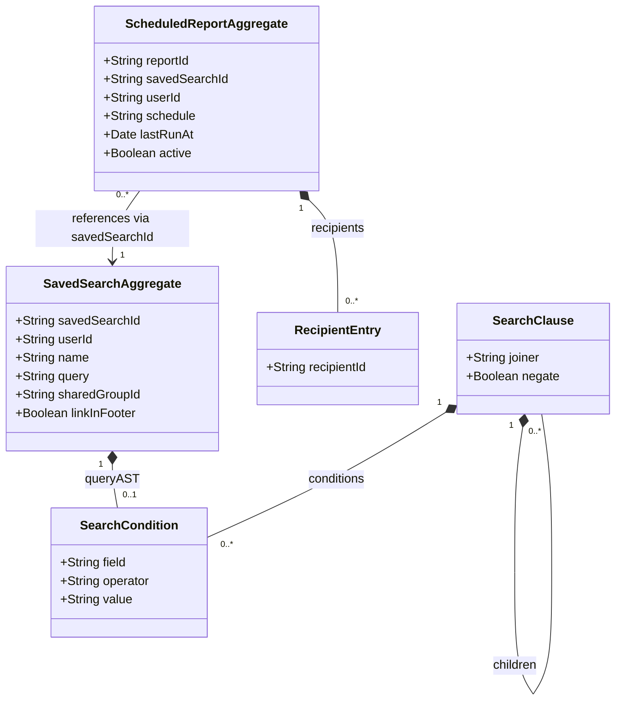

# Search — Domain Class Diagram

[source: output/phase-4-architecture/services/service-search.md]

## Aggregates

- **SavedSearchAggregate** — root entity for named query storage with sharing via groups and footer linking. CRUD-mode aggregate, not event-sourced (Q16). ID is `savedSearchId` (string UUID). [source: output/phase-4-architecture/services/service-search.md:20]
- **ScheduledReportAggregate** — root entity for scheduled email reports based on saved searches (the Whine system). Event-sourced because schedule changes and delivery history are meaningful state transitions. ID is `reportId` (string UUID). [source: output/phase-4-architecture/services/service-search.md:30]

## Child entities / value objects

- **RecipientEntry** — value-object element of `recipients` array on ScheduledReportAggregate. Each entry holds a userId or group ID string. Extracted as a child class because the `recipients` field is typed as "array of userIds or group IDs" which maps to a `List` of child entities. [source: output/phase-4-architecture/services/service-search.md:37]
- **SearchCondition** — value object representing a single boolean chart condition (`field`, `operator`, `value`). Part of the query AST tree used by the search engine's `boolean-chart-ast.ts` module. [source: output/phase-4-architecture/services/service-search.md:377]
- **SearchClause** — value object representing a clause group in the boolean chart AST, with `joiner` (`AND`/`OR`), `negate` flag, and recursive `children` of `SearchClause | SearchCondition`. [source: output/phase-4-architecture/services/service-search.md:383]

## Cross-context foreign-key references

- `SavedSearchAggregate.userId → UserAggregate (user context)` [source: output/phase-4-architecture/services/service-search.md:27]
- `SavedSearchAggregate.sharedGroupId → GroupAggregate (user context)` [source: output/phase-4-architecture/services/service-search.md:27]
- `ScheduledReportAggregate.userId → UserAggregate (user context)` [source: output/phase-4-architecture/services/service-search.md:37]
- `ScheduledReportAggregate.savedSearchId → SavedSearchAggregate (search context, intra-service)` [source: output/phase-4-architecture/services/service-search.md:37]
