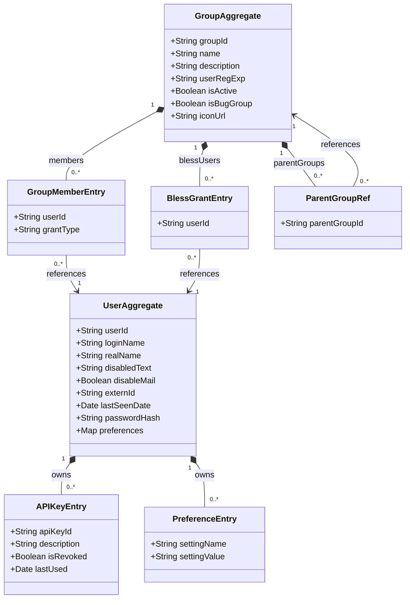

# User — Domain Class Diagram

[source: output/phase-4-architecture/services/service-user.md]

## Aggregates

- **UserAggregate** — root entity for the complete account lifecycle of a Bugzilla user: creation, profile updates, enable/disable, password management, email changes, and API key management. Surrogate `userId` (UUID) as aggregate ID. [source: output/phase-4-architecture/services/service-user.md:31]
- **GroupAggregate** — root entity for group definition, membership (direct + regex-derived), inheritance DAG, and bless/visible grant management. [source: output/phase-4-architecture/services/service-user.md:51]

## Child entities / value objects

### UserAggregate children

- **APIKeyEntry** — value object representing an API key owned by the user. Fields: `apiKeyId`, `description`, `isRevoked`, `lastUsed`. Created via `CreateAPIKey` command; revoked via `RevokeAPIKey`. Unscoped for v1 (inherits full user permissions). [source: output/phase-4-architecture/services/service-user.md:84]
  - `apiKeyId: String` — unique key identifier. [source: output/phase-4-architecture/services/service-user.md:188]
  - `description: String` — human-readable label. [source: output/phase-4-architecture/services/service-user.md:190]
  - `isRevoked: Boolean` — true after `RevokeAPIKey`. [source: output/phase-4-architecture/services/service-user.md:191]
  - `lastUsed: Date` — updated on successful API key auth (direct write, not event-driven). [source: output/phase-4-architecture/services/service-user.md:192]

- **PreferenceEntry** — value object representing a single per-user preference override from the `preferences: Map<string, string>` field. Materialized as key-value pairs via `UpdateUserSetting` command. [source: output/phase-4-architecture/services/service-user.md:43]
  - `settingName: String` — preference key. [source: output/phase-4-architecture/services/service-user.md:199]
  - `settingValue: String` — preference value. [source: output/phase-4-architecture/services/service-user.md:200]

### GroupAggregate children

- **GroupMemberEntry** — value object for a single group membership entry within `members`. Each entry carries a `userId` and a `grantType` of `DIRECT` (explicitly assigned) or `REGEXP` (auto-derived from `userRegExp`). [source: output/phase-4-architecture/services/service-user.md:62]
  - `userId: String` — FK reference to `UserAggregate`. [source: output/phase-4-architecture/services/service-user.md:62]
  - `grantType: String` — `DIRECT` or `REGEXP`. [source: output/phase-4-architecture/services/service-user.md:130]

- **BlessGrantEntry** — value object for a single entry in `blessUsers`, representing a user who can add/remove members from this group. [source: output/phase-4-architecture/services/service-user.md:63]
  - `userId: String` — FK reference to `UserAggregate`. [source: output/phase-4-architecture/services/service-user.md:63]

- **ParentGroupRef** — value object for a single entry in `parentGroups`, representing a group inheritance link. The inheritance DAG must be acyclic (enforced on `AddGroupInheritance`). [source: output/phase-4-architecture/services/service-user.md:64]
  - `parentGroupId: String` — FK reference to another `GroupAggregate`. [source: output/phase-4-architecture/services/service-user.md:64]

## Cross-context foreign-key references

No cross-context FKs. Service-user holds no foreign-key fields pointing to aggregates in other services. All cross-service interaction is event-driven (consumes `product.Events.ProductCreated` only). Service-user is the upstream context — other services hold FKs pointing here (e.g., `BugAggregate.reporterId → UserAggregate`, `BugAggregate.assignedTo → UserAggregate`). [source: output/phase-4-architecture/services/service-user.md:398]
