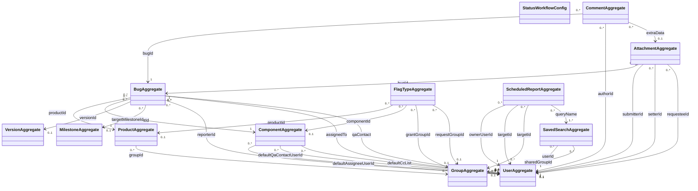

# Cross-Context Foreign-Key Diagram

Synthesised from the per-slice `class-*.md` files under `audit-output/domain-model/`.

## Aggregate Roots by Bounded Context

| Service | Aggregate Roots |
|---------|----------------|
| service-bug | BugAggregate, StatusWorkflowConfig |
| service-user | UserAggregate, GroupAggregate |
| service-product | ProductAggregate, ComponentAggregate, VersionAggregate, MilestoneAggregate |
| service-comment | CommentAggregate |
| service-attachment | AttachmentAggregate, FlagTypeAggregate |
| service-search | SavedSearchAggregate |
| service-notification | ScheduledReportAggregate |

## Mermaid Diagram

## Edge Inventory

Every edge in the diagram is traced to the slicer's cross-context FK section.

| Source Aggregate | FK Field | Target Aggregate | Source Service | Target Service | Citation |
|-----------------|----------|-----------------|---------------|---------------|----------|
| BugAggregate | `productId` | ProductAggregate | service-bug | service-product | [source: audit-output/domain-model/class-bug.md] |
| BugAggregate | `componentId` | ComponentAggregate | service-bug | service-product | [source: audit-output/domain-model/class-bug.md] |
| BugAggregate | `versionId` | VersionAggregate | service-bug | service-product | [source: audit-output/domain-model/class-bug.md] |
| BugAggregate | `targetMilestoneId` | MilestoneAggregate | service-bug | service-product | [source: audit-output/domain-model/class-bug.md] |
| BugAggregate | `reporterId` | UserAggregate | service-bug | service-user | [source: audit-output/domain-model/class-bug.md] |
| BugAggregate | `assignedTo` | UserAggregate | service-bug | service-user | [source: audit-output/domain-model/class-bug.md] |
| BugAggregate | `qaContact` | UserAggregate | service-bug | service-user | [source: audit-output/domain-model/class-bug.md] |
| CommentAggregate | `bugId` | BugAggregate | service-comment | service-bug | [source: audit-output/domain-model/class-comment.md] |
| CommentAggregate | `authorId` | UserAggregate | service-comment | service-user | [source: audit-output/domain-model/class-comment.md] |
| CommentAggregate | `extraData` | AttachmentAggregate | service-comment | service-attachment | [source: audit-output/domain-model/class-comment.md] |
| AttachmentAggregate | `bugId` | BugAggregate | service-attachment | service-bug | [source: audit-output/domain-model/class-attachment.md] |
| AttachmentAggregate | `submitterId` | UserAggregate | service-attachment | service-user | [source: audit-output/domain-model/class-attachment.md] |
| AttachmentAggregate | `setterId` (via FlagInstance) | UserAggregate | service-attachment | service-user | [source: audit-output/domain-model/class-attachment.md] |
| AttachmentAggregate | `requesteeId` (via FlagInstance) | UserAggregate | service-attachment | service-user | [source: audit-output/domain-model/class-attachment.md] |
| FlagTypeAggregate | `productId` (via FlagTypeScope) | ProductAggregate | service-attachment | service-product | [source: audit-output/domain-model/class-attachment.md] |
| FlagTypeAggregate | `componentId` (via FlagTypeScope) | ComponentAggregate | service-attachment | service-product | [source: audit-output/domain-model/class-attachment.md] |
| FlagTypeAggregate | `grantGroupId` | GroupAggregate | service-attachment | service-user | [source: audit-output/domain-model/class-attachment.md] |
| FlagTypeAggregate | `requestGroupId` | GroupAggregate | service-attachment | service-user | [source: audit-output/domain-model/class-attachment.md] |
| ProductAggregate | `groupId` (via GroupControl) | GroupAggregate | service-product | service-user | [source: audit-output/domain-model/class-product.md] |
| ComponentAggregate | `defaultAssigneeUserId` | UserAggregate | service-product | service-user | [source: audit-output/domain-model/class-product.md] |
| ComponentAggregate | `defaultQaContactUserId` | UserAggregate | service-product | service-user | [source: audit-output/domain-model/class-product.md] |
| ComponentAggregate | `userId` (via DefaultCcList) | UserAggregate | service-product | service-user | [source: audit-output/domain-model/class-product.md] |
| SavedSearchAggregate | `userId` | UserAggregate | service-search | service-user | [source: audit-output/domain-model/class-search.md] |
| SavedSearchAggregate | `sharedGroupId` | GroupAggregate | service-search | service-user | [source: audit-output/domain-model/class-search.md] |
| ScheduledReportAggregate | `ownerUserId` | UserAggregate | service-notification | service-user | [source: audit-output/domain-model/class-notification.md] |
| ScheduledReportAggregate | `targetId` (user) (via MailTarget) | UserAggregate | service-notification | service-user | [source: audit-output/domain-model/class-notification.md] |
| ScheduledReportAggregate | `targetId` (group) (via MailTarget) | GroupAggregate | service-notification | service-user | [source: audit-output/domain-model/class-notification.md] |
| ScheduledReportAggregate | `queryName` (via ScheduledReportQuery) | SavedSearchAggregate | service-notification | service-search | [source: audit-output/domain-model/class-notification.md] |

## Naming Conflicts

### UserGroupAggregate vs GroupAggregate

The attachment slicer uses `UserGroupAggregate` for the target of `grantGroupId` and `requestGroupId` [source: audit-output/domain-model/class-attachment.md], while the user slicer defines the aggregate as `GroupAggregate` [source: audit-output/domain-model/class-user.md]. The diagram above normalises to **GroupAggregate** (the name chosen by the owning service), but the attachment slicer's original naming is preserved in the Edge Inventory table.

## Boundary Disputes

### ScheduledReportAggregate: service-notification vs service-search

The manifest narrative assigns scheduled reports (the Whine system) to **service-notification**: "Notification (service-notification) owns email delivery and scheduled reports." The class-notification.md slicer models `ScheduledReportAggregate` as the sole aggregate root of service-notification [source: audit-output/domain-model/class-notification.md].

However, class-search.md also models a `ScheduledReportAggregate` with fields `reportId`, `savedSearchId`, `userId`, `schedule`, `lastRunAt`, `active` [source: audit-output/domain-model/class-search.md]. The search slicer includes its own `ScheduledReportAggregate` with cross-context FKs to UserAggregate.

The manifest is authoritative: **ScheduledReportAggregate belongs to service-notification**. The search slicer's duplicate is likely an artefact of the Whine system's close coupling to saved searches. The diagram above uses the notification placement. The service-search domain owns only `SavedSearchAggregate`.

### StatusWorkflowConfig: no cross-context edges

StatusWorkflowConfig (service-bug) has no FK references to other services and therefore does not appear as a source or target in the diagram. It is listed in the aggregate roots table for completeness.
