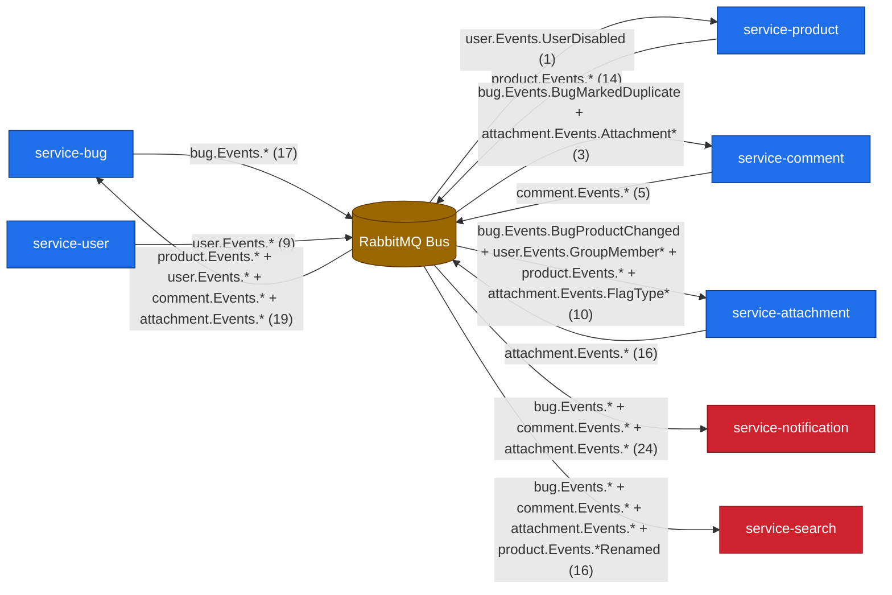
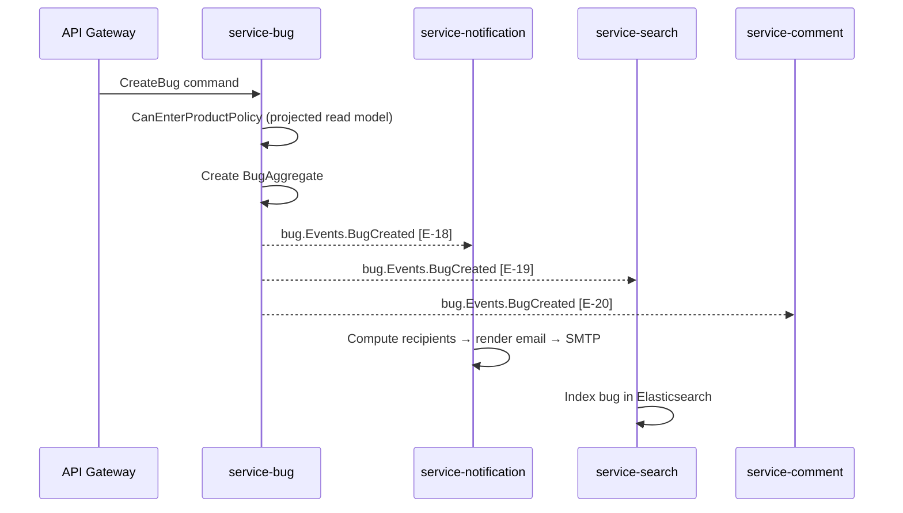
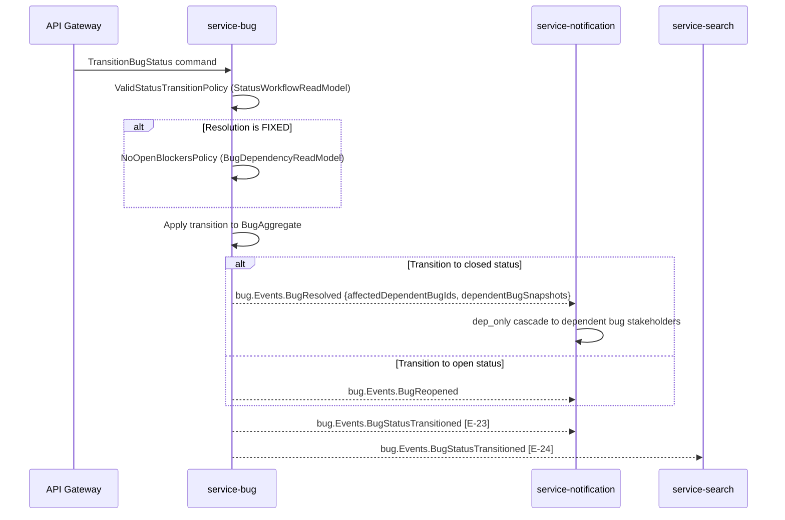
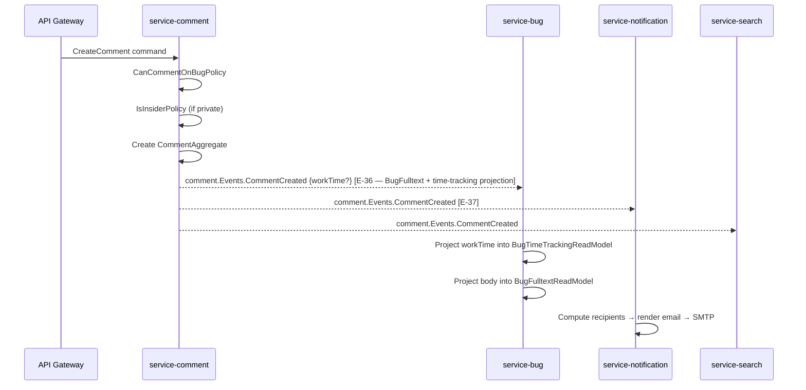
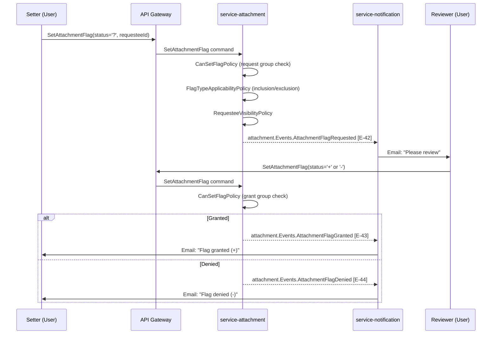

# Integration Surface

> Audit item #9. Combines architecture-phase cross-service contracts with
> exploration-phase external integrations and discovery-tree spot-checks.
> Every entry cites a source.

---

## Inbound Integrations

### Web Browsers via REST API

- **Transport / protocol**: HTTPS, JSON over HTTP. Path-based routing with regex matching per resource. [source: discovery/bugzilla/Bugzilla/WebService/Server/REST/Resources/Bug.pm:21-153]
- **Authentication**: Bugzilla cookie-based session (`logincookies` table), API key (`user_api_keys` table, passed as `Bugzilla_api_key` header or query param), or HTTP Basic. GET requests reject cookie auth to prevent CSRF. [source: output/phase-2-exploration/exploration.md:266] [source: discovery/bugzilla/Bugzilla/WebService/Server/REST.pm:194]
- **Wire format**: REST URL shape `/rest/<resource>/<id>` with JSON request/response bodies. Field filtering via `include_fields` / `exclude_fields` query parameters. [source: discovery/bugzilla/Bugzilla/WebService/Bug.pm:499-500]
- **Rate limiting / abuse controls**: IP-based login lockout (≥5 failures within 30 minutes). No general API rate limiting in source. [source: output/phase-2-exploration/exploration.md:266]
- **Source**: [source: output/phase-2-exploration/exploration.md:263-267] [source: discovery/bugzilla/Bugzilla/WebService/Server/REST.pm:8-32]

### Programmatic Clients via XMLRPC

- **Transport / protocol**: HTTP POST with XML body. Exposed via `Bugzilla::WebService::Server::XMLRPC`. [source: discovery/bugzilla/Bugzilla/WebService/Server/XMLRPC.pm:8-17]
- **Authentication**: API key, cookie session, or HTTP Basic (same as REST).
- **Wire format**: XMLRPC method calls (e.g., `Bug.get`, `Bug.create`, `Bug.update`). Error responses use XMLRPC fault codes (`faultCode`, `faultString`). [source: discovery/bugzilla/Bugzilla/WebService/Bug.pm:411] [source: discovery/bugzilla/Bugzilla/WebService/Constants.pm:239]
- **Rate limiting / abuse controls**: Same IP lockout as REST.
- **Source**: [source: discovery/bugzilla/Bugzilla/WebService/Server/XMLRPC.pm:8-76] [source: discovery/bugzilla/Bugzilla/WebService/Constants.pm:239]

### Programmatic Clients via JSONRPC

- **Transport / protocol**: HTTP POST with JSON body (also supports JSONP GET). Exposed via `Bugzilla::WebService::Server::JSONRPC`. [source: discovery/bugzilla/Bugzilla/WebService/Server/JSONRPC.pm:8]
- **Authentication**: Same methods as REST; JSONP requires callback parameter.
- **Wire format**: JSONRPC method calls mirroring XMLRPC methods. Error responses: `{ error: { message: "...", code: 123 } }`. [source: discovery/bugzilla/Bugzilla/WebService/Server/JSONRPC.pm:324] [source: discovery/bugzilla/Bugzilla/WebService/Server/JSONRPC.pm:605]
- **Rate limiting / abuse controls**: Same IP lockout as REST.
- **Source**: [source: discovery/bugzilla/Bugzilla/WebService/Server/JSONRPC.pm:8-609]

### Inbound Email (email_in.pl)

- **Transport / protocol**: Email parsed by `email_in.pl` script; supports creating bugs and appending comments via email. [source: discovery/bugzilla/Bugzilla/Bug.pm:255] [source: discovery/bugzilla/Bugzilla/Hook.pm:717-735]
- **Authentication**: Sender's email address must match a registered Bugzilla account. Hook `email_in_before_parse` allows pre-processing. [source: discovery/bugzilla/Bugzilla/Hook.pm:717]
- **Wire format**: Email subject line parsed for command (`@command=value` syntax). Body used as bug description or comment text. Multi-select custom fields and comma-separated lists supported. [source: discovery/bugzilla/Bugzilla/Bug.pm:1867] [source: discovery/bugzilla/Bugzilla/Bug.pm:2258]
- **Rate limiting / abuse controls**: None documented in source.
- **Source**: [source: discovery/bugzilla/Bugzilla/Install/Requirements.pm:458] [source: discovery/bugzilla/Bugzilla/Hook.pm:717-735]

---

## Outbound Integrations

### SMTP Relay

- **Purpose**: Outbound email notifications for bug changes, comment additions, flag requests, and scheduled whine reports. [source: output/phase-2-exploration/exploration.md:227]
- **Wire format**: SMTP envelope with per-recipient templated emails (field-change diffs). Supports two transport modes: (1) `Email::Sender::Transport::SMTP::Persistent` for SMTP relay with configurable host/port/SSL/SASL, or (2) local sendmail binary (`SENDMAIL_EXE`). [source: discovery/bugzilla/Bugzilla/Mailer.pm:27-28] [source: discovery/bugzilla/Bugzilla/Mailer.pm:137-168]
- **Failure mode**: Emails can be sent synchronously (blocks request), queued via TheSchwartz (asynchronous background job), or transaction-staged (held until DB commit). Synchronous send failure causes user-visible error; queued failures are retried by TheSchwartz. [source: output/phase-2-exploration/exploration.md:227]
- **Retry / backoff policy**: When using TheSchwartz queue, retries are handled by the job queue with exponential backoff. When sending synchronously, no retry — immediate failure. [source: discovery/bugzilla/Bugzilla/Job/Mailer.pm:15] [source: discovery/bugzilla/Bugzilla/JobQueue.pm:19]
- **Rate limits**: None enforced by Bugzilla; relies on SMTP relay's own limits.
- **Fallback behavior**: No fallback — if SMTP relay is down, synchronous sends fail with error; queued jobs remain in TheSchwartz until SMTP recovers.
- **Secrets / credentials needed**: SMTP username (`smtp_username`) and password (`smtp_password`), or local sendmail binary path. [source: discovery/bugzilla/Bugzilla/Mailer.pm:164-165]
- **Source**: [source: discovery/bugzilla/Bugzilla/Mailer.pm:27-189] [source: output/phase-2-exploration/exploration.md:227]

### LDAP Directory

- **Purpose**: Credential verification for user authentication. Alternative to local DB password validation. [source: output/phase-2-exploration/exploration.md:31] [source: discovery/bugzilla/Bugzilla/Auth/Verify/LDAP.pm:8]
- **Wire format**: LDAP bind operation (username + password). Uses `Net::LDAP` for connection. Search filter built from `LDAPBaseDN`, `LDAPuidattribute` params. User's DN retrieved via anonymous bind → search, then re-bound with user's password to verify. [source: discovery/bugzilla/Bugzilla/Auth/Verify/LDAP.pm:24-25] [source: discovery/bugzilla/Bugzilla/Auth/Verify/LDAP.pm:34-60]
- **Failure mode**: Synchronous block — login fails immediately if LDAP server is unreachable. No local fallback. [source: discovery/bugzilla/Bugzilla/Auth/Verify/LDAP.pm:50-51]
- **Retry / backoff policy**: None. Single connection attempt per login.
- **Rate limits**: None enforced by Bugzilla.
- **Fallback behavior**: No fallback to local DB auth when LDAP is configured as the verify method. If LDAP fails, login fails. [source: output/phase-2-exploration/exploration.md:331]
- **Secrets / credentials needed**: Optional `LDAPbinddn` (bind DN + password for anonymous search). `LDAPBaseDN`, `LDAPuidattribute`, `LDAPmailattribute` configuration params. [source: discovery/bugzilla/Bugzilla/Auth/Verify/LDAP.pm:80-99] [source: discovery/bugzilla/Bugzilla/Auth/Verify/LDAP.pm:143-146]
- **Source**: [source: discovery/bugzilla/Bugzilla/Auth/Verify/LDAP.pm:8-146] [source: output/phase-2-exploration/exploration.md:228]

### RADIUS Authentication Server

- **Purpose**: Credential verification via RADIUS protocol. Alternative auth method alongside DB and LDAP. [source: discovery/bugzilla/Bugzilla/Auth/Verify/RADIUS.pm:8]
- **Wire format**: RADIUS Access-Request via `Authen::Radius` Perl module. Username sent with optional `RADIUS_email_suffix` stripping. Uses `check_pwd()` method with NAS IP. [source: discovery/bugzilla/Bugzilla/Auth/Verify/RADIUS.pm:20] [source: discovery/bugzilla/Bugzilla/Auth/Verify/RADIUS.pm:38-50]
- **Failure mode**: Synchronous block — login fails immediately if RADIUS server is unreachable.
- **Retry / backoff policy**: None. Single attempt per login.
- **Rate limits**: None enforced by Bugzilla.
- **Fallback behavior**: No fallback. If RADIUS is configured and server is down, login fails.
- **Secrets / credentials needed**: `RADIUS_server` (host:port), `RADIUS_secret` (shared secret), optional `RADIUS_NAS_IP` and `RADIUS_email_suffix`. [source: discovery/bugzilla/Bugzilla/Auth/Verify/RADIUS.pm:38-40] [source: discovery/bugzilla/Bugzilla/Auth/Verify/RADIUS.pm:28]
- **Source**: [source: discovery/bugzilla/Bugzilla/Auth/Verify/RADIUS.pm:8-50]

### Memcached

- **Purpose**: Request-level and cross-request caching for frequently accessed data (configuration params, user objects, bug visibility data). [source: discovery/bugzilla/Bugzilla/Memcached.pm:8]
- **Wire format**: Memcached text protocol via `Cache::Memcached` Perl module. Key namespace via `memcached_namespace` param. Max key length 250 bytes. [source: discovery/bugzilla/Bugzilla/Memcached.pm:19] [source: discovery/bugzilla/Bugzilla/Memcached.pm:30-33]
- **Failure mode**: Non-blocking — if memcached is unavailable, the system falls back to database queries. Cache object always returned (empty operations when disabled). [source: discovery/bugzilla/Bugzilla/Memcached.pm:27-29]
- **Retry / backoff policy**: None — each cache miss falls through to DB.
- **Rate limits**: None.
- **Fallback behavior**: Graceful degradation — all cache misses result in DB lookups. Feature is optional (`feature('memcached')` check). [source: discovery/bugzilla/Bugzilla/Memcached.pm:29]
- **Secrets / credentials needed**: None — plaintext protocol, typically firewalled.
- **Source**: [source: discovery/bugzilla/Bugzilla/Memcached.pm:8-161]

### PostgreSQL / MySQL Database

- **Purpose**: Primary data store for all Bugzilla data. In the Evergreen migration, this becomes event store + read-side stores per service. [source: output/phase-2-exploration/exploration.md:17]
- **Wire format**: SQL over DBI/DBD connection. `DBIx::Connector` with lazy `dbh` handle. Multi-DB support (MySQL, PostgreSQL, Oracle, SQLite). [source: discovery/bugzilla/Bugzilla/DB.pm:17] [source: output/phase-2-exploration/exploration.md:208]
- **Failure mode**: Synchronous block — all operations fail if database is unavailable. Manual transactions (`bz_start_transaction` / `bz_commit_transaction`).
- **Retry / backoff policy**: None in application code — relies on DB connector reconnection.
- **Rate limits**: Connection pool limits; no application-level rate limiting.
- **Fallback behavior**: Shadow database support (`shadowdbhost`) for read replicas. [source: discovery/bugzilla/Bugzilla/DB.pm:146]
- **Secrets / credentials needed**: Database host, port, name, username, password (configured in `localconfig`).
- **Source**: [source: discovery/bugzilla/Bugzilla/DB.pm:8-208]

### TheSchwartz Job Queue

- **Purpose**: Asynchronous background job processing for email sending and other deferred tasks. Uses same database as Bugzilla for job storage. [source: discovery/bugzilla/Bugzilla/JobQueue.pm:19]
- **Wire format**: Database-backed job queue (TheSchwartz protocol). Jobs inserted into `schwartz_*` tables. Workers poll for jobs. [source: discovery/bugzilla/Bugzilla/DB/Schema.pm:1598-1643]
- **Failure mode**: Job insertion fails if database is down. Job execution retries on failure.
- **Retry / backoff policy**: TheSchwartz provides exponential backoff for job retries. [source: discovery/bugzilla/Bugzilla/JobQueue.pm:97]
- **Rate limits**: None.
- **Fallback behavior**: Synchronous sending attempted when queue is unavailable (depending on configuration).
- **Secrets / credentials needed**: Same database credentials as primary DB.
- **Source**: [source: discovery/bugzilla/Bugzilla/JobQueue.pm:19-97] [source: discovery/bugzilla/Bugzilla/Job/Mailer.pm:15]

---

## API Surface Inventory

### REST Endpoints

REST resources defined in `discovery/bugzilla/Bugzilla/WebService/Server/REST/Resources/`. Method + path + underlying WebService method:

| Method | Path | Service (Evergreen) | WebService Method | Auth |
|--------|------|---------|---------------|------|
| GET | `/rest/bug` | service-bug | `Bug.search` | Cookie/API key/Basic |
| POST | `/rest/bug` | service-bug | `Bug.create` | Cookie/API key/Basic |
| GET | `/rest/bug/` | service-bug | `Bug.get` | Cookie/API key/Basic |
| GET | `/rest/bug/:id` | service-bug | `Bug.get` (single) | Cookie/API key/Basic |
| PUT | `/rest/bug/:id` | service-bug | `Bug.update` | Cookie/API key/Basic |
| GET | `/rest/bug/:id/comment` | service-comment | `Bug.comments` | Cookie/API key/Basic |
| POST | `/rest/bug/:id/comment` | service-comment | `Bug.add_comment` | Cookie/API key/Basic |
| GET | `/rest/bug/comment/:id` | service-comment | `Bug.comments` (single) | Cookie/API key/Basic |
| GET | `/rest/bug/comment/tags/:id` | service-comment | `Bug.comment_tags` | Cookie/API key/Basic |
| PUT | `/rest/bug/comment/:id/tags` | service-comment | `Bug.update_comment_tags` | Cookie/API key/Basic |
| GET | `/rest/bug/:id/history` | service-bug | `Bug.history` | Cookie/API key/Basic |
| GET | `/rest/bug/:id/attachment` | service-attachment | `Bug.attachments` | Cookie/API key/Basic |
| POST | `/rest/bug/:id/attachment` | service-attachment | `Bug.add_attachment` | Cookie/API key/Basic |
| GET | `/rest/bug/attachment/:id` | service-attachment | `Bug.attachments` (single) | Cookie/API key/Basic |
| PUT | `/rest/bug/attachment/:id` | service-attachment | `Bug.update_attachment` | Cookie/API key/Basic |
| GET | `/rest/field/bug` | service-bug | `Bug.fields` (all) | Cookie/API key/Basic |
| GET | `/rest/field/bug/:name` | service-bug | `Bug.fields` (single) | Cookie/API key/Basic |
| GET | `/rest/field/bug/:name/values` | service-bug | `Bug.fields` (values) | Cookie/API key/Basic |
| GET | `/rest/field/bug/:name/:product/values` | service-bug | `Bug.fields` (product-scoped) | Cookie/API key/Basic |
| GET | `/rest/user` | service-user | `User.get` | Cookie/API key/Basic |
| POST | `/rest/user` | service-user | `User.create` | Cookie/API key/Basic |
| GET | `/rest/user/:id_or_name` | service-user | `User.get` (single) | Cookie/API key/Basic |
| PUT | `/rest/user/:id_or_name` | service-user | `User.update` | Cookie/API key/Basic |
| GET | `/rest/login` | service-user | `User.login` | Credentials in query |
| GET | `/rest/logout` | service-user | `User.logout` | Cookie/API key |
| GET | `/rest/valid_login` | service-user | `User.valid_login` | Token |
| GET | `/rest/product` | service-product | `Product.get` | Cookie/API key/Basic |
| POST | `/rest/product` | service-product | `Product.create` | Cookie/API key/Basic |
| GET | `/rest/product/:id_or_name` | service-product | `Product.get` (single) | Cookie/API key/Basic |
| PUT | `/rest/product/:id_or_name` | service-product | `Product.update` | Cookie/API key/Basic |
| GET | `/rest/product_accessible` | service-product | `Product.get_accessible_products` | Cookie/API key/Basic |
| GET | `/rest/product_enterable` | service-product | `Product.get_enterable_products` | Cookie/API key/Basic |
| GET | `/rest/product_selectable` | service-product | `Product.get_selectable_products` | Cookie/API key/Basic |
| GET | `/rest/group` | service-user | `Group.get` | Cookie/API key/Basic |
| POST | `/rest/group` | service-user | `Group.create` | Cookie/API key/Basic |
| PUT | `/rest/group/:id_or_name` | service-user | `Group.update` | Cookie/API key/Basic |
| GET | `/rest/classification/:id_or_name` | service-product | `Classification.get` | Cookie/API key/Basic |
| POST | `/rest/component` | service-product | `Component.create` | Cookie/API key/Basic |
| POST | `/rest/flag_type` | service-attachment | `FlagType.create` | Cookie/API key/Basic |
| GET | `/rest/flag_type/:product/:component` | service-attachment | `FlagType.get` | Cookie/API key/Basic |
| GET | `/rest/flag_type/:id` | service-attachment | `FlagType.get` (single) | Cookie/API key/Basic |
| PUT | `/rest/flag_type/:id` | service-attachment | `FlagType.update` | Cookie/API key/Basic |
| GET | `/rest/bug_user_last_visit/:id` | service-bug | `BugUserLastVisit.get` | Cookie/API key/Basic |
| POST | `/rest/bug_user_last_visit/:id` | service-bug | `BugUserLastVisit.update` | Cookie/API key/Basic |
| GET | `/rest/version` | — (system) | `Bugzilla.version` | Cookie/API key/Basic |
| GET | `/rest/extensions` | — (system) | `Bugzilla.extensions` | Cookie/API key/Basic |
| GET | `/rest/timezone` | — (system) | `Bugzilla.timezone` | Cookie/API key/Basic |
| GET | `/rest/time` | — (system) | `Bugzilla.time` | Cookie/API key/Basic |
| GET | `/rest/last_audit_time` | — (system) | `Bugzilla.last_audit_time` | Cookie/API key/Basic |
| GET | `/rest/parameters` | — (system) | `Bugzilla.parameters` | Cookie/API key/Basic |

[source: discovery/bugzilla/Bugzilla/WebService/Server/REST/Resources/Bug.pm:21-153] [source: discovery/bugzilla/Bugzilla/WebService/Server/REST/Resources/User.pm:21-50] [source: discovery/bugzilla/Bugzilla/WebService/Server/REST/Resources/Product.pm:23-53] [source: discovery/bugzilla/Bugzilla/WebService/Server/REST/Resources/Group.pm:21-38] [source: discovery/bugzilla/Bugzilla/WebService/Server/REST/Resources/Classification.pm:21-33] [source: discovery/bugzilla/Bugzilla/WebService/Server/REST/Resources/Component.pm:23-28] [source: discovery/bugzilla/Bugzilla/WebService/Server/REST/Resources/FlagType.pm:23-38] [source: discovery/bugzilla/Bugzilla/WebService/Server/REST/Resources/BugUserLastVisit.pm:18-33] [source: discovery/bugzilla/Bugzilla/WebService/Server/REST/Resources/Bugzilla.pm:21-31]

### GraphQL Types

N/A — no GraphQL surface in current architecture. The migration introduces REST-only microservices behind an API gateway. [source: output/phase-4-architecture/interaction-map.md:1-15] [source: output/phase-5-specification/specs/service-bug/SERVICE_SPEC.md — no GraphQL types section]

### WebSocket Channels

N/A — no WebSocket surface in current architecture. Bugzilla's real-time updates are achieved through polling, not streaming. [source: output/phase-2-exploration/exploration.md — no WebSocket references]

### XMLRPC / JSONRPC (Legacy)

Both XMLRPC and JSONRPC expose the same 31 write operations and 24 read operations across 9 resource namespaces as the REST API. They share implementation modules under `Bugzilla::WebService::*`. Key method namespaces:

| XMLRPC/JSONRPC Method Namespace | WebService Module | Evergreen Service Target |
|----------------------------------|-------------------|----------------------|
| `Bug.*` (get, create, update, search, add_comment, history, attachments, fields, etc.) | `Bugzilla::WebService::Bug` | service-bug, service-comment, service-attachment |
| `User.*` (get, create, update, login, logout) | `Bugzilla::WebService::User` | service-user |
| `Product.*` (get, create, update, get_accessible, get_enterable, get_selectable) | `Bugzilla::WebService::Product` | service-product |
| `Group.*` (get, create, update) | `Bugzilla::WebService::Group` | service-user |
| `Classification.*` (get) | `Bugzilla::WebService::Classification` | service-product |
| `Component.*` (create) | `Bugzilla::WebService::Component` | service-product |
| `FlagType.*` (get, create, update) | `Bugzilla::WebService::FlagType` | service-attachment |
| `Bugzilla.*` (version, extensions, time, timezone, parameters, last_audit_time) | `Bugzilla::WebService::Bugzilla` | system/config |
| `BugUserLastVisit.*` (get, update) | `Bugzilla::WebService::BugUserLastVisit` | service-bug |

XMLRPC error format: `{ faultCode: <int>, faultString: <string> }`. JSONRPC error format: `{ error: { message: <string>, code: <int> } }`. [source: discovery/bugzilla/Bugzilla/WebService/Server/JSONRPC.pm:324] [source: discovery/bugzilla/Bugzilla/WebService/Server/JSONRPC.pm:605] [source: discovery/bugzilla/Bugzilla/WebService/Server/REST.pm:633] [source: output/phase-2-exploration/exploration.md:263-267]

[source: discovery/bugzilla/Bugzilla/WebService/Server/XMLRPC.pm:8-76] [source: discovery/bugzilla/Bugzilla/WebService/Server/JSONRPC.pm:8-609]

---

## Wire-Format Constraints

### Field Names: snake_case Legacy IDs

The legacy API uses `snake_case` field names (`bug_id`, `creation_time`, `is_open`, `last_change_time`, `qa_contact`, `assigned_to`) and **integer** IDs. The Evergreen migration uses `camelCase` (`bugId`, `createdAt`, `isOpen`) and **UUID string** IDs. Any REST compatibility layer must map between these conventions. [source: discovery/bugzilla/Bugzilla/WebService/Bug.pm:371-372] [source: discovery/bugzilla/Bugzilla/WebService/Bug.pm:698] [source: output/phase-5-specification/specs/service-bug/SERVICE_SPEC.md — Command inputs use `bugId` (string UUID)]

### Field Types: Integers vs Strings for IDs

Legacy API returns bug IDs as `int` via `$self->type('int', $bug->id)`. Client scripts may depend on numeric comparison (`if (bug_id > 1000)`). The migration uses UUID strings — a breaking change requiring a compatibility shim or versioned API. [source: discovery/bugzilla/Bugzilla/WebService/Bug.pm:452] [source: discovery/bugzilla/Bugzilla/WebService/Bug.pm:698]

### Date Format: ISO 8601 Outbound

All outbound datetime values are formatted as ISO 8601 via `$time->iso8601()`. Inbound dates are parsed flexibly by `datetime_from()`. Clients parsing dates depend on ISO 8601 format (e.g., `2024-01-15T10:30:00Z`). [source: discovery/bugzilla/Bugzilla/WebService/Server.pm:51-67]

### Boolean Encoding: 0/1 vs true/false

Legacy XMLRPC encodes booleans as XMLRPC `<boolean>` type (maps to `0`/`1` integers). JSONRPC and REST encode as JSON `true`/`false`. The spec is inconsistent across transports — clients may depend on one encoding. [source: discovery/bugzilla/Bugzilla/WebService/Server/XMLRPC.pm:46]

### Array Ordering: Comments Ascending by Creation Time

`GetBugComments` returns comments ordered by `createdAt` ascending, then `commentId` ascending as tiebreaker. Consumers rely on this ordering (comment #0 is always the bug description). [source: output/phase-5-specification/specs/service-comment/SERVICE_SPEC.md — "ordered by `createdAt` ascending, then `commentId` ascending"]

### Pagination: Offset + Limit with No Cursor

`Bug.search()` uses `offset` + `limit` pagination. Offset requires `limit` (rejects offset without limit). Maximum limit enforced by server (`$max_results`). No cursor-based pagination. Response does not include a `total_count` field in the source. [source: discovery/bugzilla/Bugzilla/WebService/Bug.pm:509-522]

### Error Envelope Shape

Three distinct error envelope shapes across transports:

| Transport | Success Envelope | Error Envelope |
|-----------|-----------------|----------------|
| REST | HTTP status code + JSON body | `{ "error": true, "message": "...", "code": 123 }` |
| JSONRPC | JSONRPC 2.0 response | `{ error: { message: "...", code: 123 } }` |
| XMLRPC | XMLRPC response | `{ faultCode: <int>, faultString: <string> }` |

[source: discovery/bugzilla/Bugzilla/WebService/Server/REST.pm:633] [source: discovery/bugzilla/Bugzilla/WebService/Server/JSONRPC.pm:324,605] [source: discovery/bugzilla/Bugzilla/WebService/Bug.pm:411]

Error codes are numeric and documented: transient errors above 0, specific codes like 52 (param_must_be_numeric), 103 (alias_is_numeric). [source: discovery/bugzilla/Bugzilla/WebService/Constants.pm:39-65]

### Field Filtering: include_fields / exclude_fields

All list/get endpoints support `include_fields` and `exclude_fields` query parameters for response projection. Clients may depend on field presence/absence patterns. The `Bug.update` mega-command accepts ~40 field types in a single call. [source: discovery/bugzilla/Bugzilla/WebService/Bug.pm:499-500] [source: output/phase-2-exploration/exploration.md:266]

### GET Requests Reject Cookie Auth (CSRF)

GET endpoints reject cookie-based authentication to prevent CSRF. Only API key auth is accepted on GET. Scripts using cookies must use POST. [source: discovery/bugzilla/Bugzilla/WebService/Server/REST.pm:194] [source: output/phase-2-exploration/exploration.md:266]

### Encoding: UTF-8

Source application operates in UTF-8. Email handling has legacy MIME quirks (charset conversion in mail templates). Inbound email parsing normalizes line endings (`\r\n` → `\n`, `\r` → `\n`). [source: discovery/bugzilla/Bugzilla/WebService/Server.pm — no explicit charset headers found in REST server, consistent with default UTF-8 JSON] [source: output/phase-5-specification/specs/service-comment/SERVICE_SPEC.md — "Line endings are normalized (`\r\n` → `\n`, `\r` → `\n`)"]

### Deprecated Dual Fields

Several API responses return both deprecated and current field names (e.g., `sortkey` and `sort_key`). Clients may depend on either. [source: discovery/bugzilla/Bugzilla/WebService/Bug.pm:202-203] [source: discovery/bugzilla/Bugzilla/WebService/Bug.pm:246-247]

---

## Message and Event Contracts

> **INTERNAL vs EXTERNAL distinction**: The events below are *internal* contracts between Evergreen microservices, propagated over the RabbitMQ message bus. They are NOT customer-facing — they MAY be reshaped during migration as long as all consumers update in lockstep. This contrasts with the REST/XMLRPC/JSONRPC API surface above, which CANNOT be reshaped without an explicit versioning strategy and consumer migration plan.

All 45 event subscriptions from the interaction map are listed below. [source: output/phase-4-architecture/interaction-map.md:1-45]

### Event-Flow Diagrams

*Diagrams below visualize key flows; the full 45-event catalog is the authoritative reference table that follows.*

#### Bus Topology Overview — All 7 Services

Producer → RabbitMQ → consumer fan-out, with edge labels showing event-group counts (not individual events). Total subscriptions across all groups = 45 (see canonical table below).

#### Bug Creation Fan-Out (E-18, E-19, E-20)

`BugCreated` is published once and consumed by service-notification (email), service-search (index), and service-comment (reserve thread). Rows E-18, E-19, E-20 in the canonical table below. [source: output/phase-4-architecture/interaction-map.md:19]

#### Bug Status Transition Cascade (E-23, E-24)

`BugStatusTransitioned` and the conditional `BugResolved` / `BugReopened` variants drive the dependency-notification cascade. Rows E-23, E-24 in the canonical table below. [source: output/phase-4-architecture/interaction-map.md:84]

#### Comment Created Fan-Out (E-36, E-37)

`CommentCreated` projects `workTime` into `BugTimeTrackingReadModel` on service-bug, and triggers email on service-notification. Rows E-36, E-37 in the canonical table below. [source: output/phase-4-architecture/interaction-map.md:41]

#### Flag Review & Approval Workflow (E-42, E-43, E-44)

Two-phase flag workflow: setter requests review (`?`), reviewer grants (`+`) or denies (`-`). Each transition emits a distinct event consumed by service-notification. Rows E-42, E-43, E-44 in the canonical table below. [source: output/phase-4-architecture/interaction-map.md:153]

| # | Event | Producer | Payload Fields | Consumers | Notes |
|---|-------|----------|----------------|-----------|-------|
| E-01 | `user.Events.GroupMemberAdded` | service-user | `groupId`, `userId` | service-bug | Updates UserGroupMembershipReadModel for auth policies |
| E-02 | `user.Events.GroupMemberRemoved` | service-user | `groupId`, `userId` | service-bug | Removes group from membership read model |
| E-03 | `user.Events.UserCreated` | service-user | `userId`, `email`, etc. | service-bug | Seeds user in membership read models |
| E-04 | `user.Events.EmailPreferencesUpdated` | service-user | preference data | service-notification | Updates NotificationPreferencesReadModel |
| E-05 | `user.Events.GroupMemberAdded` | service-user | `groupId`, `userId` | service-notification | Updates watcher/visibility models |
| E-06 | `user.Events.GroupMemberRemoved` | service-user | `groupId`, `userId` | service-notification | Updates watcher/visibility models |
| E-07 | `product.Events.ProductCreated` | service-product | product data, `allowsUnconfirmed` | service-bug | Projects ProductInfoReadModel |
| E-08 | `product.Events.ProductUpdated` | service-product | product data | service-bug | Updates ProductInfoReadModel |
| E-09 | `product.Events.ComponentCreated` | service-product | component data, default assignee/QA/CC | service-bug | Adds component to ProductInfoReadModel |
| E-10 | `product.Events.ComponentUpdated` | service-product | component data | service-bug | Updates component in ProductInfoReadModel |
| E-11 | `product.Events.VersionCreated` | service-product | version data | service-bug | Adds version to ProductInfoReadModel |
| E-12 | `product.Events.MilestoneCreated` | service-product | milestone data | service-bug | Adds milestone to ProductInfoReadModel |
| E-13 | `product.Events.GroupControlsUpdated` | service-product | group control matrix | service-bug | Rebuilds ProductGroupControlsReadModel |
| E-14 | `product.Events.GroupControlsMadeMandatory` | service-product | `productId`, `groupId` | service-bug | Saga: retroactively adds mandatory group to all bugs |
| E-15 | `product.Events.MilestoneDeleted` | service-product | milestone data | service-bug | Flags bugs referencing deleted milestone |
| E-16 | `product.Events.ProductCreated` | service-product | product data | service-search | Indexes product name in Elasticsearch |
| E-17 | `product.Events.VersionRenamed` | service-product | version data | service-search | Updates version name in Elasticsearch |
| E-18 | `bug.Events.BugCreated` | service-bug | `bugId`, `summary`, `status`, `productId`, `componentId`, `versionId`, `reporterId`, `assignedTo`, `priority`, `severity`, `ccList`, `keywords`, `customFields`, `createdAt` | service-notification | Sends new-bug email |
| E-19 | `bug.Events.BugCreated` | service-bug | same as E-18 | service-search | Indexes bug in Elasticsearch |
| E-20 | `bug.Events.BugCreated` | service-bug | same as E-18 | service-comment | Creates comment #0 from description |
| E-21 | `bug.Events.BugUpdated` | service-bug | `bugId`, `changes` map (field→{old,new}), `updatedAt` | service-notification | Sends field-change email |
| E-22 | `bug.Events.BugUpdated` | service-bug | same as E-21 | service-search | Updates Elasticsearch document |
| E-23 | `bug.Events.BugStatusTransitioned` | service-bug | `bugId`, `oldStatus`, `newStatus`, `resolution`, `commentRequired` | service-notification | Sends status-change email + dependency cascade |
| E-24 | `bug.Events.BugStatusTransitioned` | service-bug | same as E-23 | service-search | Updates bug status in Elasticsearch |
| E-25 | `bug.Events.BugResolutionChanged` | service-bug | `bugId`, `oldResolution`, `newResolution` | service-notification | Sends resolution-change email |
| E-26 | `bug.Events.BugAssigned` | service-bug | `bugId`, `oldAssignee`, `newAssignee` | service-notification | Sends assignment email |
| E-27 | `bug.Events.BugMarkedDuplicate` | service-bug | `bugId`, `duplicateOfBugId`, `oldStatus`, `newStatus` | service-notification | Sends duplicate notification |
| E-28 | `bug.Events.BugMarkedDuplicate` | service-bug | same as E-27 | service-comment | Creates system comments (type 1 on dup, type 2 on original) |
| E-29 | `bug.Events.BugDependencyAdded` | service-bug | `bugId`, `dependsOnBugId` | service-notification | Sends dependency notification |
| E-30 | `bug.Events.BugDependencyRemoved` | service-bug | `bugId`, `dependsOnBugId` | service-notification | Sends dependency removal notification |
| E-31 | `bug.Events.CcAdded` | service-bug | `bugId`, `userId` | service-notification | Sends CC addition email |
| E-32 | `bug.Events.CcRemoved` | service-bug | `bugId`, `userId` | service-notification | Sends CC removal email |
| E-33 | `bug.Events.BugCustomFieldChanged` | service-bug | `bugId`, `fieldName`, `oldValue`, `newValue` | service-search | Updates custom field in Elasticsearch |
| E-34 | `bug.Events.BugProductChanged` | service-bug | `bugId`, `oldProductId`, `newProductId`, `oldComponentId`, `newComponentId` | service-attachment | Retargets flags to new product/component rules |
| E-35 | `bug.Events.BugTimetrackingUpdated` | service-bug | `bugId`, `estimatedTime`, `remainingTime`, `deadline`, `changes` | service-notification | Optional time-tracking notification |
| E-36 | `comment.Events.CommentCreated` | service-comment | `commentId`, `bugId`, `authorId`, `body`, `isPrivate`, `commentType`, `extraData`, `workTime`, `createdAt` | service-bug | Updates BugFulltextReadModel + time-tracking |
| E-37 | `comment.Events.CommentCreated` | service-comment | same as E-36 | service-notification | Sends comment-added email |
| E-38 | `comment.Events.CommentPrivacyChanged` | service-comment | `commentId`, `isPrivate` | service-bug | Toggles private text in fulltext index |
| E-39 | `attachment.Events.AttachmentCreated` | service-attachment | `attachmentId`, `bugId`, metadata | service-comment | Creates system comment type 5 |
| E-40 | `attachment.Events.AttachmentUpdated` | service-attachment | `attachmentId`, `bugId`, metadata | service-comment | Creates system comment type 6 |
| E-41 | `attachment.Events.AttachmentCreated` | service-attachment | `attachmentId`, `bugId`, metadata | service-notification | Sends new-attachment email |
| E-42 | `attachment.Events.AttachmentFlagRequested` / `attachment.Events.BugFlagRequested` | service-attachment | flag data, `requestee` | service-notification | Sends flag-requested email (one decorator per event variant on `FlagNotificationHandler`) |
| E-43 | `attachment.Events.AttachmentFlagGranted` / `attachment.Events.BugFlagGranted` | service-attachment | flag data | service-notification | Sends flag-granted email to setter + requestee (one decorator per event variant) |
| E-44 | `attachment.Events.AttachmentFlagDenied` / `attachment.Events.BugFlagDenied` | service-attachment | flag data | service-notification | Sends flag-denied email to setter + requestee (one decorator per event variant) |
| E-45 | `attachment.Events.AttachmentMarkedObsolete` | service-attachment | `attachmentId` | service-attachment (internal) | Cancels all pending `?` flags |

**Event sizing**: BugCreated ~2-5 KB, BugUpdated ~1-8 KB, CommentCreated ~1-5 KB, flag events ~0.5-1 KB. Estimated peak throughput: 100 events/sec, ~300 KB/sec on RabbitMQ. [source: output/phase-4-architecture/interaction-map.md — Section 7.2]

**Synchronous query dependencies** (4 total, NOT events but important cross-service contracts):

| # | Caller | Query | Target | Purpose |
|---|--------|-------|--------|---------|
| Q-01 | service-comment | `GetBug` | service-bug | Validate bug exists + user has product-edit permission |
| Q-02 | service-notification | `GetUserByEmail` | service-user | Resolve email → userId for recipient computation |
| Q-03 | service-notification | Saved search query | service-search | Execute saved search for whine reports |
| Q-04 | service-bug | `GetBug` (internal) | service-bug | Visibility check on referenced bug |

[source: output/phase-4-architecture/interaction-map.md — Section 2]

---

## Compatibility Requirements for Migration

### 1. Public REST API (`/rest/bug/*`, `/rest/user/*`, `/rest/product/*`, etc.)

- **Why**: Browser users, CI pipelines, downstream automation scripts, third-party integrations (e.g., bmo.mozilla.org, Eclipse Mylyn, custom scripts). The REST API is the primary programmatic interface. [source: output/phase-2-exploration/exploration.md:263-267]
- **Compatibility scope**: Wire format (field names, types, error envelope, pagination shape, date encoding), semantics (bug lifecycle, permission model).
- **Suggested versioning strategy**: URL-prefixed (`/api/v1/...`) for the Evergreen-native API, with a compatibility shim at `/rest/...` that maps legacy field names to new camelCase/UUID conventions. Parallel-deployment option: run legacy Bugzilla behind `/rest/` and new Evergreen behind `/api/v1/` with shared database during migration.
- **Risk if broken**: All existing scripts and CI integrations return 404 or malformed responses. bmo-style installations lose all automation.

### 2. XMLRPC API

- **Why**: Legacy integrations, older scripts, some enterprise tools that only support XMLRPC. [source: discovery/bugzilla/Bugzilla/WebService/Server/XMLRPC.pm:8-76]
- **Compatibility scope**: Method names (`Bug.get`, `Bug.create`, etc.), fault code format, field types (XMLRPC `<int>`, `<boolean>`, `<dateTime.iso8601>`).
- **Suggested versioning strategy**: Deprecation path. Announce EOL, maintain a thin XMLRPC-to-REST adapter during transition. Low priority given declining usage.
- **Risk if broken**: Legacy enterprise integrations stop working. Typically lower impact than REST.

### 3. JSONRPC API

- **Why**: Some programmatic clients use JSONRPC specifically. Shared implementation with REST. [source: discovery/bugzilla/Bugzilla/WebService/Server/JSONRPC.pm:8-609]
- **Compatibility scope**: Method names, error envelope `{ error: { message, code } }`, JSONP callback support.
- **Suggested versioning strategy**: Same as XMLRPC — deprecation path with optional adapter.
- **Risk if broken**: Similar to XMLRPC but potentially higher usage in modern scripts.

### 4. SMTP Outbound Email Notifications

- **Why**: Email is the primary notification mechanism for most Bugzilla installations. All stakeholders (reporters, assignees, QA, CC, watchers) depend on email for bug updates. [source: output/phase-2-exploration/exploration.md:227] [source: discovery/bugzilla/Bugzilla/Mailer.pm:27-189]
- **Compatibility scope**: Email envelope (From, To, Reply-To), subject-line format, body template with field-change diffs, MIME encoding, threading headers (`In-Reply-To`, `References`).
- **Suggested versioning strategy**: Must preserve wire compatibility. Maintain same email template structure and headers. Internal migration from TheSchwartz to Evergreen event-driven notification service should be transparent to recipients.
- **Risk if broken**: Users miss critical bug updates, leading to communication breakdown in development teams.

### 5. LDAP Authentication Bind

- **Why**: Enterprise Bugzilla installations use LDAP for SSO. Users cannot log in if LDAP integration breaks. [source: discovery/bugzilla/Bugzilla/Auth/Verify/LDAP.pm:8-146]
- **Compatibility scope**: LDAP search filter format, bind DN resolution, attribute mapping (`LDAPmailattribute` for email sync).
- **Suggested versioning strategy**: Implement as gateway-level adapter (as suggested in architecture phase). The adapter must produce the same authentication result (user verified → session created) as the legacy Perl module.
- **Risk if broken**: All LDAP-authenticated users locked out immediately. No fallback unless local DB auth is also enabled.

### 6. RADIUS Authentication

- **Why**: Some installations use RADIUS for centralized auth. [source: discovery/bugzilla/Bugzilla/Auth/Verify/RADIUS.pm:8-50]
- **Compatibility scope**: RADIUS shared secret, NAS IP, email suffix handling.
- **Suggested versioning strategy**: Gateway-level adapter, same approach as LDAP. Lower priority than LDAP given smaller install base.
- **Risk if broken**: RADIUS-authenticated users locked out.

### 7. Inbound Email (email_in.pl)

- **Why**: Some installations allow bug creation and comment addition via email. Productivity-critical for email-heavy workflows. [source: discovery/bugzilla/Bugzilla/Hook.pm:717-735]
- **Compatibility scope**: Email subject-line command syntax, body parsing rules, sender-to-account matching, hook points (`email_in_before_parse`, `email_in_after_parse`).
- **Suggested versioning strategy**: Preserve as IMAP/POP polling service or email webhook endpoint. Maintain same parsing rules.
- **Risk if broken**: Users who create bugs via email lose that capability.

### 8. Cross-Service Event Contracts (Internal)

- **Why**: Internal coordination between Evergreen microservices. Not customer-facing. [source: output/phase-4-architecture/interaction-map.md:1-45]
- **Compatibility scope**: Event names and payload shapes between services.
- **Suggested versioning strategy**: May be freely redesigned during migration as long as all consumers update in lockstep. No external versioning needed. Use schema registry for internal coordination.
- **Risk if broken**: Internal inconsistency (stale read models, missed notifications) but no external customer impact if fixed before deployment.

### 9. Password Hash Compatibility

- **Why**: Existing users must be able to log in after migration without password resets. Bugzilla uses SHA-256 with salt (`bz_crypt`). [source: output/phase-2-exploration/exploration.md:266]
- **Compatibility scope**: Password verification algorithm must accept existing hashes.
- **Suggested versioning strategy**: Implement compatible verifier in Evergreen auth service with automatic algorithm upgrade on next successful login. Migrate hash format transparently.
- **Risk if broken**: All existing users forced to reset passwords — significant operational burden and user frustration.

### Preserve vs. Redesign Matrix

| Surface | Must Preserve | May Redesign | Rationale |
|---------|---------------|--------------|-----------|
| REST `/rest/bug/*` | Yes (wire-compatible v1) | No | CI pipelines, scripts, bmo |
| REST `/rest/user/*` | Yes (wire-compatible v1) | No | User management integrations |
| REST `/rest/product/*` | Yes (wire-compatible v1) | No | Product admin scripts |
| REST `/rest/group/*`, `/rest/classification/*`, `/rest/component/*`, `/rest/flag_type/*` | Yes (wire-compatible v1) | No | Admin API integrations |
| XMLRPC | Optional (deprecate) | Yes (adapter layer) | Low usage, legacy |
| JSONRPC | Optional (deprecate) | Yes (adapter layer) | Low usage, legacy |
| Cross-service events (E-01 to E-45) | No | Yes | Internal, all consumers updated in lockstep |
| SMTP email notifications | Yes (preserve envelope + template format) | No | All stakeholders depend on email |
| LDAP bind shape | Yes (preserve search filter + attribute mapping) | No | Enterprise auth |
| RADIUS auth | Yes (preserve shared secret + NAS IP) | No | Enterprise auth |
| Inbound email parser | Yes (preserve subject-line syntax) | No | Productivity tool dependency |
| Password hashes | Yes (compatible verifier) | No | Seamless user migration |
| Field name mapping (snake_case → camelCase) | Yes in compat layer | No in v2 API | Scripts depend on `bug_id`, `creation_time` |
| ID format (integer → UUID) | Yes in compat layer | No in v2 API | Scripts may do numeric comparison |
| Pagination (offset+limit) | Yes in compat layer | Yes for v2 (may add cursor) | Scripts depend on offset+limit |
| Error envelope | Yes per transport | No in v2 API | Scripts parse error codes |
| Memcached integration | No | Yes (replace with Redis or per-service cache) | Internal caching, no external contract |
| TheSchwartz job queue | No | Yes (replace with RabbitMQ-based event handlers) | Internal async processing |
| Database schema | No | Yes (event-sourced, new schema) | Complete rewrite of persistence layer |
