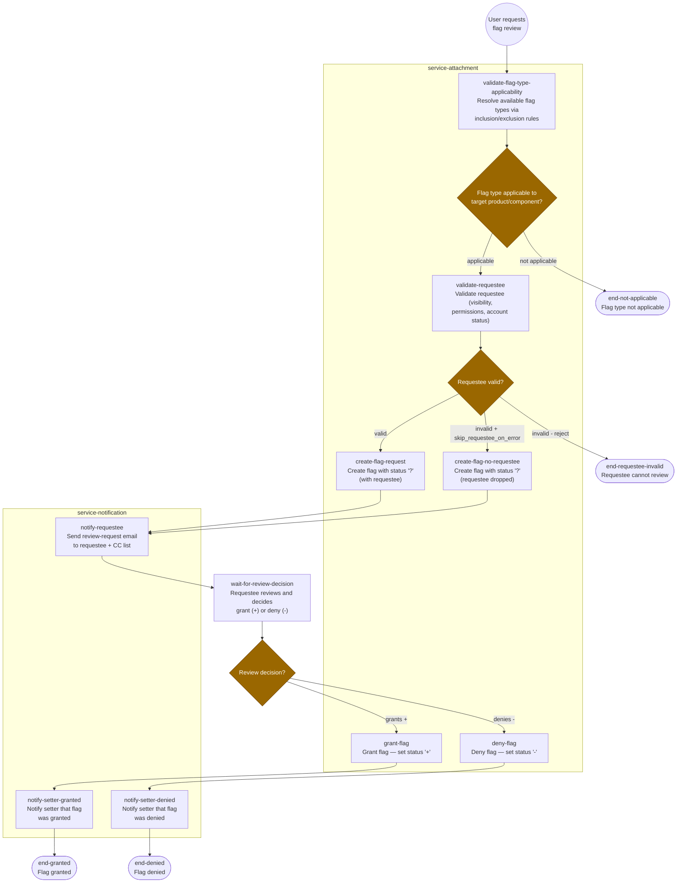
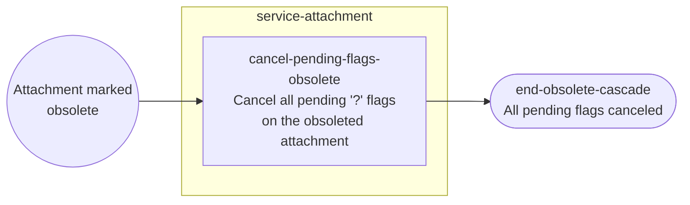
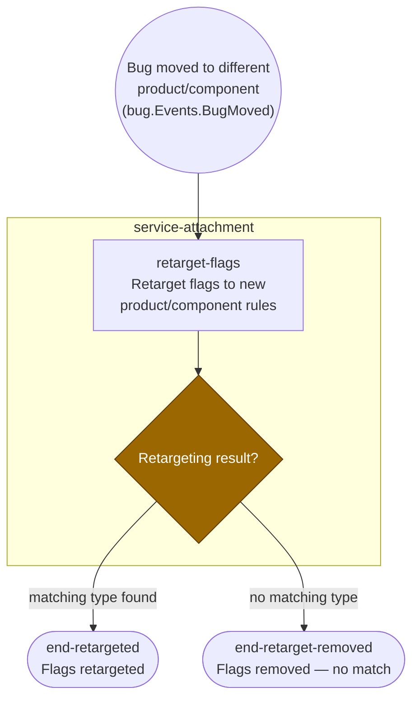
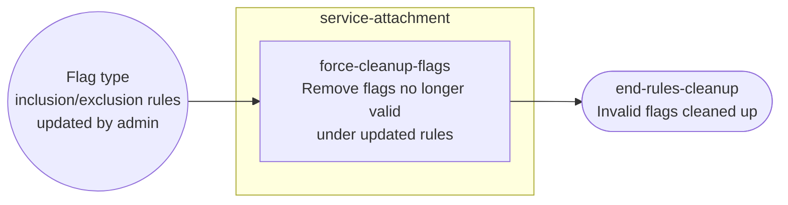
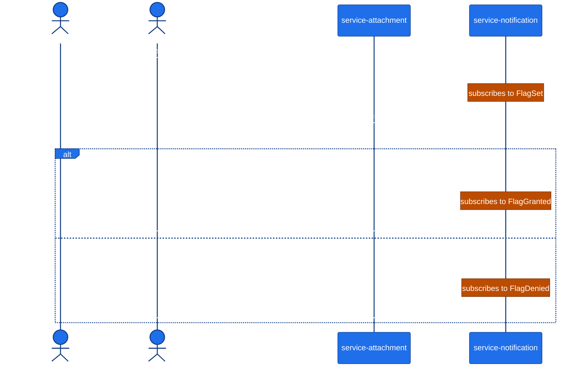

# Flag Review & Approval Workflow

## Workflow Overview

The Flag Review & Approval Workflow governs the lifecycle of review and approval flags in Bugzilla — the mechanism by which users request code reviews, approvals, feedback, and other sign-offs from designated reviewers. Flags can be set on either attachments (e.g., a patch needing review) or directly on bugs (e.g., a release-approval flag). The workflow covers the complete flag lifecycle: requesting review (`?` status), granting (`+`) or denying (`-`), clearing (`X`), and compensating actions when the surrounding context changes (attachment obsolescence, bug product moves, admin rule changes).

All flag logic — both attachment-level and bug-level — is owned by `service-attachment` per architectural decision ADR-010. The `service-notification` service subscribes to flag events to deliver email. The `service-bug` service emits events that trigger flag retargeting when bugs move between products.

## Workflow Diagram (Mermaid)

The workflow is split into four stages: the main happy path (request → review → grant/deny), and three compensation flows triggered by independent events.

### Stage 1 — Main Happy Path (Request, Review, Decision)

### Stage 2 — Compensation A: Attachment Obsoleted

### Stage 3 — Compensation B: Bug Moved Between Products

### Stage 4 — Compensation C: Flag Type Rules Changed

## Participants

| Service | Role | Responsibility |
|---------|------|----------------|
| `service-attachment` | **Initiator** | Owns all flag aggregates, flag types, inclusion/exclusion rules. Processes `SetAttachmentFlag`, `SetBugFlag`, and `MarkAttachmentObsolete` commands. Subscribes to `BugMoved` events for retargeting. |
| `service-notification` | **Participant** | Subscribes to `FlagSet`, `FlagGranted`, `FlagDenied`, and `AttachmentFlagCleared` events. Resolves recipients (requestee, setter, CC list) filtered by bug group visibility and private attachment visibility. Renders and delivers email. |
| `service-bug` | **Participant** | Emits `BugMoved` events when a bug's product or component changes. This triggers flag retargeting in `service-attachment`. |

## Trigger

The workflow is triggered by a **user action**: an authenticated user sets a flag with `?` status on a bug or attachment, optionally specifying a requestee (the person asked to review or approve). This is an interactive operation — the user selects a flag type from the available types (resolved via inclusion/exclusion rules for the target's product/component), sets the status to `?`, and optionally picks a specific requestee.

Three compensating triggers can interrupt or modify the workflow after initiation:

1. **Attachment obsolescence** — when `MarkAttachmentObsolete` is issued, all pending `?` flags on that attachment are cascade-canceled.
2. **Bug product/component move** — when `service-bug` emits `BugMoved`, `service-attachment` retargets or removes flags whose types are no longer applicable.
3. **Admin rule change** — when a flag type's inclusion/exclusion rules are updated, a force-cleanup removes now-invalid flags.

## Steps

### Step 1 — Resolve Flag Type Applicability

**Node**: `validate-flag-type-applicability` (serviceTask)

When the user requests a flag, the system first resolves which flag types are available for the target (bug or attachment) based on its product and component. This uses the `flaginclusions` and `flagexclusions` junction tables:

- A flag type is **available** if the target's product/component matches an inclusion row (NULL product/component = wildcard).
- A flag type is **excluded** if a matching exclusion row exists, even if it was included.

**Command**: `attachment.Queries.GetAvailableFlagTypes` — returns the list of applicable flag types for the given product/component combination.

If the requested flag type is not applicable, the workflow ends immediately (`end-not-applicable`).

### Step 2 — Validate Requestee

**Node**: `validate-requestee` (serviceTask)

If the user specified a requestee, the system validates:

1. **Account enabled** — the requestee's account must be active.
2. **Bug visibility** — the requestee can see the bug (respects group-based access restrictions).
3. **Attachment visibility** — if the flag targets a private attachment, the requestee must be in the "insider" group.
4. **Grant permission** — the requestee must have permission to set the flag (`can_set_flag` check, typically membership in the flag type's `grant_group`).

If validation fails:
- If `skip_requestee_on_error` is set, the flag is created without a specific requestee (anyone in the grant group can fulfill it) → `create-flag-no-requestee`.
- Otherwise, the request is rejected → `end-requestee-invalid`.

### Step 3 — Create Flag with `?` Status

**Node**: `create-flag-request` or `create-flag-no-requestee` (serviceTask)

The system creates the flag with status `?`. For attachment-level flags, the command is `attachment.Commands.SetAttachmentFlag`; for bug-level flags, it is `attachment.Commands.SetBugFlag`. Both produce an `attachment.Events.FlagSet` event.

The command handler enforces:
- The flag type is `is_requestable`.
- If a requestee is specified, the flag type is `is_requesteeble`.
- If the flag type is not `is_multiplicable`, no other flag of the same type exists on the target (aggregate concurrency control prevents race conditions).
- The setter has the appropriate `request_group` permission (or no group restriction).

### Step 4 — Notify Requestee

**Node**: `notify-requestee` (serviceTask)

`service-notification` subscribes to `attachment.Events.FlagSet` and:

1. Sends a review-request email to the **requestee** (if specified).
2. Sends notification to anyone on the flag type's **CC list** (filtered by bug group visibility and private attachment visibility).
3. If the requestee has the `requestee_cc` preference enabled, auto-adds them to the bug's CC list.

The notification email uses the event payload for context (flag type name, target bug summary, setter identity, attachment description if applicable).

### Step 5 — Wait for Review Decision

**Node**: `wait-for-review-decision` (userTask)

The requestee (or any user in the grant group, if no specific requestee was set) reviews the flag and decides to grant (`+`) or deny (`-`). This is a user-driven step — the system waits for the reviewer to act.

### Step 6 — Grant or Deny

**Nodes**: `grant-flag` or `deny-flag` (serviceTask)

The reviewer issues the appropriate command (`attachment.Commands.SetAttachmentFlag` with status `+` or `-`). The command handler validates:

- The setter is in the flag type's `grant_group` (or the grant_group is null, meaning anyone can grant/deny).
- The flag exists and is currently in `?` status.

On success, the handler emits either `attachment.Events.FlagGranted` or `attachment.Events.FlagDenied`.

For multiplicable flags, multiple reviewers may each set their own flag instance — the workflow runs independently per flag instance.

### Step 7 — Notify Setter of Result

**Nodes**: `notify-setter-granted` or `notify-setter-denied` (serviceTask)

`service-notification` subscribes to the grant/deny events and sends email to:

1. The **original setter** — their `?` request has been fulfilled or rejected.
2. The flag type's **CC list** (filtered by visibility).
3. The **requestee** — confirming their own action (for audit trail).

### Step 8 — Workflow Complete

**Nodes**: `end-granted` or `end-denied` (endEvent)

The flag review is complete. The flag remains on the target with its final status (`+` or `-`) until explicitly cleared or the flag type is deactivated.

## Event Flow

### Primary Event Sequence (Happy Path)

### Cross-Service Event Subscriptions

| Subscriber | Subscribed Event | Action |
|------------|-----------------|--------|
| `service-notification` | `attachment.Events.FlagSet` | Email requestee and CC list about new review request |
| `service-notification` | `attachment.Events.FlagGranted` | Email setter and CC list about granted flag |
| `service-notification` | `attachment.Events.FlagDenied` | Email setter and CC list about denied flag |
| `service-notification` | `attachment.Events.AttachmentFlagCleared` | Email setter about canceled/cleared flag |
| `service-attachment` | `bug.Events.BugMoved` | Retarget or remove flags based on new product/component rules |
| `service-attachment` | `attachment.Events.FlagTypeInclusionsChanged` | Force cleanup of flags that no longer match inclusion rules |
| `service-attachment` | `attachment.Events.FlagTypeExclusionsChanged` | Force cleanup of flags that now match exclusion rules |

### Event Payload Requirements

For `service-notification` to render emails without querying back to `service-attachment` or `service-bug` (per ADR-012 — events carry full diff payloads):

- **FlagSet**: `{ flagId, flagTypeName, targetBugId, targetBugSummary, attachId?, attachDescription?, setterId, setterNick, requesteeId?, requesteeNick?, status, productId, componentName }`
- **FlagGranted/FlagDenied**: `{ flagId, flagTypeName, targetBugId, targetBugSummary, attachId?, attachDescription?, setterId, setterNick, requesteeId?, requesteeNick?, previousStatus, newStatus, reviewerId, reviewerNick }`
- **AttachmentFlagCleared**: `{ flagId, flagTypeName, targetBugId, attachId?, setterId, setterNick, previousStatus, reason }`

## Error Handling & Compensation

### Attachment Obsolescence Cascade

**Trigger**: `MarkAttachmentObsolete` command issued on an attachment.

When an attachment is marked obsolete, the command handler in `service-attachment` iterates all flags with status `?` on that attachment and clears each one. For each cleared flag:

1. Emits `attachment.Events.AttachmentFlagCleared` with reason `obsolete`.
2. `service-notification` sends email to the setter of each cleared flag, informing them the review request was canceled because the attachment was obsoleted.

**Consistency**: The cascade is performed within the same command handler execution — all pending flags are cleared atomically as part of the `MarkAttachmentObsolete` transaction. No partial state is possible.

**Compensation model**: Not reversible. Once an attachment is obsolete and flags are cleared, the setter must re-request on a non-obsolete attachment.

### Bug Product/Component Move — Flag Retargeting

**Trigger**: `service-bug` emits `bug.Events.BugMoved`.

`service-attachment` subscribes to `BugMoved` events and runs the retargeting logic:

1. For each flag on the bug and its attachments, check if the flag type is still applicable in the new product/component (using inclusion/exclusion rules).
2. If the same flag type name is available in the new product/component, update the flag's `type_id` to the new type → emit `FlagRetargeted`.
3. If no matching flag type exists, delete the flag → emit `AttachmentFlagCleared` with reason `retarget_failed`.
4. `service-notification` sends email to the setter for each retargeted or removed flag.

**Consistency**: Retargeting is eventually consistent — it happens in a subscription handler after the `BugMoved` event is published. There is a brief window where flags may reference a flag type that is technically invalid for the new product/component. This is acceptable because:
- The bug move is the primary operation; flag retargeting is a compensating action.
- The window is bounded by the message bus delivery latency (typically milliseconds).

**Projection lag**: The `FlagTypeReadModel` used by the retargeting logic must reflect the latest product/component configuration. If the product move also changes flag type inclusion/exclusions, the read model must be updated first. The subscription handler should use `waitForProjection` semantics or retry with backoff if the read model is stale.

### Flag Type Inclusion/Exclusion Rule Changes — Force Cleanup

**Trigger**: Admin updates a flag type's inclusion or exclusion rules.

When rules change, some existing flags may become invalid. The `service-attachment` subscription handler runs `force_cleanup`:

1. Query all flags of the affected flag type.
2. For each flag, check if its target's product/component still matches the updated inclusion/exclusion rules.
3. If invalid, clear the flag → emit `AttachmentFlagCleared` with reason `rule_change`.
4. `service-notification` sends email to the setter.

**Consistency**: Same eventual consistency model as retargeting. The cleanup runs after the rule change events are published.

### Requestee Validation Failures

If the requestee cannot see the bug (group restrictions) or the attachment (private/insider), the flag request may:

1. **Silently drop the requestee** (if `skip_requestee_on_error` is true) — the flag is created without a specific requestee, meaning anyone in the grant group can fulfill it.
2. **Reject the request** — return an error to the user, who must choose a different requestee or remove the requestee.

This is not a compensation scenario — it's a validation gate that prevents invalid state from being created.

### Non-Multiplicable Flag Conflict

If the flag type is not multiplicable and a flag of the same type already exists on the target, the aggregate's concurrency control will reject the second creation attempt. The user receives an error indicating the flag type is already set. This is a standard optimistic concurrency conflict, not a compensation scenario.

## Data Consistency Model

### Aggregate Ownership

All flag state is owned by `service-attachment` (per ADR-010). The `AttachmentAggregate` (for attachment-level flags) and a flag-capable aggregate for bug-level flags are the sources of truth. Flag types are managed as configuration entities within the same service.

### Eventual Consistency Boundaries

| Data | Owner | Consistency | Notes |
|------|-------|-------------|-------|
| Flag state (+, -, ?, X) | `service-attachment` aggregate | **Strong** — within aggregate transaction | Flag creation and status changes are atomic within the aggregate |
| Flag read models | `service-attachment` projections | **Eventual** — projected from events | `AttachmentFlagReadModel` may lag by milliseconds |
| Notification delivery | `service-notification` | **Eventual** — async subscription processing | Email is sent after the event is published and processed |
| Flag retargeting after bug move | `service-attachment` subscription | **Eventual** — triggered by `BugMoved` event | Brief window of potentially invalid flags |
| Flag type applicability | `service-attachment` read model | **Eventual** — projected from inclusion/exclusion events | Admin rule changes propagate asynchronously |

### Projection Lag Tolerance

- `service-notification` must tolerate projection lag when resolving recipient visibility. The event payload carries sufficient context (product ID, component ID, bug group IDs) for the notification handler to make visibility decisions without querying the latest read model.
- `service-attachment` retargeting handler should use `waitForProjection` semantics when querying `FlagTypeReadModel` after a `BugMoved` event, to ensure the product/component configuration is current before making retargeting decisions.
- If `waitForProjection` is not available, the handler should retry with exponential backoff (3 attempts, 100ms/500ms/2s) before falling back to conservative behavior (remove the flag and notify the setter).

### Cross-Service Invariants

1. **Flag type applicability invariant**: A flag can only exist on a target whose product/component matches the flag type's inclusion rules and does not match its exclusion rules. This is enforced at command time (in `SetAttachmentFlag`/`SetBugFlag` handler) and repaired reactively (via retargeting and force-cleanup subscriptions).

2. **Obsolete attachment flag invariant**: An obsolete attachment must not have any flags in `?` status. Enforced by `MarkAttachmentObsolete` command handler cascade.

3. **Grant group authorization invariant**: Only users in the flag type's `grant_group` (or anyone if null) can set `+` or `-` status. Enforced in the command handler's Layer 2 policy (`CanSetFlagPolicy`).

4. **Non-multiplicable uniqueness invariant**: A non-multiplicable flag type can have at most one flag instance per target. Enforced by aggregate concurrency control.

5. **Requestee visibility invariant**: The requestee of a flag must be able to see the bug (and the attachment, if private). Enforced at creation time in the `validate-requestee` step. If the requestee's access is later revoked, the flag is NOT automatically cleared — the requestee simply cannot act on it, and another grant group member can fulfill the request.

## Failure Modes

### FM-1: Notification Delivery Failure

**Scenario**: `service-notification` cannot deliver email to the requestee (SMTP error, invalid address).

**Recovery**: The notification handler should implement retry with exponential backoff (3 attempts). If all retries fail, log the failure and continue — the flag still exists in `?` status and the requestee can still act on it via the UI. Email is advisory, not authoritative.

**Compensation**: None needed. The flag's state is independent of notification delivery.

### FM-2: Flag Retargeting Race Condition

**Scenario**: A reviewer grants a flag (`+`) while `service-attachment` is simultaneously retargeting flags after a `BugMoved` event.

**Recovery**: The aggregate's optimistic concurrency control detects the conflict. The retargeting subscription handler should reload the flag and re-evaluate. If the flag was already granted (`+`), the retargeting should preserve the granted status and only update the `type_id` if the same flag type exists in the new product/component.

**Compensation**: If retargeting fails (no matching type) but the flag was already granted, the flag should be preserved in its granted state with a warning notification. Deleting a granted flag due to a product move would lose the approval decision.

### FM-3: Obsolete Cascade Partial Failure

**Scenario**: `MarkAttachmentObsolete` handler clears some but not all pending flags before a system error.

**Recovery**: Since all flag clearings happen within a single aggregate transaction (the attachment aggregate), partial failure is impossible — the transaction either commits all changes or rolls back entirely. On retry, the handler starts fresh.

**Compensation**: None needed. Atomicity is guaranteed by the aggregate boundary.

### FM-4: Duplicate Flag Creation on Multiplicable Types

**Scenario**: Two users simultaneously create flags of the same multiplicable type on the same target.

**Recovery**: Both creations succeed — multiplicable flags explicitly allow this. Each gets its own flag instance with its own setter and requestee. The workflow runs independently for each instance.

**Compensation**: None needed. This is expected behavior for multiplicable types (e.g., requesting review from multiple people simultaneously).

### FM-5: Non-Multiplicable Flag Race

**Scenario**: Two users simultaneously create flags of the same non-multiplicable type on the same target.

**Recovery**: The aggregate's concurrency control rejects the second creation. The user receives an error: "Flag type [name] is already set on this target."

**Compensation**: None needed. The aggregate invariant is preserved.

### FM-6: BugMoved Event Delivery Delay

**Scenario**: A bug is moved to a new product, but the `BugMoved` event is delayed on the message bus. During the delay, a user creates a new flag on the bug using the old product's flag types.

**Recovery**: The `SetAttachmentFlag` command handler validates against the current product/component (from its read model). If the read model has already been updated by the bug service's projection, the new flag request will be validated against the new product's rules. If the read model is stale (still shows the old product), a flag may be created that is immediately invalid once retargeting runs.

**Compensation**: The retargeting subscription handler will detect and clean up the invalid flag when it eventually processes the `BugMoved` event. The setter is notified that their flag was removed. This is an acceptable edge case — the window is bounded by message bus latency.

### FM-7: Flag Type Deactivated During Pending Review

**Scenario**: An admin deactivates a flag type (`is_active = false`) while flags of that type are in `?` status.

**Recovery**: Deactivating a flag type prevents new flag creation but does NOT clear existing flags. Pending `?` flags remain and the reviewer can still grant or deny them. This matches Bugzilla's behavior — inactive types are soft-disabled, not retroactively cleared.

**Compensation**: None needed. The admin can explicitly clear remaining flags if desired.

## Decision Rules Referenced

| Gateway ID | Gateway label | Rule ID | Rule citation |
|------------|---------------|---------|---------------|
| gateway-applicable | Flag type applicable to target product/component? | [BR-attachment-010](../decision-rules.md#br-attachment-010) | output/phase-5-specification/specs/service-attachment/SERVICE_SPEC.md#business-rule-10 |
| gateway-applicable | Flag type applicable to target product/component? | [BR-attachment-POLICY-FlagTypeApplicabilityPolicy](../decision-rules.md#br-attachment-policy-flagtypeapplicabilitypolicy) | output/phase-5-specification/specs/service-attachment/SERVICE_SPEC.md#authorization-layer-2 |
| gateway-applicable | Flag type applicable to target product/component? | [BR-attachment-011](../decision-rules.md#br-attachment-011) | output/phase-5-specification/specs/service-attachment/SERVICE_SPEC.md#business-rule-11 |
| gateway-requestee-valid | Requestee valid? | [BR-attachment-016](../decision-rules.md#br-attachment-016) | output/phase-5-specification/specs/service-attachment/SERVICE_SPEC.md#business-rule-16 |
| gateway-requestee-valid | Requestee valid? | [BR-attachment-POLICY-RequesteeVisibilityPolicy](../decision-rules.md#br-attachment-policy-requesteevisibilitypolicy) | output/phase-5-specification/specs/service-attachment/SERVICE_SPEC.md#authorization-layer-2 |
| gateway-decision | Review decision? | [BR-attachment-ST-FlagRequested-Granted](../decision-rules.md#br-attachment-st-flagrequested-granted) | output/phase-5-specification/specs/service-attachment/SERVICE_SPEC.md#state-machines |
| gateway-decision | Review decision? | [BR-attachment-ST-FlagRequested-Denied](../decision-rules.md#br-attachment-st-flagrequested-denied) | output/phase-5-specification/specs/service-attachment/SERVICE_SPEC.md#state-machines |
| gateway-decision | Review decision? | [BR-attachment-POLICY-CanSetFlagPolicy](../decision-rules.md#br-attachment-policy-cansetflagpolicy) | output/phase-5-specification/specs/service-attachment/SERVICE_SPEC.md#authorization-layer-2 |
| gateway-decision | Review decision? | [BR-attachment-015](../decision-rules.md#br-attachment-015) | output/phase-5-specification/specs/service-attachment/SERVICE_SPEC.md#business-rule-15 |
| gateway-retarget-result | Retargeting result? | [BR-attachment-018](../decision-rules.md#br-attachment-018) | output/phase-5-specification/specs/service-attachment/SERVICE_SPEC.md#business-rule-18 |
| gateway-retarget-result | Retargeting result? | [BR-attachment-010](../decision-rules.md#br-attachment-010) | output/phase-5-specification/specs/service-attachment/SERVICE_SPEC.md#business-rule-10 |
